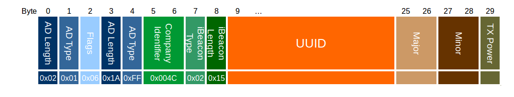

# Bluenet protocol v0.3.0
-------------------------

# Advertisements and scan response
When no device is connected, [advertisements](#ibeacon_packet) will be sent at a regular interval (100ms by default). A device that actively scans, will also receive a [scan response packet](#scan_response_packet). This contains useful info about the state.

# Services
When connected, the following services are available.

## General service

The general service has UUID f5f90000-f5f9-11e4-aa15-123b93f75cba.

Characteristic | UUID | Date type | Description
--- | --- | --- | ---
Temperature    | f5f90001-f5f9-11e4-aa15-123b93f75cba | int 32 | Chip temperature in Celcius. Notifications are available.
Reset          | f5f90005-f5f9-11e4-aa15-123b93f75cba | int 32 | Write 1 to reset. Write 66 to go to DFU mode.
Mesh           | f5f90006-f5f9-11e4-aa15-123b93f75cba | [Mesh packet](#mesh_characteristic_packet) | 
Config write   | f5f90007-f5f9-11e4-aa15-123b93f75cba | [Config packet](#config_packet) | Write a configuration setting.
Config select  | f5f90008-f5f9-11e4-aa15-123b93f75cba | uint 8 | Write the type of configuration you want to read from `Config read`.
Config read    | f5f90009-f5f9-11e4-aa15-123b93f75cba | [Config packet](#config_packet) | Read a configuration setting.

## Power service

The power service has UUID 5b8d0000-6f20-11e4-b116-123b93f75cba.

Characteristic | UUID | Date type | Description
--- | --- | --- | ---
PWM                | 5b8d0001-6f20-11e4-b116-123b93f75cba | uint 8 | Set PWM value. Value of 0 is completely off, 255 (100 on new devices) is completely on.
Power sample write | 5b8d0002-6f20-11e4-b116-123b93f75cba | uint 8 | Start sampling current and voltage. Write 1 if you want to read only power consumption, 2 if you want to read power samples, 3 for both.
Power sample read  | 5b8d0003-6f20-11e4-b116-123b93f75cba | [Power curve](#power_curve_packet) | Last sampled current and voltage.
Power consumption  | 5b8d0004-6f20-11e4-b116-123b93f75cba | uint 16 | The current power consumption.
Current limit      | 5b8d0005-6f20-11e4-b116-123b93f75cba | uint 8 | Not implemented yet.

## Indoor localization service

The localization service has UUID 7e170000-429c-41aa-83d7-d91220abeb33.

Characteristic | UUID | Date type | Description
--- | --- | --- | ---
RSSI                  | 7e170001-429c-41aa-83d7-d91220abeb33 | uint 8 | RSSI to connected device. Notifications are available.
Scan write            | 7e170003-429c-41aa-83d7-d91220abeb33 | uint 8 | Start or stop scanning. write 0 to stop, 1 to start.
Scan read             | 7e170004-429c-41aa-83d7-d91220abeb33 | [Scan result list](#scan_result_list_packet) | After stopping the scan, you can read the results here.
Tracked devices write | 7e170002-429c-41aa-83d7-d91220abeb33 | [Tracked device](#tracked_device_packet) | Add or overwrite a tracked device. Set threshold larger than 0 to remove the tracked device from the list.
Tracked devices read  | 7e170005-429c-41aa-83d7-d91220abeb33 | [Tracked device list](#tracked_device_list_packet) | Read the current list of tracked devices.

## Schedule service

The schedule service has UUID 96d20000-4bcf-11e5-885d-feff819cdc9f.

Characteristic | UUID | Date type | Description
--- | --- | --- | ---
Set time        | 96d20001-4bcf-11e5-885d-feff819cdc9f | uint 32 | Sets the time. Timestamp is in seconds since epoch.
Schedule write  | 96d20002-4bcf-11e5-885d-feff819cdc9f | [Schedule entry](#schedule_entry_packet) | Add or modify a schedule entry. Set nextTimestamp to 0 to remove the entry from the list.
Schedule read   | 96d20003-4bcf-11e5-885d-feff819cdc9f | [Schedule list](#schedule_list_packet) | Get a list of all schedule entries.

## Mesh Service

The mesh service comes with [OpenMesh](https://github.com/NordicSemiconductor/nRF51-ble-bcast-mesh) and has UUID 2a1e0000-fd51-d882-8ba8-b98c0000cd1e

Characteristic | UUID | Date type | Description
--- | --- | --- | ---
Meta data   | 2a1e0004-fd51-d882-8ba8-b98c0000cd1e | | Get mesh configuration.
Value       | 2a1e0005-fd51-d882-8ba8-b98c0000cd1e | | Characteristic where the mesh values can be read.

# Data structures

### Configuration packet

Type | Name | Length | Description
--- | --- | --- | ---
uint 8  | Type | 1 | Type, see table below.
uint 8  | Reserved | 1 | Not used: reserved for alignment.
uint 16 | Length | 2 | Length of the payload in bytes.
uint 8 | Payload | Length | Payload data, depends on type.

Available configurations:

Type nr | Type name | Payload type | Payload description
--- | --- | --- | ---
0 | Device name | char array | Name of the device.
1 | Device type | char array | **Deprecated.**
2 | Room | uint 8 | **Deprecated.**
3 | Floor | uint 8 | Floor number.
4 | Nearby timeout | uint 16 | Time in ms before switching off when noone is nearby (not implemented yet).
5 | PWM frequency | uint 8 | Sets PWM frequency (not implemented yet).
6 | iBeacon major | uint 16 | iBeacon major number.
7 | iBeacon minor | uint 16 | iBeacon minor number.
8 | iBeacon UUID | 16 bytes | iBeacon UUID.
9 | iBeacon RSSI | int 8 | iBeacon RSSI at 1 meter.
10 | Wifi settings | char array | Json with the wifi settings: `{ "ssid": "<name here>", "key": "<password here>"}`.
11 | TX power | int 8 | TX power, can be: -40, -30, -20, -16, -12, -8, -4, 0, or 4.
12 | Advertisement interval | uint 16 | Advertisement interval between 0x0020 and 0x4000 in units of 0.625 ms.
13 | Passkey | char array | Passkey of the device: must be 6 digits.
14 | Min env temp | int 8 | If temperature (in degrees Celcius) goes below this value, send an alert (not implemented yet).
15 | Max env temp | int 8 | If temperature (in degrees Celcius) goes above this value, send an alert (not implemented yet).
16 | Scan duration | uint 16 | Scan duration in ms. *Setting this too high may cause the device to reset during scanning.*
17 | Scan send delay | uint 16 | Time in ms to wait before sending scan results over the mesh. *Setting this too low may cause the device to reset during scanning.*
18 | Scan break duration | uint 16 | Waiting time in ms between sending results and next scan. *Setting this too low may cause the device to reset during scanning.*
19 | Boot delay | uint 16 | Time to wait with radio after boot, **Setting this too low may cause the device to reset on boot.**
20 | Max chip temp | int 8 | If the chip temperature (in degrees Celcius) goes above this value, the power gets switched off.
21 | Scan filter | uint 8 | Filter out certain types of devices from the scan results (1 for GuideStones, 2 for CrownStones, 3 for both).
22 | Scan filter fraction | uint 16 | If scan filter is set, do *not* filter them out each every X scan results.

### Power curve packet

Type | Name | Length | Description
--- | --- | --- | ---
uint 16 | numSamples     | 2              | Number of current samples + voltage samples, including the first samples.
uint 16 | firstCurrent   | 2              | First current sample.
uint 16 | lastCurrent    | 2              | Last current sample.
uint 16 | firstVoltage   | 2              | First voltage sample.
uint 16 | lastVoltage    | 2              | Last voltage sample.
uint 32 | firstTimeStamp | 4              | Timestamp of first current sample.
uint 32 | lastTimeStamp  | 4              | Timestamp of last sample.
int 8   | currentDiffs   | numSamples/2-1 | Array of differences with previous current sample.
int 8   | voltageDiffs   | numSamples/2-1 | Array of differences with previous voltage sample.
int 8   | timeDiffs      | numSamples-1   | Array of differences with previous timestamp.

### Scan result packet

Type | Name | Length | Description
--- | --- | --- | ---
byte array | Address | 6 | Bluetooth address of the scanned device.
int 8 | RSSI | 1 | Average RSSI to the scanned device.
uint 16 | Occurrences | 2 | Number of times the devices was scanned.

### Scan result list packet

Type | Name | Length | Description
--- | --- | --- | ---
uint 8 | size | 1 | Number of scanned devices in the list.
[Scan result](#scan_result_packet) | size * 9 | Array of scan result packets.

### Tracked device packet

Type | Name | Length | Description
--- | --- | --- | ---
byte array | Address | 6 | Bluetooth address of the tracked device.
int 8 | RSSI threshold | 1 | If the RSSI to this device is above the threshold, then switch on the power.

### Tracked device list packet

Type | Name | Length | Description
--- | --- | --- | ---
uint 8 | size | 1 | Number of tracked devices in the list.
[Tracked device](#tracked_device_packet) | size * 7 | Array of tracked device packets.
uint 16 array | Counters | size * 2 | Counter that keeps up how long ago the RSSI of a device was above the threshold (for internal use).

### Schedule repeat packet

#### Repeat type 0
Perform action every X minutes.

Type | Name | Length | Description
--- | --- | --- | ---
uint 16 | Repeat time | 2 | Repeat every `<repeat time>` minutes, 0 is not allowed.

#### Repeat type 1
Perform action every 24h, but only on certain days these days of the week.

Type | Name | Length | Description
--- | --- | --- | ---
uint 8 | Day of week | 1 | Bitmask, with bits 0-6 for Sunday-Saturday and bit 7 for all days.
uint 8 | Next day of week | 1 | Remember what day of week comes next. 0-6, where 0=Sunday.

#### Repeat type 2
Perform action only once. Entry gets removed after action was performed.

Type | Name | Length | Description
--- | --- | --- | ---
uint 8 | Reserved | 2 | Unused.

### Schedule action packet

#### Action type 0
Set power switch to a given value.

Type | Name | Length | Description
--- | --- | --- | ---
uint 8 | Pwm | 1 | Power switch value. Range 0-100, where 0 is off and 100 is fully on.
uint 8 | Reserved | 2 | Unused.

#### Action type 1
Fade from current power switch value to a given power switch value, in X seconds.

Type | Name | Length | Description
--- | --- | --- | ---
uint 8 | Pwm end | 1 | Power switch value after fading.
uint 16 | Fade duration | 2 | Fade duration in seconds.

#### Action type 2
Toggle the power switch.

Type | Name | Length | Description
--- | --- | --- | ---
uint 8 | Reserved | 3 | Unused.

### Schedule entry packet

Type | Name | Length | Description
--- | --- | --- | ---
uint 8 | ID | 1 | Unique id of this schedule entry.
uint 8 | Override mask | 1 | Bitmask of states to override. Presence mask = 1.
uint 8 | Type | 1 | Combined repeat and action type. Defined as `repeatType + (actionType << 4)`.
uint 32 | Next timestamp | 4 | Timestamp of the next time this entry triggers.
[schedule repeat](#schedule_repeat_packet) | Repeat data | 2 | Repeat time data, depends on the repeat type.
[schedule action](#schedule_action_packet) | Action data | 3 | Action data, depends on the action type.

### Schedule list packet

Type | Name | Length | Description
--- | --- | --- | ---
uint 8 | Size | 1 | Number of entries in the list.
[schedule entry](#schedule_entry_packet) | Entries | 12 | Schedule entry list.

### Mesh payload packet

Type | Name | Length | Description
--- | --- | --- | ---
byte array | Target address | 6 | Bluetooth address of the device at which this message is aimed at, all zero for any device.
uint 16 | Type | 2 | Type of message, see table below.
byte array | Payload | 0 to 91 | Payload data, depends on type.

Type nr | Type name | Payload type | Payload description
--- | --- | --- | ---
0 | Event | uint 16 | Event type that happened.
1 | Power | uint 8 | Current power usage.
2 | Beacon | beacon mesh | Configure the iBeacon settings.
3 | Command | mesh command | Send a command over the mesh.
4 | Config | [Configuration](#config_packet) | Send a configuration.
101 | Scan result | [Scan result list](#scan_result_list_packet) | List of scanned devices.

### Mesh characteristic packet

Type | Name | Length | Description
--- | --- | --- | ---
uint 8 | Handle | 1 | Handle on which to send the message.
uint 8 | Reserved | 1 | Not used: reserved for alignment.
uint 16 | Length | 2 | Length of the data.
[Mesh Payload](#mesh_payload_packet) | Payload | Length | Payload data.

### Mesh message packet
This packet is a slightly modified version of the one used in [OpenMesh](https://github.com/NordicSemiconductor/nRF51-ble-bcast-mesh); we simply increased the content size.

Type | Name | Length | Description
--- | --- | --- | ---
uint 8 | Preamble | 1 | 
uint 32 | Access address | 4 | Number used to find relevant messages, set by application.
uint 8 | Type | 1 | 
uint 8 | Length | 1 | 
byte array | Source address | 6 | Address of the node that put this message into the mesh.
uint 8 | AD Length | 1 | Length of data after this field, excluding CRC.
uint 8 | AD type | 1 | 
uint 16 | Service UUID | 2 | Mesh service UUID.
uint 16 | Handle | 2 | Handle of this message.
uint 16 | Version | 2 | Used internally.
[Mesh Payload](#mesh_payload_packet) | Payload | 99 | Payload data.
byte array | CRC | 3 | Checksum.

### Mesh value notification packet
This packet is used to get the [mesh messages](#mesh_message_packet) pushed over GATT notifications.

Type | Name | Length | Description
--- | --- | --- | ---
uint 8 | Opcode | 1 | 
byte array | Payload | | 

Opcode | Type name | Payload type | Payload description
--- | --- | --- | ---
0 | Data | | Not used.
1 | FlagSet | | Not used.
2 | FlagReq | | Not used.
17 | CmdRsp | | Not used.
18 | FlagRsp | | Not used.
32 | MultipartStart | [Multipart notification](#mesh_multipart_notification_packet) | First part of the multi part notification.
33 | MultipartMid | [Multipart notification](#mesh_multipart_notification_packet) | Middle part of the multi part notification.
34 | MultipartEnd | [Multipart notification](#mesh_multipart_notification_packet) | Last part of the multi part notification.

### Mesh multipart notification packet
Each mesh message is notified in multiple pieces, as a notification can only be 20 bytes. The opcode of the [value notification](#mesh_value_notification_packet) tells whether it is the first, last or a middle piece.

Type | Name | Length | Description
--- | --- | --- | ---
uint 16 | Handle | 2 | Handle on which the messages was sent or received.
uint 8 | Length | 1 | Length of the data of this part.
byte array | Data | Length | Data of this part of the whole mesh message.

### iBeacon packet
This packet is according to iBeacon spec, see for example [here](http://www.havlena.net/en/location-technologies/ibeacons-how-do-they-technically-work/).

Type | Name | Length | Description
--- | --- | --- | ---
uint 8 | iBeacon prefix | 9 | This is fixed data.
uint 8 | Proximity UUID | 16 | 
uint 16 | Major | 2 | 
uint 16 | Minor | 2 | 
uint 16 | TX Power | 2 | Received signal strength at 1 meter.

### Scan response packet
The packet that is sent when a BLE central scans.

Type | Name | Length | Description
--- | --- | --- | ---
uint 8 | Name Flag | 1 | 
uint 8 | Name Length | 1 | Length of the name.
char array | Name Bytes | 9 | The name of this device.
uint 8 | Service Flag | 1 | 
uint 8 | Service Length | 1 | 
uint 16 | Service UUID | 2 | Service UUID
[Service data](#scan_response_servicedata_packet) | 16 | Service data, state info.

### Scan response service data packet
This packet contains the state info. It will be encrypted using AES 128.

Type | Name | Length | Description
--- | --- | --- | ---
uint 16 | Crownstone ID | 2 | ID that identifies this Crownstone.
uint 16 | Crownstone state ID | 2 | ID of the Crownstone of which the state is shown.
uint 8 | Switch state | 1 | The state of the switch, 0 - 100 (where 0 is off, 100 is on, dimmed in between).
uint 8 | Event bitmask | 1 | Shows if the Crownstone has something new to tell.
uint 8 | Reserved | 2 | Reserved for future use.
uint 32 | Power usage | 4 | The power usage at this moment (mW).
uint 32 | Accumulated energy | 4 | The accumulated energy (kWh).

