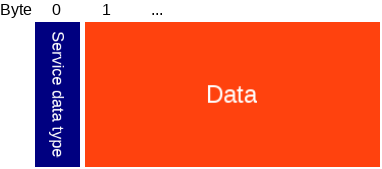

# Bluenet protocol v0.4.1
-------------------------

# Advertisements and scan response
When no device is connected, [advertisements](#ibeacon_packet) will be sent at a regular interval (100ms by default). A device that actively scans, will also receive a [scan response packet](#scan_response_packet). This contains useful info about the state.

### iBeacon advertisement packet
This packet is according to iBeacon spec, see for example [here](http://www.havlena.net/en/location-technologies/ibeacons-how-do-they-technically-work/).

Type | Name | Length | Description
--- | --- | --- | ---
uint 8 | AD Length | 1 | Length of the Flags AD Structure (0x02)
uint 8 | AD Type | 1 | Flags (0x01)
uint 8 | Flags | 1 |
uint 8 | AD Length | 1 | Length of the Manufacturer AD Structure  (0x1A)
uint 8 | AD Type | 1 | Manufacturer Specific Data (0xFF)
uint 8 | Company Id | 2 | Apple (0x004C)
uint 8 | iBeacon Type | 1 | IBeacon Type (0x02)
uint 8 | iBeacon Length | 1 | IBeacon Length (0x15)
uint 8 | Proximity UUID | 16 |
uint 16 | Major | 2 |
uint 16 | Minor | 2 |
int 8 | TX Power | 1 | Received signal strength at 1 meter.

### Scan response packet
The packet that is sent when a BLE central scans.

Type | Name | Length | Description
--- | --- | --- | ---
uint 8 | AD Length | 1 | Length of the Name AD Structure (0x0A)
uint 8 | AD Type | 1 | Shortened Local Name (0x08)
char []] | Name Bytes | 9 | The shortened name of this device.
uint 8 | AD Length | 1 | Length of the Service Data AD Structure (0x13)
uint 8 | AD Type | 1 | Service Data (0x16)
uint 16 | Service UUID | 2 | Service UUID
[Service data](#scan_response_servicedata_packet) | 16 | Service data, state info.

### Scan response service data packet
This packet contains the state info. It will be encrypted using AES 128.

Type | Name | Length | Description
--- | --- | --- | ---
uint 16 | Crownstone ID | 2 | ID that identifies this Crownstone.
uint 16 | Crownstone state ID | 2 | ID of the Crownstone of which the state is shown.
uint 8 | Switch state | 1 | The state of the switch, 0 - 100 (where 0 is off, 100 is on, dimmed in between).
uint 8 | Event bitmask | 1 | Shows if the Crownstone has something new to tell.
uint 8 | Reserved | 2 | Reserved for future use.
int 32 | Power usage | 4 | The power usage at this moment (mW).
int 32 | Accumulated energy | 4 | The accumulated energy (kWh).

# Services
When connected, the following services are available.

## Crownstone service

The crownstone service has UUID 24f00000-7d10-4805-bfc1-7663a01c3bff and provides all the functionality of the Crownstone through the following services

Characteristic | UUID | Date type | Description
--- | --- | --- | ---
Control        | 24f00001-7d10-4805-bfc1-7663a01c3bff | [Control packet](#control_packet) | Write a command to the control characheristic
Mesh Control   | 24f00002-7d10-4805-bfc1-7663a01c3bff | [Mesh control packet](#mesh_control_packet) | Write a command to the mesh control characheristic to send into the mesh
Config Control | 24f00004-7d10-4805-bfc1-7663a01c3bff | [Config packet](#config_packet) | Write or select a config setting
Config Read    | 24f00005-7d10-4805-bfc1-7663a01c3bff | [Config packet](#config_packet) | Read or Notify on a previously selected config setting
State Control  | 24f00006-7d10-4805-bfc1-7663a01c3bff | [State packet](#state_packet) | Select a state variable
State Read     | 24f00007-7d10-4805-bfc1-7663a01c3bff | [State packet](#state_packet) | Read or Notify on a previously selected state variable

## Setup service

The setup service has UUID 24f10000-7d10-4805-bfc1-7663a01c3bff and is only available after a factory reset.

Characteristic | UUID | Date type | Description
--- | --- | --- | ---
Control        | 24f10001-7d10-4805-bfc1-7663a01c3bff | [Control packet](#control_packet) | Write a command to the control characheristic
MAC Address    | 24f10002-7d10-4805-bfc1-7663a01c3bff | uint 8 [6] | Read the MAC address of the device

## General service

The general service has UUID 24f20000-7d10-4805-bfc1-7663a01c3bff.

Characteristic | UUID | Date type | Description
--- | --- | --- | ---
Temperature    | 24f20001-7d10-4805-bfc1-7663a01c3bff | int 32 | Chip temperature in Celcius. Notifications are available.
Reset          | 24f20002-7d10-4805-bfc1-7663a01c3bff | uint 8 | Write 1 to reset. Write 66 to go to DFU mode.

## Power service

The power service has UUID 24f30000-7d10-4805-bfc1-7663a01c3bff.

Characteristic | UUID | Date type | Description
--- | --- | --- | ---
PWM                | 24f30001-7d10-4805-bfc1-7663a01c3bff | uint 8 | Set PWM value. Value of 0 is completely off, 255 (100 on new devices) is completely on.
Relay              | 24f30002-7d10-4805-bfc1-7663a01c3bff | uint 8 | Switch Relay. Value of 0 is off, other is on.
Power samples      | 24f30003-7d10-4805-bfc1-7663a01c3bff | [Power Samples](#power_samples_packet) | List of sampled current and voltage values.
Power consumption  | 24f30004-7d10-4805-bfc1-7663a01c3bff | uint 16 | The current power consumption.

## Indoor localization service

The localization service has UUID 24f40000-7d10-4805-bfc1-7663a01c3bff.

Characteristic | UUID | Date type | Description
--- | --- | --- | ---
Track control           | 24f40001-7d10-4805-bfc1-7663a01c3bff | [Tracked device](#tracked_device_packet) | Add or overwrite a tracked device. Set threshold larger than 0 to remove the tracked device from the list.
Tracked devices         | 24f40002-7d10-4805-bfc1-7663a01c3bff | [Tracked device list](#tracked_device_list_packet) | Read the current list of tracked devices.
Scan control            | 24f40003-7d10-4805-bfc1-7663a01c3bff | uint 8 | Start or stop scanning. write 0 to stop, 1 to start.
Scanned devices         | 24f40004-7d10-4805-bfc1-7663a01c3bff | [Scan result list](#scan_result_list_packet) | After stopping the scan, you can read the results here.
RSSI                    | 24f40005-7d10-4805-bfc1-7663a01c3bff | uint 8 | RSSI to connected device. Notifications are available.

## Schedule service

The schedule service has UUID 24f50000-7d10-4805-bfc1-7663a01c3bff.

Characteristic | UUID | Date type | Description
--- | --- | --- | ---
Set time        | 24f50001-7d10-4805-bfc1-7663a01c3bff | uint 32 | Sets the time. Timestamp is in seconds since epoch.
Schedule write  | 24f50002-7d10-4805-bfc1-7663a01c3bff | [Schedule entry](#schedule_entry_packet) | Add or modify a schedule entry. Set nextTimestamp to 0 to remove the entry from the list.
Schedule read   | 24f50003-7d10-4805-bfc1-7663a01c3bff | [Schedule list](#schedule_list_packet) | Get a list of all schedule entries.

## Mesh Service

The mesh service comes with [OpenMesh](https://github.com/NordicSemiconductor/nRF51-ble-bcast-mesh) and has UUID 0000fee4-0000-1000-8000-00805f9b34fb

Characteristic | UUID | Date type | Description
--- | --- | --- | ---
Meta data   | 2a1e0004-fd51-d882-8ba8-b98c0000cd1e | | Get mesh configuration.
Value       | 2a1e0005-fd51-d882-8ba8-b98c0000cd1e | | Characteristic where the mesh values can be read.

# Data structures

### Control packet

Type | Name | Length | Description
--- | --- | --- | ---
uint 8  | Type | 1 | Command type, see table below.
uint 8  | Reserved | 1 | Not used: reserved for alignment.
uint 16 | Length | 2 | Length of the payload in bytes.
uint 8 | Payload | Length | Payload data, depends on type.

Available command types:

Type nr | Type name | Payload type | Payload description
--- | --- | --- | ---
0 | Switch | uint 8 | Switch power, 0 = OFF, 100 = FULL ON
1 | PWM | uint 8 | Set PWM to value, 0 = OFF, 100 = FULL ON
2 | Set Time | uint 32 | Set time to value, where value is seconds since 1970-01-01 00:00:00 UTC
3 | Goto DFU | - | Reset device to DFU mode
4 | Rest | uint 8 | Reset device
5 | Factory reset | uint 32 | Reset device to factory setting, needs Code 0xdeadbeef as payload
6 | Keep alive state | ... | Keep alive with state ..., TBD
7 | Keep alive | ...  | Keep alive ..., TBD
8 | Enable mesh | uint 8 | Enable/Disable Mesh, 0 = OFF, other = ON
9 | Enable encryption | uint 8 | Enable/Disable Encryption, 0 = OFF, other = ON
10 | Enable iBeacon | uint 8 | Enable/Disable iBeacon, 0 = OFF, other = ON
11 | Enable continuous power measurement | uint 8 | Enable/Disable continuous power measurement, 0 = OFF, other = ON, TBD
12 | Enable scanner | [Enable Scanner payload](#cmd_enable_scanner_payload) | Enable/Disable scanner
13 | Scan for devices | uint 8 | Scan for devices, 0 = OFF, other = ON
14 | User feedback | ... | User feedback ..., TBD
15 | Schedule entry | ... | Schedule entry ..., TBD
16 | Relay | uint 8 | Switch relay, 0 = OFF, 1 = ON

#### Enable Scanner payload

Type | Name | Length | Description
--- | --- | --- | ---
uint 8 | enable | 1 | 0 = OFF, other = ON
uint 16 | delay | 1 | start scanner with delay in ms

### Configuration packet

Type | Name | Length | Description
--- | --- | --- | ---
uint 8  | Type | 1 | Type, see table with configuration types below.
uint 8  | OpCode | 1 | The op code determines if it's a write or a read operation, see table with op codes below
uint 16 | Length | 2 | Length of the payload in bytes.
uint 8 | Payload | Length | Payload data, depends on type.

Available configurations types:

Type nr | Type name | Payload type | Description
--- | --- | --- | ---
0 | Device name | char [] | Name of the device.
1 | Device type | char [] | **Deprecated.**
2 | Room | uint 8 | **Deprecated.**
3 | Floor | uint 8 | Floor number. **Deprecated**
4 | Nearby timeout | uint 16 | Time in ms before switching off when none is nearby
5 | PWM frequency | uint 8 | Sets PWM frequency **not implemented**
6 | iBeacon major | uint 16 | iBeacon major number.
7 | iBeacon minor | uint 16 | iBeacon minor number.
8 | iBeacon UUID | uint 8 [16] | iBeacon UUID.
9 | iBeacon Tx Power | int 8 | iBeacon signal strength at 1 meter.
10 | Wifi settings | char [] | Json with the wifi settings: `{ "ssid": "<name here>", "key": "<password here>"}`.
11 | TX power | int 8 | TX power, can be: -40, -30, -20, -16, -12, -8, -4, 0, or 4.
12 | Advertisement interval | uint 16 | Advertisement interval between 0x0020 and 0x4000 in units of 0.625 ms.
13 | Passkey | uint 8 [6] | Passkey of the device: must be 6 digits.
14 | Min env temp | int 8 | If temperature (in degrees Celcius) goes below this value, send an alert (not implemented yet).
15 | Max env temp | int 8 | If temperature (in degrees Celcius) goes above this value, send an alert (not implemented yet).
16 | Scan duration | uint 16 | Scan duration in ms. *Setting this too high may cause the device to reset during scanning.*
17 | Scan send delay | uint 16 | Time in ms to wait before sending scan results over the mesh. *Setting this too low may cause the device to reset during scanning.*
18 | Scan break duration | uint 16 | Waiting time in ms between sending results and next scan. *Setting this too low may cause the device to reset during scanning.*
19 | Boot delay | uint 16 | Time to wait with radio after boot, **Setting this too low may cause the device to reset on boot.**
20 | Max chip temp | int 8 | If the chip temperature (in degrees Celcius) goes above this value, the power gets switched off.
21 | Scan filter | uint 8 | Filter out certain types of devices from the scan results (1 for GuideStones, 2 for CrownStones, 3 for both).
22 | Scan filter fraction | uint 16 | If scan filter is set, do *not* filter them out each every X scan results.
23 | Current limit | uint 8 | Set current limit to **not implemented**
24 | Mesh enabled | uint 8 | Stores if mesh is enabled. *read only*
25 | Encryption enabled | uint 8 | Stores if encryption is enabled. *read only*
26 | iBeacon enabled | uint 8 | Stores if iBeacon is enabled. *read only*
27 | Scanner enabled | uint 8 | Stores if device scanning is enabled. *read only*
28 | Continuous power measurement enabled | uint 8 | Stores if continuous power measurement is enabled. *read only*
29 | Tracker enabled | uint 8 | Stores if device tracking is enabled. *read only*
30 | ADC sample rate | ... | TBD
31 | Power sample burst interval | ... | TBD
32 | Power sample continuous interval | ... | TBD
33 | Power sample continuous number samples | ... | TBD
34 | Crownstone Identifier | uint 16 | Crownstone identifier used in advertisement package
35 | Owner encryption key | uint 8 [16] | 16 byte key used to encrypt/decrypt owner access functions
36 | Member encryption key | uint 8 [16] | 16 byte key used to encrypt/decrypt member access functions
37 | Guest encryption key | uint 8 [16] | 16 byte key used to encrypt/decrypt guest access functions

OpCodes:

OpCode | Name | Description
--- | --- | ---
0 | Read | Select the configuration setting for reading. will load it from storage, then write it to the Config Read Characteristic. Length and payload of the configuration packet will be ignored
1 | Write | Write the configuration setting to storage.

Note: On the Config Read Characteristic, the OpCode is set to Read (0), and the length and payload will have actual data depending on the type.

### State packet

Type | Name | Length | Description
--- | --- | --- | ---
uint 8  | Type | 1 | Type, see table with configuration types below.
uint 8  | OpCode | 1 | The op code determines if it's a write, read, or notify operation, see table with op codes below
uint 16 | Length | 2 | Length of the payload in bytes.
uint 8 | Payload | Length | Payload data, depends on type.

Available state variables:

Type nr | Type name | Payload type | Description | Persistent
--- | --- | --- | --- | :---:
128 | Reset counter | uint 32 | Counts the number of resets (DEBUG) | x
129 | Switch state | uint 8 | Current Switch state, 0 = OFF, 100 = FULL ON |
130 | Accumulated energy | uint 32 | Accumulated energy in ... over time, TBD | x
131 | Power usage | uint 32 | Current power usage in ..., TBD |
132 | Tracked devices | [Tracked devices](#tracked_device_list_packet) | List of tracked devices | x
133 | Schedule | [Schedule List](#schedule_list_packet) | Schedule, TBD | x
134 | Operation Mode | uint 8 | ..., TBD | x
135 | Temperature | int 32 | Chip temperature in °C |

OpCodes:

OpCode | Name | Description
--- | --- | ---
0 | Read | Select the configuration setting for reading. will load it from storage, then write it to the Config Read Characteristic. Length and payload of the configuration packet will be ignored
1 | Write | Write the state variable **disabled**
2 | Notify | Enable/Disable notifications for state variable. Every time the state variable is updated, the new value is written to the State Read Characteristic. To use effectively, enable GATT Notifications on the State Read Characteristic. Length has to be 1, and payload is 0 = disable, other = enable

Note: On the State Read Characteristic, the OpCode is also set to distinguish between a one time read, and a continuous notification. In return, the length and payload will have actual data depending on the type.

### Power curve packet, TBD

Type | Name | Length | Description
--- | --- | --- | ---
uint 16 | numSamples     | 2              | Number of current samples + voltage samples, including the first samples.
uint 16 | firstCurrent   | 2              | First current sample.
uint 16 | lastCurrent    | 2              | Last current sample.
uint 16 | firstVoltage   | 2              | First voltage sample.
uint 16 | lastVoltage    | 2              | Last voltage sample.
uint 32 | firstTimeStamp | 4              | Timestamp of first current sample.
uint 32 | lastTimeStamp  | 4              | Timestamp of last sample.
int 8 []| currentDiffs   | numSamples/2-1 | Array of differences with previous current sample.
int 8 []| voltageDiffs   | numSamples/2-1 | Array of differences with previous voltage sample.
int 8 []| timeDiffs      | numSamples-1   | Array of differences with previous timestamp.

### Scan result packet

Type | Name | Length | Description
--- | --- | --- | ---
uint 8 [] | Address | 6 | Bluetooth address of the scanned device.
int 8 | RSSI | 1 | Average RSSI to the scanned device.
uint 16 | Occurrences | 2 | Number of times the devices was scanned.

### Scan result list packet

Type | Name | Length | Description
--- | --- | --- | ---
uint 8 | size | 1 | Number of scanned devices in the list.
[Scan result](#scan_result_packet) | size * 9 | Array of scan result packets.

### Tracked device packet

Type | Name | Length | Description
--- | --- | --- | ---
uint 8 [] | Address | 6 | Bluetooth address of the tracked device.
int 8 | RSSI threshold | 1 | If the RSSI to this device is above the threshold, then switch on the power.

### Tracked device list packet

Type | Name | Length | Description
--- | --- | --- | ---
uint 8 | size | 1 | Number of tracked devices in the list.
[Tracked device](#tracked_device_packet) | size * 7 | Array of tracked device packets.
uint 16 [] | Counters | size * 2 | Counter that keeps up how long ago the RSSI of a device was above the threshold (for internal use).

### Schedule repeat packet

#### Repeat type 0
Perform action every X minutes.

Type | Name | Length | Description
--- | --- | --- | ---
uint 16 | Repeat time | 2 | Repeat every `<repeat time>` minutes, 0 is not allowed.

#### Repeat type 1
Perform action every 24h, but only on certain days these days of the week.

Type | Name | Length | Description
--- | --- | --- | ---
uint 8 | Day of week | 1 | Bitmask, with bits 0-6 for Sunday-Saturday and bit 7 for all days.
uint 8 | Next day of week | 1 | Remember what day of week comes next. 0-6, where 0=Sunday.

#### Repeat type 2
Perform action only once. Entry gets removed after action was performed.

Type | Name | Length | Description
--- | --- | --- | ---
uint 8 | Reserved | 2 | Unused.

### Schedule action packet

#### Action type 0
Set power switch to a given value.

Type | Name | Length | Description
--- | --- | --- | ---
uint 8 | Pwm | 1 | Power switch value. Range 0-100, where 0 is off and 100 is fully on.
uint 8 | Reserved | 2 | Unused.

#### Action type 1
Fade from current power switch value to a given power switch value, in X seconds.

Type | Name | Length | Description
--- | --- | --- | ---
uint 8 | Pwm end | 1 | Power switch value after fading.
uint 16 | Fade duration | 2 | Fade duration in seconds.

#### Action type 2
Toggle the power switch.

Type | Name | Length | Description
--- | --- | --- | ---
uint 8 | Reserved | 3 | Unused.

### Schedule entry packet

Type | Name | Length | Description
--- | --- | --- | ---
uint 8 | ID | 1 | Unique id of this schedule entry.
uint 8 | Override mask | 1 | Bitmask of states to override. Presence mask = 1.
uint 8 | Type | 1 | Combined repeat and action type. Defined as `repeatType + (actionType << 4)`.
uint 32 | Next timestamp | 4 | Timestamp of the next time this entry triggers.
[schedule repeat](#schedule_repeat_packet) | Repeat data | 2 | Repeat time data, depends on the repeat type.
[schedule action](#schedule_action_packet) | Action data | 3 | Action data, depends on the action type.

### Schedule list packet

Type | Name | Length | Description
--- | --- | --- | ---
uint 8 | Size | 1 | Number of entries in the list.
[schedule entry](#schedule_entry_packet) | Entries | 12 | Schedule entry list.

### Mesh control packet

Type | Name | Length | Description
--- | --- | --- | ---
uint 8 | Handle | 1 | Handle on which to send the message.
uint 8 | Reserved | 1 | Not used: reserved for alignment.
uint 16 | Length | 2 | Length of the data.
[Mesh Payload](#mesh_payload_packet) | Payload | Length | Payload data.

### Mesh payload packet

Type | Name | Length | Description
--- | --- | --- | ---
uint 8 [] | Target address | 6 | Bluetooth address of the device at which this message is aimed at, all zero for any device.
uint 16 | Type | 2 | Type of message, see table below.
uint 8 [] | Payload | 0 to 91 | Payload data, depends on type.

Type nr | Type name | Payload type | Payload description
--- | --- | --- | ---
0 | Command | [Control](#control_packet) | Send a command over the mesh, see control packet
1 | Beacon | [Beacon data](#beacon_mesh_data_packet) | Configure the iBeacon settings.
2 | Config | [Configuration](#config_packet) | Send/Request a configuration setting, see configuration packet
3 | State | [State](#state_packet) | Send/Request a state variable, see state packet
101 | Scan result | [Scan result list](#scan_result_list_packet) | List of scanned devices.
103 | Power Samples | [Power samples](#power_samples_packet) | List of power samples.
104 | Event | uint 16 | Event type that happened.

### Beacon mesh data packet

Type | Name | Length | Description
--- | --- | --- | ---
uint 16 | Major | 1 |
uint 16 | Minor | 1 |
uint 8 | Proximity UUID | 16 |
int 8 | TX Power | 1 | Received signal strength at 1 meter.

### Mesh message packet
This packet is a slightly modified version of the one used in [OpenMesh](https://github.com/NordicSemiconductor/nRF51-ble-bcast-mesh); we simply increased the content size.

Type | Name | Length | Description
--- | --- | --- | ---
uint 8 | Preamble | 1 |
uint 32 | Access address | 4 | Number used to find relevant messages, set by application.
uint 8 | Type | 1 |
uint 8 | Length | 1 |
uint 8 [] | Source address | 6 | Address of the node that put this message into the mesh.
uint 8 | AD Length | 1 | Length of data after this field, excluding CRC.
uint 8 | AD type | 1 |
uint 16 | Service UUID | 2 | Mesh service UUID.
uint 16 | Handle | 2 | Handle of this message.
uint 16 | Version | 2 | Used internally.
[Mesh Payload](#mesh_payload_packet) | Payload | 99 | Payload data.
uint 8 [] | CRC | 3 | Checksum.

### Mesh notification packet
This packet is used to get the [mesh messages](#mesh_message_packet) pushed over GATT notifications.

Type | Name | Length | Description
--- | --- | --- | ---
uint 8 | OpCode | 1 | See available op codes in table below
uint 8 | Payload | |

Opcode | Type name | Payload type | Payload description
--- | --- | --- | ---
0 | Data | [Mesh data update](#mesh_data_update_packet) | Single part notification (if all data fits in one packet).
1 | Flag Set | | Not used.
2 | Flag Req | | Not used.
17 | Cmd Rsp | | Not used.
18 | Flag Rsp | | Not used.
32 | MultipartStart | [Mesh data update](#mesh_data_update_packet) | First part of the multi part notification.
33 | MultipartMid | [Mesh data update](#mesh_data_update_packet) | Middle part of the multi part notification.
34 | MultipartEnd | [Mesh data update](#mesh_data_update_packet) | Last part of the multi part notification.

### Mesh data update packet
Each mesh data message is notified in multiple pieces, as a notification can only be 20 bytes. The op code of the [Mesh notification](#mesh_notification_packet) tells whether it is a single, or the first, last or a middle piece of a multipart message.

Type | Name | Length | Description
--- | --- | --- | ---
uint 16 | Handle | 2 | Handle on which the messages was sent or received.
uint 8 | Length | 1 | Length of the data of this part.
uint 8 | Data | Length | Data of this part. If OpCode is Data, it is the length of the whole mesh message, otherwise it is the length of the current part.

