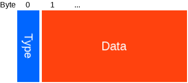
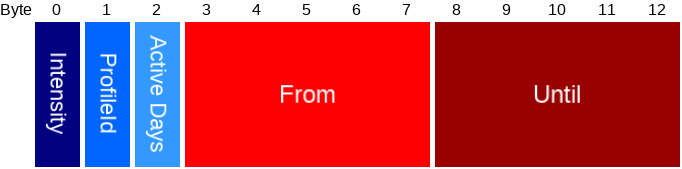
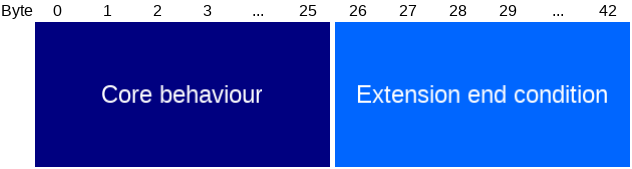
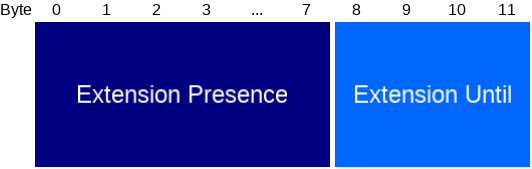
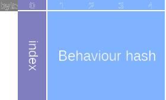
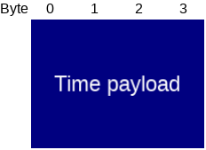
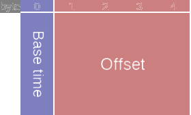
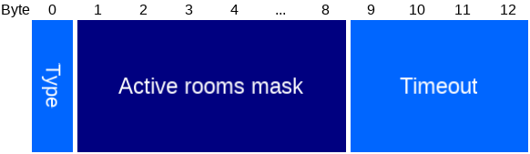
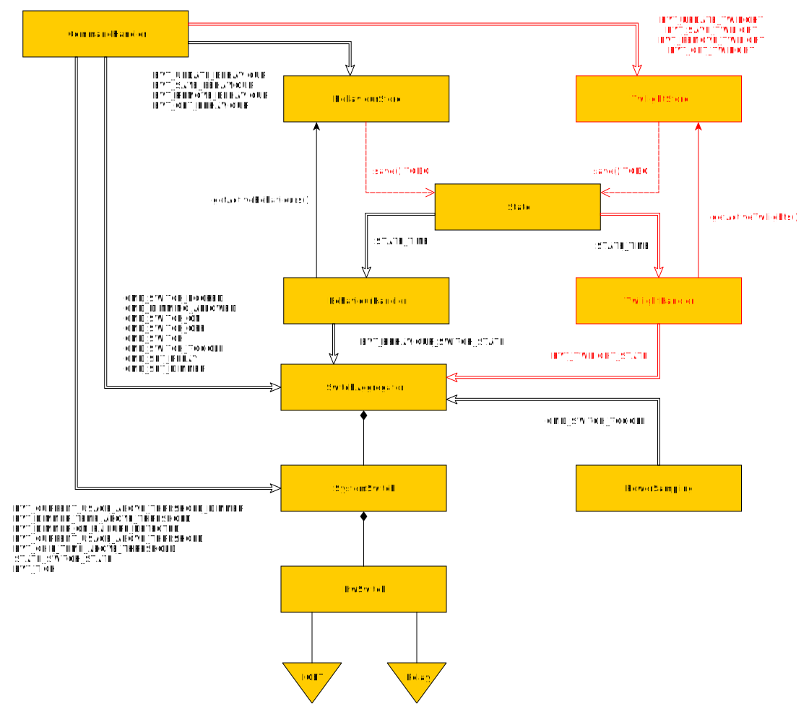

# Behaviour

Behaviours can be set and retrieved. The user can check the [master hash](#behaviour-master-hash) to check if all behaviours are synchronized.

## Table of contents

- [Commands](#behaviour-commands)
- [Packets](#behaviour-packets)

## Behaviour Commands

- [Add](#add-behaviour)
- [Replace](#replace-behaviour)
- [Remove](#remove-behaviour)
- [Get](#get-behaviour)
- [List](#get-behaviour-indices)

### Add behaviour

Add a new behaviour to an empty index.

#### Add behaviour packet

Type | Name | Length | Description
--- | --- | --- | ---
[Behaviour](#behaviour-payload) | Data | ... | Behaviour to add.

#### Result codes

Value | Explanation
--- | ---
NO_SPACE | All behaviour slots have already been taken.
BUSY | The memory was too busy to respond.
SUCCESS | There was a slot free, and memory wasn't busy - request executed. See return payload for details.
... | Other cases may happen in case of exception.

#### Add behaviour result packet

The result will always contain the most current master hash.

Type | Name | Length | Description
--- | --- | --- | ---
uint8 | Index | 1 | The index at which the behaviour is stored, or 255 when not successful.
[Hash](#behaviour-master-hash) | Master hash | 4 | The master hash after handling the request.

### Replace Behaviour

Replace a behaviour at given index by the given behaviour.

#### Replace behaviour packet

Type | Name | Length | Description
--- | --- | --- | ---
uint8 | Index | 1 | Index of the behaviour to replace.
[Behaviour](#behaviour-payload) | Data | ... | Behaviour to replace the current one at given index with.

#### Result codes

Value | Explanation
--- | ---
WRONG_PARAMETER | The index is out of range.
BUSY | The memory was too busy to respond.
SUCCESS | The index is valid and memory could be queried. See return payload for details.
... | Other cases may happen in case of exception.

#### Replace behaviour result packet

The result will always contain the most current master hash.

Type | Name | Length | Description
--- | --- | --- | ---
uint8 | Index | 1 | The index at which the behaviour was replaced.
[Hash](#behaviour-master-hash) | Master hash | 4 | The master hash after handling the request.

### Remove behaviour

Remove the behaviour at given index.

#### Remove behaviour packet

Type | Name | Length | Description
--- | --- | --- | ---
uint8 | Index | 1 | Index of the behaviour to remove.

#### Result codes

Value | Explanation
--- | ---
WRONG_PARAMETER | The index is out of range.
BUSY | The memory was too busy to respond.
SUCCESS | Behaviour at given index is removed, or was already empty.
... | Other cases may happen in case of exception.

#### Remove behaviour result packet

The result will always contain the most current master hash.

Type | Name | Length | Description
--- | --- | --- | ---
uint8 | Index | 1 | The index from which the behaviour was removed.
[Hash](#behaviour-master-hash) | Master hash | 4 | The master hash after handling the request.

### Get behaviour

Retrieve the behaviour at given index.

#### Get behaviour packet

Type | Name | Length | Description
--- | --- | --- | ---
uint8 | Index | 1 | Index of the behaviour to obtain.

#### Result codes

Value | Explanation
--- | ---
WRONG_PARAMETER | The index is out of range.
NOT_FOUND | No behaviour was found at given index.
BUSY | The memory was too busy to respond.
SUCCESS | The index is valid and memory could be queried. See return payload for details.
... | Other cases may happen in case of exception.

#### Get behaviour result packet

If the index is unoccupied, the result payload has length 0.

Type | Name | Length | Description
--- | --- | --- | ---
uint8 | Index | 1 | The index of the requested behaviour.
[Behaviour](#behaviour-payload) | Data | ... | The behaviour that is stored at the given `Index`.

### Get behaviour indices

Query which indices in the behaviour store are currently occupied.

#### Result codes

Value | Explanation
--- | ---
BUSY | The memory was too busy to respond.
SUCCESS | Memory could be queried. See return payload for details.
... | Other cases may happen in case of exception.

#### Behaviour indices result packet

Type | Name | Length | Description
--- | --- | --- | ---
[Index with hash](#index-and-behaviour-hash)[] | list | ... | List of all occupied indices, and their hashes.

## Behaviour packets

#### Behaviour payload

Type | Name | Length | Description
--- | --- | --- | ---
uint8_t | Type | 1 | <ol start="0"><li>[Switch behaviour](#switch-behaviour)</li><li>[Twilight behaviour](#twilight-behaviour)</li><li>[Smart timer](#smart-timer)</li></ol>
uint8_t[] | Data | ... | Type dependent

#### Switch behaviour

Type | Name | Length | Description
--- | --- | --- | ---
uint8 | Intensity | 1 | Value from 0-100, both inclusive, indicating the desired intensity of the device (0 for 'off', 100 for 'fully on')
uint8 | ProfileId | 1 | This behaviour belongs to the given Profile ID. (Currently unused)
[Day of week bitmask](#day-of-week-bitmask) | Active days | 1 | Selects which days of the week this behaviour is active
[Time of day](#time-of-day) | From | 5 | The behaviour is active from, inclusive, this time of day.
[Time of day](#time-of-day) | Until | 5 | The behaviour is active until, exclusive, this time of day.
[Presence description](#presence-description) | Presence | 13 | Description of the presence conditions that need to hold for this behaviour to be active.

#### Twilight behaviour

Type | Name | Length | Description
--- | --- | --- | ---
uint8 | Intensity | 1 | Value from 0-100, both inclusive, indicating the desired intensity of the device (0 for 'off', 100 for 'fully on')
uint8 | ProfileId | 1 | This behaviour belongs to the given Profile ID. (Currently unused)
[Day of week bitmask](#day-of-week-bitmask) | Active days | 1 | Selects which days of the week this behaviour is active
[Time of day](#time-of-day) | From | 5 | The behaviour is active from, inclusive, this time of day.
[Time of day](#time-of-day) | Until | 5 | The behaviour is active until, exclusive, this time of day.

#### Smart timer

A Smart timer consists of a switch behaviour and an exit condition. This can be used to ensure that for example,
when a timer expires it will wait until the room is empty before switching off the device. (Essentially extending the original behaviour.)

At the 'Until'-time of the 'Core' behaviour, it is checked whether the behaviour is still active (i.e. its presence condition is still fullfilled).
If that is the case, a temporary extension for the behaviour is created which is identical to the Core behaviour with the Presence condition replaced
by the Extension Presence and the Until time replaced by the Extension Until time. This temporary rule will be destroyed after the Extension Until time
expires. If the extension end condition timeout is set to 0, the temporary behaviour will be destroyed as soon as the presencecondition is no longer met.

Type | Name | Length | Description
--- | --- | --- | ---
[Switch behaviour](#switch-behaviour) | Core behaviour | 26 | The core behaviour is interpreted identical to switch behaviour.
[End condition](#behaviour-end-condition) | Extension end condition | 17 | Describes the conditions that determine when this extension will be removed.

#### Behaviour end condition

Type | Name | Length | Description
--- | --- | --- | ---
[Presence description](#presence-description) | Extension presence | 13 | Description of the presence conditions that the Extension behaviour will use.

#### Behaviour master hash

The `BehaviourStore` can generate a hash that can be used to verify if an application is up to date. The data that is hashed is as in the following table. The hashing algorithm used is [Fletcher32](https://en.wikipedia.org/wiki/Fletcher%27s_checksum). As this algorithm is based on 16-bit integer array as input each entry in the table below is padded with 0x00 at the end if its length is uneven.

Only indices with non empty behaviours are used to calculate the master hash.

Type | Name | Length
--- | --- | ---
uint8 | Index0 | 1 (padded with 0x00)
[Behaviour](#behaviour-payload) | Behaviour0 | size depends on the type of payload
uint8 | Index1 | 1 (padded with 0x00)
[Behaviour](#behaviour-payload) | Behaviour1 | size depends on the type of payload
... | ... | ...
uint8 | IndexLast | 1 (padded with 0x00)
[Behaviour](#behaviour-payload) | BehaviourLast | size depends on the type of payload

#### Index and behaviour hash

For each behaviour individually, a hash can be calculated as well, similar to the [master hash](#behaviour-master-hash).

Type | Name | Length | Description
--- | --- | --- | ---
uint8 | index | 1 | Index of an occupied behaviour.
uint32 | Behaviour hash | 4 | The hash of the behaviour at this index. Generated by calculating the [Fletcher32](https://en.wikipedia.org/wiki/Fletcher%27s_checksum) hash of the behaviour data, padded with zeroes if necessary.

#### Time difference

Type | Name | Length | Description
--- | --- | --- | ---
int32 | Time payload | 4 | Signed difference in seconds since a known-from-context moment in time (future - past >= 0).

#### Time of day

Type | Name | Length | Description
--- | --- | --- | ---
uint8 | Base time |  1 | <ol start="0"><li>Midnight </li><li>Sunrise </li><li>Sunset</li></ol>
[Time difference](#time-difference) | Offset | 4 | 

#### Day of week bitmask

Type | Name | Length | Description
--- | --- | --- | ---
uint8 | Bitmask | 1 | 0: sunday - 6: saturday. 7: must be 0.

#### Presence description

Given that for each room it is known if there are users present in that room or not, a Presence Description
evaluates to 'true' or 'false'. It can be used to implement behaviours that take current presence into account.

Type | Name | Length | Description
--- | --- | --- | ---
uint8 | Type | 1 | <ol start="0"><li>Vacuously true condition</li><li>Anyone in any of the rooms</li><li>Noone in any of the rooms</li><li>Anyone anywhere in sphere</li><li>Noone anywhere in sphere</li></ol>
uint64 | Active rooms mask | 8 | Room with id `i` corresponds to bit `i` in this mask.
uint32_t | Timeout | 4 | Whenever a presence description is satisfied (evaluates to true), it shall evaluate to true until this time out expires. Use 0 to ignore. Units: seconds.

## Firmware design internals

In the diagram below the event flow concerning Behaviours and Twilights is depicted. Double arrows (annotated) indicate which `event`'s are received and handled by the node pointed to, red/dashed objects indicate not-yet implemented features, aggregation arrows indicate object ownership as in the sense of UML and lines indicate connection to physical domain.

Main essence of the design is that there are multiple ways that a use can operate on the same switch. Each of these has their own semantics, and therefore a piece of software needs to aggregate between these input channels in order to decide what actually will have to happen. This is the job of the SwitchAggregator. The aggregator has a SystemSwitch object which takes care of the safety and integrity of the physical device by monitoring error states and for example blocking access in case of overheating. Any commands passed down from SystemSwitch onto HwSwitch will be pushed into the driver. This last layer allows to abstract away from any hardware specifics and later could be part of the mock-up surface.

Storing behaviours and Twilights will require additional logic in order to ensure synchronisation across different devices/phones. All communication from and to host devices regarding Behaviours and Twilights is extracted into a Store object, that takes care of this matter. The corresponding handler object can access the store to query the active Behaviours/Twilights whenever necessary through a static reference.

