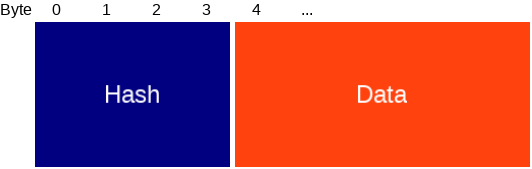
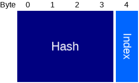
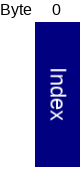
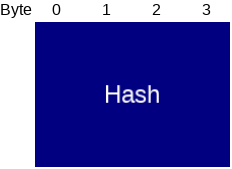

# Behaviour

This document describes the Crownstones' Behaviour concept in more technical detail.

# Table of Contents
1. [Communication API for (smartphone) applications](#api_summary)
2. [Protocol Packet Definitions](#behaviour_protocol)
3. [Firmware Design Internals](#firmware_design)

<a name="api_summary"></a>
# Communication API for (smartphone) applications

To store, update and sync Behaviours, the application can communicate over the Crownstone bluetooth protocol
by sending [Behaviour Packets](PROTOCOL.md#behaviour_packet). The advertized state contains a [Behaviour Hash](#behaviour_hash)
of all stored behaviours, which can be used to identify an out-of-sync condition.


```C++
/**
 * Returns an index in range [0,MaxBehaviours) on succes, 
 * or 0xffffffff if it couldn't be saved.
 */
 uint8_t save(Behaviour b);

/**
 * Replace the behaviour at [index] with [b]
 * postcondition is identical to the
 * postcondition of calling save(b) when it returns [index].
 */
bool replace(uint8_t index, Behaviour b);

/**
 * deletes the behaviour at [index] the behaviour is removed from storage.
 */
bool remove(uint8_t index);

/**
 *  returns the stored behaviour at [index].
 */
Behaviour get(uint8_t index);

/**
 * returns a map with the currently occupied indices and the 
 * behaviours at those indices.
 */
std::vector<std::pair<uint8_t,Behaviour>> get();
```

<a name="behaviour_protocol"></a>
# Protocol Packet Definitions

### Behaviour Commands

<a name="save_behaviour_packet"></a>
#### Save Behaviour Payload



When a Save Behaviour packet is received by the Crownstone, it will try to store the Behaviour represented by `Data` 
to its persistent memory. Upon success, it returns the `Index` (uint8) that can be used to refer to this behaviour. 

Type | Name | Length | Description
--- | --- | --- | ---
[Behaviour](#behaviour_payload) | Data | ... | Behaviour to save

<a name="replace_behaviour_packet"></a>
#### Replace Behaviour Payload


When a Replace Behaviour packet is received by the Crownstone, it will try to replace the behaviour at `index` by the
Behaviour represented by `Data`.


Type | Name | Length | Description
--- | --- | --- | ---
uint8 | Index | 1 | Index of the behaviour to replace
[Behaviour](#behaviour_payload) | Data | ... | Behaviour to replace the current one at given index with

<a name="remove_behaviour_packet"></a>
#### Remove Behaviour Payload



When a Remove Behaviour packet is received by the Crownstone, it will try to remove the behaviour at `index`.

Type | Name | Length | Description
--- | --- | --- | ---
uint8 | Index | 1 | Index of the behaviour to remove

<a name="get_behaviour_packet"></a>
#### Get Behaviour Payload



When a Get Behaviour packet is received by the Crownstone it will retrieve the behaviour at given `Index`. 
If such behaviour exists, it is returned.

Type | Name | Length | Description
--- | --- | --- | ---
uint8 | Index | 1 | Index of the behaviour to obtain. 0xff for 'get all'

<a name="behaviour_payload"></a>
#### Behaviour Payload


Type | Name | Length | Description
--- | --- | --- | ---
uint8_t | Type | 1 | <ol start="0"><li>[Switch Behaviour](#switch_behaviour)</li><li>[Twilight Behaviour](#twilight_behaviour)</li><li>[Smart Timer](#smart_timer)</li></ol>
uint8_t[] | Data | ... | Type dependent

<a name="switch_behaviour"></a>
#### Switch Behaviour


Type | Name | Length | Description
--- | --- | --- | ---
uint8 | Intensity | 1 | Value from 0-100, both inclusive, indicating the desired intensity of the device (0 for 'off', 100 for 'fully on')
uint8 | Options | 1 | Reserved for future use
[Day Of Week Bitmask](#day_of_week_bitmask) | Active Days | 1 | Selects which days of the week this behaviour is active
[Time Of Day](#time_of_day) | From | 5 | The behaviour is active from, inclusive, this time of day.
[Time Of Day](#time_of_day) | Until | 5 | The behaviour is active until, exclusive, this time of day.
[Presence Description](#presence_description) | Presence | 13 | Description of the presence conditions that need to hold for this behaviour to be active. 

<a name="twilight_behaviour"></a>
#### Twilight Behaviour


Type | Name | Length | Description
--- | --- | --- | ---
uint8 | Intensity | 1 | Value from 0-100, both inclusive, indicating the desired intensity of the device (0 for 'off', 100 for 'fully on')
[Day Of Week Bitmask](#day_of_week_bitmask) | Active Days | 1 | Selects which days of the week this behaviour is active
[Time Of Day](#time_of_day) | From | 5 | The behaviour is active from, inclusive, this time of day.
[Time Of Day](#time_of_day) | Until | 5 | The behaviour is active until, exclusive, this time of day.

<a name="smart_timer"></a>
#### Smart Timer

A Smart Timer consists of a Switch Behaviour and an exit condition. This can be used to ensure that for example,
when a timer expires it will wait until the room is empty before switching off the device. (Essentially extending the original behaviour.)

At the 'Until'-time of the 'Core' behaviour, it is checked wether the behaviour is still active (i.e. its presence condition is still fullfilled).
If that is the case, a temporary extension for the behaviour is created which is identical to the Core behaviour with the Presence condition replaced
by the Extension Presence and the Until time replaced by the Extension Until time. This temporary rule will be destroyed after the Extension Until time
expires. 


Type | Name | Length | Description
--- | --- | --- | ---
[Switch Behaviour](#switch_behaviour) | Core Behaviour | 20 | The core behaviour is interpreted identical to Switch Behaviour.
[End Condition](#behaviour_end_condition) | Extension End Condition |  | 

<a name="behaviour_end_condition"></a>
#### Behaviour End Condition


Type | Name | Length | Description
--- | --- | --- | ---
[Presence Description](#presence_description) | Extension Presence | 8 | Description of the presence conditions that the Extension behaviour will use.
[Time Difference](#time_difference) | Extension Until | 4 | Extend the core behaviour's 'Until' time by at least the given time difference, possibly longer if the extension presence condition is still satisfied after this time difference expires. Negative values will be rounded up to 0.

<a name="behaviour_hash"></a>
#### Behaviour Hash



Type | Name | Length | Description
--- | --- | --- | ---
uint32 | Hash | 4 | [Fletcher32](https://en.wikipedia.org/wiki/Fletcher%27s_checksum) hash of a [Behaviour Payload](#behaviour_payload)

<a name="time_difference"></a>
#### Time Difference


Type | Name | Length | Description
--- | --- | --- | ---
int32 | Time Payload | 4 | Signed difference in seconds since a known-from-context moment in time (future - past >= 0).

<a name="time_of_day"></a>
#### Time of Day


Type | Name | Length | Description
--- | --- | --- | ---
uint8 | Base Time |  1 | <ol start="0"><li>Midnight </li><li>Sundown </li><li>Sunrise</li></ol>
[Time Difference](#time_difference) | Offset | 4 | 

<a name="day_of_week_bitmask"></a>
#### Day of Week Bitmask


Type | Name | Length | Description
--- | --- | --- | ---
uint8 | Bitmask | 1 | 0: sunday - 6: saturday. 7: must be 0.

<a name="presence_description"></a>
#### Presence Description

Given that for each room it is known if there are users present in that room or not, a Presence Description
evaluates to 'true' or 'false'. It can be used to implement behaviours that take current presence into account.


Type | Name | Length | Description
--- | --- | --- | ---
uint8 | Type | 1 | <ol start="0"><li>Vacuously true condition</li><li>Anyone in any of the rooms</li><li>Noone in any of the rooms</li><li>Anyone anywhere in sphere</li><li>Noone anywhere in sphere</li></ol>
uint64 | Active Rooms Mask | 8 | Room with id `i` corresponds to bit `i` in this mask.
uint32_t | Timeout | 4 | 

<a name="firmware_design"></a>
# Firmware Design Internals

In the diagram below the event flow concerning Behaviours and Twilights is depicted. Double arrows (annotated) indicate which `event`'s are received and handled by the node pointed to, red/dashed objects indicate not-yet implemented features, aggregation arrows indicate object ownership as in the sense of UML and lines indicate connection to physical domain.

Main essence of the design is that there are multiple ways that a use can operate on the same switch. Each of these has their own semantics, and therefore a piece of software needs to aggregate between these input channels in order to decide what actually will have to happen. This is the job of the SwitchAggregator. The aggregator has a SystemSwitch object which takes care of the safety and integrity of the phyisical device by monitoring error states and for example blocking access in case of overheating. Any commands passed down from SystemSwitch onto HwSwitch will be pushed into the driver. This last layer allows to abstract away from any hardware specifics and later could be part of the mock-up surface.

Storing behaviours and Twilights will require additional logic in order to ensure synchronisation accross different devices/phones. All communication from and to host devices regarding Behaviours and Twilights is extracted into a Store object, that takes care of this matter. The corresponding handler object can access the store to query the active Behaviours/Twilights whenever necessary through a static reference.


