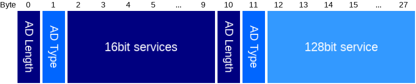
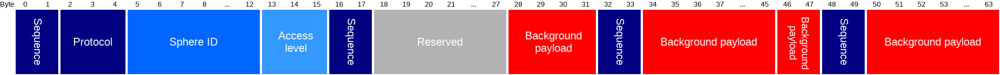
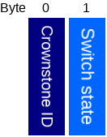

# Bluenet broadcast protocol v4.0.0
-----------------------------------

This only documents the latest protocol, older versions can be found in the git history.

# Index
- [Background](#background_broadcasts)
- [Command](#command_broadcasts)

# Background broadcasts

These are meant to be broadcasted by phones all the time.

#### Background broadcast advertisement

The packet that the phone should advertise to send a background broadcast.

Type | Name | Length | Description
--- | --- | --- | ---
uint8 | AD Length | 1 | Length of the next AD structure.
uint8 | AD Type | 1 | 0xFF: Manufacturer specific data.
uint8 | Company id | 2 | 0x004C: Apple.
uint8 | type | 1 | 0x01: Services bitmask.
uint8 [] | Services bitmask | 16 | Consists of 3x the same [data](#background_adv_data) plus 2 unused bits.

#### Background broadcast data

Type | Name | Length in bits | Description
--- | --- | --- | ---
uint8 | Protocol | 2 | Protocol version, currently 0.
uint8 | Sphere ID | 8 | Hash of the sphere ID, acts as filter, so that not every advertisement has to be decrypted.
uint16 [] | Payload | 32 | Encrypted [payload](#background_adv_payload), using 32b RC5 with 128b localization key.

#### Background broadcast payload

Type | Name | Length in bits | Description
--- | --- | --- | ---
uint16 | Validation | 16 | Validation: current local time as unix timestamp, right shifted by 7.
uint8 | Location ID | 6 | ID of the location where the user is.
uint8 | Profile ID | 3 | ID of the profile the user is using.
uint8 | RSSI offset | 4 | Offset from standard signal strength. Divide by 2, then add 8.
uint8 | flags | 3 | [Flags](#background_adv_flags).

#### RC5 broadcast payload

Type | Name | Length in bits | Description
--- | --- | --- | ---
uint8 | Counter | 8 | Count of the broadcast command. This value should be increased for each newly broadcasted command.
uint8 | Reserved | 8 | Reserved for future use.
uint8 | Location ID | 6 | ID of the location where the user is.
uint8 | Profile ID | 3 | ID of the profile the user is using.
uint8 | RSSI offset | 4 | Offset from standard signal strength. Divide by 2, then add 8.
uint8 | flags | 3 | [Flags](#background_adv_flags).

#### Background broadcast flags

Bit | Name |  Description
--- | --- | ---
0 | Reserved | Reserved for future use.
1 | Ignore for behaviour | Set to 1 when this broadcast should be ignored for behaviour rules.
2 | Tap to toggle | Set to 1 when this phone has tap to toggle enabled.

## Command broadcasts

These are meant to be broadcasted by phones for specific commands, like switching Crownstones.

#### Command broadcast advertisement

The packet that the phone should advertise to send a command broadcast.

Type | Name | Length | Description
--- | --- | --- | ---
uint8 | AD Length | 1 | 9: Length of the next AD structure.
uint8 | AD Type | 1 | 0x03: Complete list of 16 bit service UUIDs.
uint16 [] | 16bit services | 8 | List of four 16 bit service UUIDs, which are used as [header](#command_adv_header) data.
uint8 | AD Length | 1 | 17: Length of the next AD structure.
uint8 | AD Type | 1 | 0x07: Complete list of 128 bit service UUIDs.
uint64[] | 128bit service | 16 | Single 128 bit service UUID, which is used as [encrypted payload](#command_adv_payload), sent as two uint64.

#### Command broadcast header

Type | Name | Length in bits | Description
--- | --- | --- | ---
uint8 | Sequence | 2 | 0: Sequence of this service UUID.
uint8 | Protocol | 3 | Protocol version, currently 0.
uint8 | Sphere ID | 8 | Sphere ID that must be the same as given during setup. Used to filter out broadcasts that are not meant for this Crownstone.
uint8 | Access level | 3 | Shortened access level: 0=admin, 1=member, 2=basic, 4=setup.
uint8 | Sequence | 2 | 1: Sequence of this service UUID.
uint8 | Reserved | 2 | Reserved for future use.
uint8 | Device token | 8 | Token of this device, should be unique per device (phone) in the sphere.
uint16 | Background payload | 4 | First 4 bits of first block of [encrypted background payload](#background_adv_payload).
uint8 | Sequence | 2 | 2: Sequence of this service UUID.
uint16 | Background payload | 12 | Last 12 bits of first block of [encrypted background payload](#background_adv_payload).
uint16 | Background payload | 2 | First 2 bits of second block of [encrypted background payload](#background_adv_payload).
uint8 | Sequence | 2 | 3: Sequence of this service UUID.
uint16 | Background payload | 14 | Last 14 bits of second block of [encrypted background payload](#background_adv_payload).

#### Command broadcast payload

Type | Name | Length | Description
--- | --- | --- | ---
uint32 | Validation | 4 | Validation in the form of a local time unix timestamp.
uint8 | Command type | 1 | See the list of [types](#command_adv_types).
uint8[] | Command data | 11 | Depends on command type.

#### Command broadcast types

Type nr | Type name | Payload type | Payload Description | A | M | B | S
--- | --- | --- | --- | :---: | :---: | :---: | :--:
0 | No operation | - | None | x | x | x |
1 | Multi switch | [Multi switch short list packet](#multi_switch_short_list_packet) | List of switch commands | x | x | x |

##### Multi switch short list packet

Type | Name | Length | Description
--- | --- | --- | ---
uint 8 | Count | 1 | Number of valid entries.
[Multi switch short entry](#multi_switch_short_entry_packet) [] | List | 10 | A list of switch commands.

##### Multi switch short entry

Type | Name | Length | Description
--- | --- | --- | ---
uint 8 | Crownstone ID | 1 | The identifier of the crownstone to which this item is targeted.
uint 8 | Switch state | 1 | The switch state to be set by the targeted crownstone. 0 = off, 100 = fully on.

