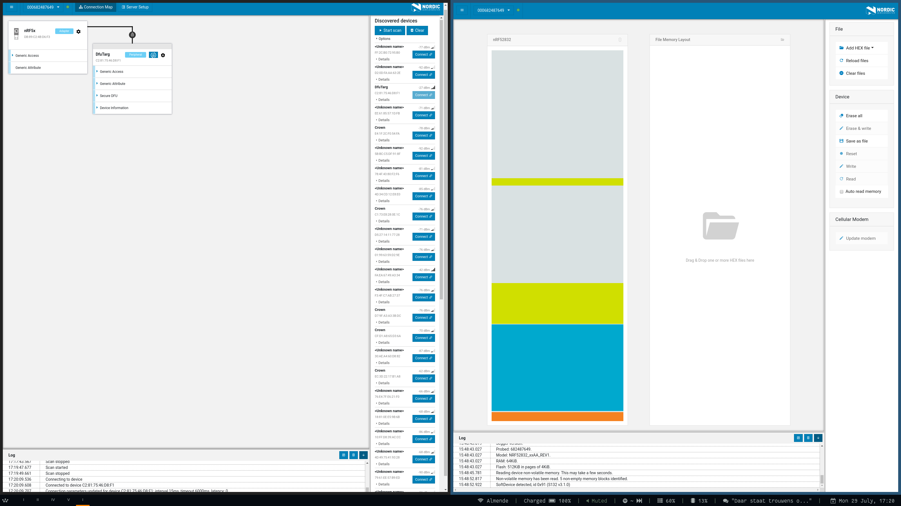

# Build system

We are using the `CMake` build system. There are some old scripts in `source/scripts`. They are slowly phased out
to make place for `CMake` equivalents.

The purpose of [CMake](https://cmake.org/):

* Compilation that is independent of platform and compiler.

In practice we do not need so much to be independent of the compiler, but the independence of the platform potentially
means we can support development on both Linux, Mac, as well as Windows. Moreover, it has the following benefits,
especially if also used to download prerequisite tools.

* More reliable code completion in code editors
* Same versions of build tools for every developer
* The version of the tools that have been used are checked into the code repository can can be used for reproduction.
* Continuous integration by a few simple commands
* Construction of a docker image by a few simple commands

# Downloads

All downloaded tools are now part of the build as well. There is a parent directory that downloads all software that
is required. This is:

* Nordic SDK
* Nordic Mesh
* Nordic nrfutil software
* GNU cross-compiler
* JLink tools

The Softdevice is part of the Nordic SDK and does not need to be downloaded separately. The Jenkins continuous 
integration system does not need to download JLink and the nrfutil software henceforth they can be excluded from the
build by

    cmake .. -DDOWNLOAD_JLINK=OFF -DDOWNLOAD_NRFUTIL=OFF

If you update the version of one of the supporting tools, you will also need to update the md5 hash in the parent
`CMakeLists.txt` file. This has the following syntax:

    set(NORDIC_NRF5_SDK_DOWNLOAD_URL ${NORDIC_DOWNLOAD_URL}/SDKs/nRF5/Binaries/nRF5SDK153059ac345.zip)
    set(NORDIC_NRF5_SDK_MD5 46a8c9cd4b5d7ee4c5142e8fae3444c4)

If you upgrade to a new file, download it, and run `md5sum *` on the command line. Then update both name and hash in
the `CMakeLists.txt` file.

There are some other tools from Nordic that are convenient to use. They are optional, however, they are quite 
convenient. For example, reading out the memory layout is implemented very nicely (see Figure).

You can enable the download of `nrfconnect` by:

    cmake .. -DDOWNLOAD_NRFCONNECT=ON
    make

This particular tool requires `npm`. Install it through something like `sudo apt install npm`. Subsequently, it downloads a lot of stuff, amongst which also `nrfjprog` it it cannot find it. Make sure it does not lead to 
version conflicts. You can run these by:

    make nrfconnect_core_setup
    make nrfconnect_core

These run in separate shells. The `_setup` you at least have to run once. After that it can do continuous rebuilds.
You can select the tool to use from the list of apps. By default there are now quite a few apps there. The 
programmer can also be downloaded separately by setting the `-DDOWNLOAD_NRFCONNECT_PROGRAMMER` flag at `CMake`.

## Patches

There are at times patches required for the tools that are downloaded. They can be found in the `patch` directory.
That directory contains a `README.md` file with general instructions and if lucky explanations of the patches. In
general patches are generated through something like (take the mesh SDK as example):

    diff -ruN tools/mesh_sdk tools/mesh_sdk_patched > patch/00mesh.patch

A patch is applied in the workspace directory.

# Configuration

Loading a particular board configuration, say `config/default/CMakeBuild.config`, is done in a cross-platform manner,
namely by reading out the file and parsing it in CMake itself.

The file that does this can be found in `source/conf/cmake/modules/load_configuration.cmake`. It loads the file that
it's given as its first parameter and adds to the list that it's given as its second parameter. This list is just a
list in the form of "-DKEY0:STRING=VALUE0 -DKEY1:STRING=VALUE1". 
This can be forwarded to other CMake projects, but does not yet give this particular build access to those keys and 
values. Henceforth, a side-effect of this function is that it also sets those keys with their values in the 
`PARENT_SCOPE`. That means that values like `SERIAL_NUM`, `GDB_PORT` etc. become available to the parent CMake build.

There is also a `config/$target/CMakeBuild.overwrite.config` file that will be sourced after 
`config/$target/CMakeBuild.config` and that you can use to write specifics to the particular system you are working on.

There is also a `config/$target/CMakeBuild.runtime.config` file that will only be used at **runtime**. This means that
if you set `SERIAL_NUM` or `GDB_PORT` in this file, it will immediately pick up these values without you having to
run `cmake`. For example `make reset` will immediately reset the right device (without a configuration or compilation step).

# Dependency on configuration

The dependency on the configuration file is made possible to adding it explicitly as a dependency on the source files.
Only adding it as dependency on the target will cause the linker to run again after changing configuration values,
but it does not run the compiler because it does not know that object files could potentially change. 

A different solution strategy would be to have a `configure_file` command that generates a header file from our
configuration file, so that automatically only the source files that link into this changed header file will need to
be rebuild. However, in our build we allow for multiple targets. This would either:

1. Have a header file in the code repository that changes all the time. By switching from board to board the 
entire compilation tree has to be rebuild.
2. Have a header file in the separate `config/boardX` directory. This however complicates the building process. The
source files have to link suddenly to some header file on a dynamic location. This is likely to confuse any IDE.

The disadvantage is that we have a very large set of compiler flags that we pass to the compiler. If not running
make as `VERBOSE=1 make`, those will not be visible to the user.

To actually add this dependency we need `set_source_files_properties` with `OBJECT_DEPENDS`:

    set_source_files_properties(${FOLDER_SOURCE}
	    PROPERTIES OBJECT_DEPENDS ${WORKSPACE_DIR}/config/${BOARD_TARGET}/CMakeBuild.config
    )

Also add the dependency to the target binary.

We do one thing more, we also make sure CMake itself is triggered on a change.

    set_property(DIRECTORY APPEND PROPERTY CMAKE_CONFIGURE_DEPENDS ${WORKSPACE_DIR}/config/${BOARD_TARGET}/CMakeBuild.config)

Beautiful. :-)

# Board versions

To actually extract the proper board versions, we do some string manipulation using `CMake` itself. The file can be
found in `source/conf/cmake/modules/load_hardware_version_mapping.cmake`. This defines two functions. One returns
the board version given a board name. The other maps the other way around.

This function requires the header file `source/include/cfg/cs_Boards.h` as first argument. It parses all the 
macro definitions and will use those as mappings.

    #define ACR01B10D    1008

The regular expression might actually fail if you create fancy commands with `#define` statements in there. The 
mapping is used to write the board version to UICR.

    make write_hw_version

Reading it, uses the inverse function.

# Target

The target is something like `crownstone`. However, there are other files that are generated as well. There is a 
binary file, a hex file, and an elf file. The file without extension is the same as the .elf file. Then there are
two more files generated:

    ${CMAKE_OBJCOPY} -O binary ${PROJECT_NAME} ${PROJECT_NAME}.bin
    ${CMAKE_OBJCOPY} -O ihex ${PROJECT_NAME} ${PROJECT_NAME}.hex

The executable is made dependent on those files, so they will always be generated. The .hex file is the one accepted
by the `nrfjprog` tool. The `.bin` file might be used by less sophisticated tools. The .elf file is required for
debugging (it contains the symbols).

# Hierarchy

The parent build uses `ExternalProject` to both download the external dependencies and compile the `bluenet` source
directory (which in its turn also compiles the bootloader). The latter is not done through `ExternalProject`, but
directly by `add_subdirectory`. This means that all cross-compilation information is directly available to it. It
also means that the bootloader is build together with the firmware.

# Similarly named header files

Both the firmware as well as the bootloader use an `sdk_config.h` file. They are located in different directories.
Due to the fact that the bootloader is linked through `add_subdirectory` it inherits all the same include directories.
It is important to not include the directory in which aforementioned file is stored. 

Hence, we add this include directory only to firmware target (not the bootloader):
    
    set(INCLUDE_DIR "include" "include/ble" "include/third") # not here
    ...
    target_include_directories(${PROJECT_NAME} PRIVATE "include/third/nrf") # here

Note, it is harder to figure out that the wrong file is used when the `ifndef` macro only checks on a mangled filename:

    #ifndef SDK_CONFIG_H
    #define SDK_CONFIG_H
    ...
    #endif

You might be surprised by which file gets included. There's a perfectly modern alternative

    #pragma once

Use that. Yes, it is non-standard, but [convince me](https://stackoverflow.com/questions/787533/is-pragma-once-a-safe-include-guard).

# External tools

The proper way to use an external tool such as nrfjprog where we have to process the output is by using a dedicated
CMake script. An example is given in `nrfjprog.cmake`.

This changes a call like the following

    COMMAND nrfjprog -f nrf52 --memrd 0x000300C 

To something like

    COMMAND ${CMAKE_COMMAND} -DINSTRUCTION:STRING=READ -DADDRESS:STRING=0x000300C -P ${DEFAULT_MODULES_PATH/nrfjprog.cmake

We want to do this because we want to parse the output of such a command. By incorporating it into a CMake script we
can use `execute_process`. This can run a utility like `nrfjprog` and can capture stdout, stderr, and the error status.
Subsequently, we can use CMake itself to process the results with the appropriate regular expressions.

For now, this has been implemented for `make read_softdevice_version`. Other calls where we process the output of a
command line tool have to be implemented still. 

Note that the `-P` switch has to be the last one. In the code a set of defines are put together in the variable
`${DEFAULT_NRFUTIL_READ_DPARAM}`.

# TODO

The following things can be done:

* The external tools that are downloaded right now are the ones for a Linux OS. The .zip, .gz, and .deb files have
to be adjusted for another OS. Their installation commands needs to be adjusted as well.
* The patches in `PATCH_COMMAND` after a download are OS specific.
* Implement cross-platform file for external commands other than `make read_softdevice_version`.

# Tips & Tricks

The difference between `SET` and `OPTION` is minimal. The latter only has `ON` and `OFF` as values. That's all.

## Cross-platform

If an external `COMMAND` is executed, always use the CMake built-in option (`CMAKE_COMMAND`) if it's available.

    COMMAND ${CMAKE_COMMAND} -E echo "This one"
    COMMAND echo "Not this one"

The first command is cross-platform, the second is not.

## Spaces

In an external `COMMAND` CMake is often placing a backslash in from of a space. This is not always solved by adding
VERBATIM. There is however another "trick".

This does NOT work:

    set(SERIAL_SWITCH_AND_NUM "--snr 123456")
    ...
    COMMAND nrfjprog -f nrf52 --memrd 0x000300C ${SERIAL_SWITCH_AND_NUM}

The following DOES work

    set(SERIAL_SWITCH "--snr")
    set(SERIAL_NUM "123456")
    ...
    COMMAND nrfjprog -f nrf52 --memrd 0x000300C ${SERIAL_SWITCH} ${SERIAL_NUM}

## Clean

You might think dependencies are managed by `make`, but this is not true. The dependencies are managed by `cmake`. See for example [this question on SO](https://stackoverflow.com/questions/56155681/cmake-make-object-dependency-issue-not-rebuilding-when-header-changes). A `depend.make` file is generated by `cmake` and especially if particular header files are not used anymore after a refactoring it might be the case that this file is not updated. Just running `make clean` is not sufficient. You can rebuild the dependencies by:

    make depend
    
For any suggestion to improve the build system, file an issue at the issue tracker on github!
