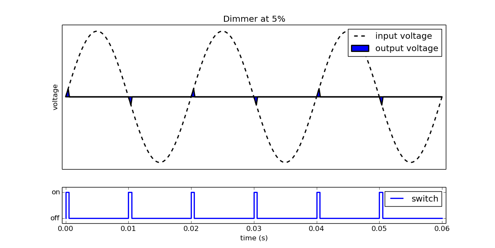

# Dimmer
--------

The Crownstone can act as a regular dimmer. It does so by switching the power on and off very quickly (100Hz). It's best explained visually: 

### Dimmer type

Currently it's a trailing edge dimmer. In short, this means it turns on when there is 0V, and turns off when there is voltage. This is usually better for the life-time of lights, as there is no sudden inrush of electricity.

### Compatibility

All dimmable lights that we tested, worked great! We keep up a list of lights [here](https://crownstone.rocks/compatibility/dimming/).

#### Ikea
- [LEDARE E27 400 lumen](http://www.ikea.com/nl/nl/catalog/products/00347874/).
- [LUNNOM E14 200 lumen](http://www.ikea.com/nl/nl/catalog/products/10342833/).
- [LEDARE E27 1800 lumen](http://www.ikea.com/nl/nl/catalog/products/70305979/).
- [LEDARE E14 400 lumen](http://www.ikea.com/nl/nl/catalog/products/70358703/).

#### Philips
- [Led spot 8718696582558](https://www.philips.nl/c-p/8718696582558/led-spot-dimbaar)
- Led kaars 9290002726. Dimmable, but 35% is already similar to 100%.

#### Lucide
- [Led Bulb 5411212491046](http://www.lucide.be/nl/productinformatie/p/49032-05-62/lamp/led-bulb)
- [Led Bulb 5411212490896](http://www.lucide.be/nl/productinformatie/p/49017-05-62/lamp/led-bulb)

#### KS
- [Classic Gold Rustic Led 3857](https://www.nostalux.nl/Buitenverlichting/lichtbronnen/lamp-edison-led-3857.html)

### Persistence

The state of the dimmer is saved, so that when you turn the Crownstone off and on again, the dimmer will be at same percentage again.
Unfortunately, it currently takes about 2 seconds before the dimmer state is restored, as it takes some time for the internal power supply to initialize. However, this delay can be reduced by software improvements later on.
