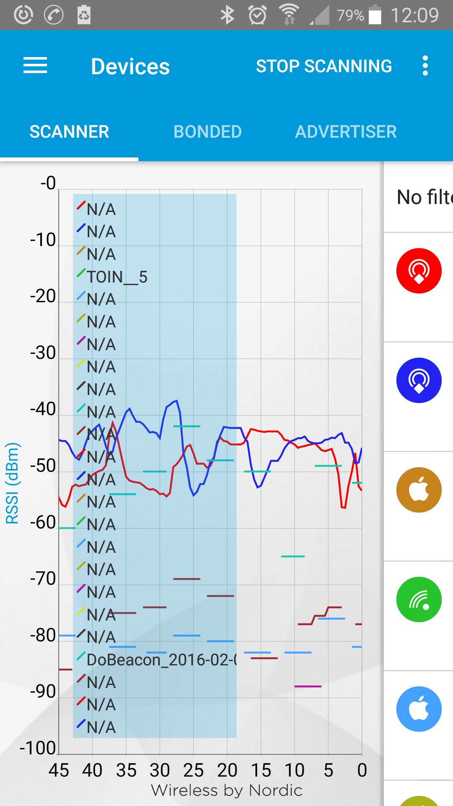

# Indoor Localization

The localization of smartphones is through receiving BLE packets from the Crownstones. It is important that those smartphones do not need to connect to get information from the Crownstones. That's why there is information incorporated in an encrypted form in the advertisement packets. The type of advertisement packet we use is that according to iBeacon.

The difference between the Crownstones and ordinary iBeacons (that you can buy off the shelf everywhere) are manifold:

* Crownstones do not need batteries. So they are more an internet-of-things backbone than a one-off pilot with (1) skyrocketing maintenance costs, (2) problems about them being moved all the time, (3) problems with theft.
* Crownstones can switch, dim, and monitor the power consumption of devices and lights. You get comfort and energy savings, not just indoor localization.
* Crownstones use not a single beacon to detect if it is close. It uses signals from multiple beacons to figure out in which room a person resides. 

## iBeacon 

It is possible to receive iBeacon advertisement frames on Android. However, the devices have very different behaviour regarding the regularity with which the advertisements are received.

## Eddystone

We were pleasantly surprised by how smooth the curves are for receiving Eddystone messages on Android devices! It must have been the case that a different team has been working on making this perfect!

Any other message type is received much less regularly!
