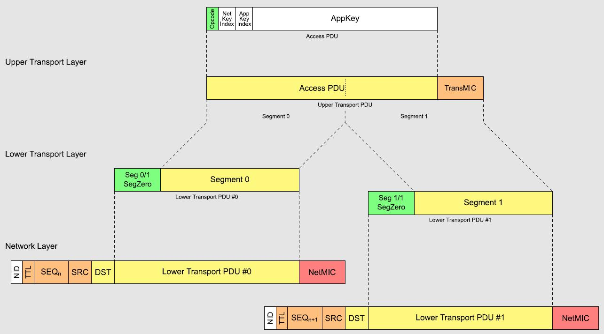
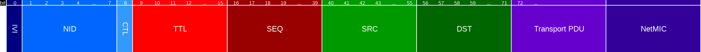
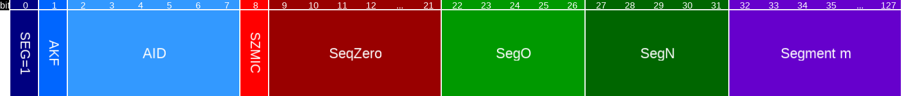
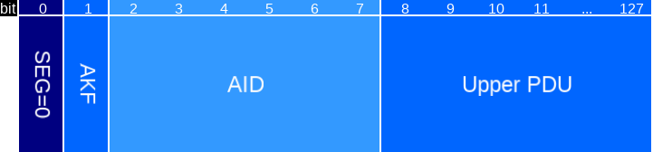

# Mesh

The bluenet firmware supports Bluetooth Mesh. On top of Bluetooth Mesh (spec, [pdf](https://www.bluetooth.org/docman/handlers/downloaddoc.ashx?doc_id=457092)) we have defined a protocol, which can be found
[here](MESH_PROTOCOL.md).

Bluetooth mesh uses **flooding**. Each node broadcasts to all its neighbouring nodes. All authenticated network packets
it receives (and that are not in the message cache) are retransmitted with a time-to-live (TTL) counter that is
decrementing with each hop.

layer | function
---|---
model | application-level (e.g. a Light Lightness Model)
access | encrypted communication (application level), data verification
upper transport | encrypted communication (application/device level), transport control (heartbeat)
lower transport | reliable mechanism (acknowledgements), desegmentation and segmentation
network | encrypted on the network level, defines how to relay
bearer | mesh packets (protocol data units or PDUs) which implement an advertising bearer and a GATT bearer
BLE | the Bluetooth LE stack

There are also some special roles for nodes in a Bluetooth Mesh.

node | function
---|---
relay | retransmit incoming messages
low-power | reduce duty-cycle to save energy
friend | save messages intended for low-power nodes
proxy | implement access to the mesh for non-mesh Bluetooth LE devices

The bluenet firmware is intended for behind power outlets: sufficient power! Hence, each node is a **relay**. Those 
**low-power** nodes need **friend** nodes to save their messages for them when they wake up. This is not necessary
for our use case. The firmware also does not implement the **proxy** role (the GATT bearer at the bearer level).
The bluenet firmware already defines services and characteristics to interface with the firmware. This would only add
a second redundant route and increase required memory resources.

## Encryption

There are three levels of encryption:

key | function
---|---
network | be able to relay messages in the mesh but cannot access application data
application | encrypt/decrypt between e.g. light switches and light bulbs and no other applications (only valid within the same mesh)
device | secures communication between a yet unprovisioned device and a provisioner

It is a very nice feature of Bluetooth mesh that it is possible to relay data for other applications without the
ability to inspect that data.

The protocol defines a mechanism for the removal of a node. Regretfully this does not anything sophisticated from the
broadcast encryption literature. It requires redistribution of new network keys and application keys to all remaining
nodes that are not put on the blacklist.

A privacy key can be derived from the network key to obfuscate, for example, a source address. Due to it being derived
from the network key, other nodes in the mesh can decrypt it.

Replay attacks are countered by a sequence number (SEQ) and an initialization vector (IV) index. A message is only
accepted if it is sufficiently new (brought about by simple incrementing). The SEQ (3 bytes) is actually send over 
the air and the IV (4 bytes) is only very slowly changing and considered to be known by the network.

The encryption itself is done through AES-CCM (just as Bluetooth LE).

## Mesh messages

This overview from silabs gives the best insight into segmentation.



Compare this image with the information below to get a grasp on the make-up of a packet.

### Mesh message packet



Type | Name | Length in bits | Description
--- | --- | --- | ---
uint8 | IVI | 1 | Least significant bit of IV index
uint8 | NID | 7 | Network-based ID. Derived from network key to indentify the mesh
uint8 | CTL | 1 | Access message versus control message
uint8 | TTL | 7 | Time to live
uint8 | SEQ | 24 | Sequence number
uint8 | SRC | 16 | Source address
uint8 | DST | 16 | Destination address
uint8 | Transport PDU | N | Packet contents
uint8 | NetMIC | 32 | Network Message Integrity Check (64 bits for a control message)

The first byte are in the clear, then there are a couple obfuscated, and destination and transport payload are 
encrypted. The transport PDU is of of a maximum size of 128 bits (16 bytes) for an access message and 96 bits (12 bytes)
for a control message. The total message is 31 bytes.

The TTL can have a value of `0`. In that case the message will not be relayed. This means all receiving nodes will
know that this message is a single radio link away. This can be used to build up a topology of the network.

### Segmented message

The transport payload can be separated into multiple segments. However, this eats a little bit from the payload to 
indicate the segment index and count. For our access messages with a transport PDU of 16 bytes:



Type | Name | Length in bits | Description
--- | --- | --- | ---
uint8 | SEG=1 | 1 | High bit means a segmented message
uint8 | AKF | 1 | Indicates the application layer key
uint8 | AID | 6 | Defines the application layer key
uint8 | SZMIC | 1 | Indicates that the size of the NetMIC in the upper layer is 4 bytes (32 bits)
uint8 | SeqZero | 13 | Least significant bits of SeqAuth.
uint8 | SegO | 5 | Segment number of segment m
uint8 | SegN | 5 | Maximum number of segments
uint8 | Segment m | 96 | The segment itself (for last segment can be 8 up to 96 bits)

You see that a single segmented message contains 96 bits or only 12 bytes. It is actually even worse. Even that
segment is not free to define.

Type | Name | Length in bits | Description
--- | --- | --- | ---
uint8 | Opcode | 24 | A manufacturer-specific opcode starts with `11` and takes 3 bytes.
uint8 | Payload | 40 | Actual contents (5 bytes)
uint8 | TransMIC | 32 | Transport Message Integrity Check (4 bytes)

Note that there are only 5 bytes of actual contents left (8 bytes if you add the opcode)!

### Unsegmented message

A single unsegmented message has slightly more space for data (because there is no segmentation overhead).



Type | Name | Length in bits | Description
--- | --- | --- | ---
uint8 | SEG=0 | 1 | Low bit means a segmented message
uint8 | AKF | 1 | Indicates the application layer key
uint8 | AID | 6 | Defines the application layer key
uint8 | Upper PDU | 120 | The upper transport access PDU

There are 120 bits (15 bytes). And again this is divided into:

Type | Name | Length in bits | Description
--- | --- | --- | ---
uint8 | Opcode | 24 | A manufacturer-specific opcode starts with `11` and takes 3 bytes.
uint8 | Payload | 64 | Actual contents (8 bytes)
uint8 | TransMIC | 32 | Transport Message Integrity Check (4 bytes)

There are 64 bits for the message (8 bytes).

The [protocol](MESH_PROTOCOL.md) uses one byte for the message type which leaves 7 bytes for contents to be communicated
over the mesh. Note that this not contain versioning. From the first byte starting with `11` we might use the remaining six to do versioning later on.

## Radio access

Underlying mesh as well as listening for or setting up Bluetooth connections, broadcasting Bluetooth LE advertisements,
etc. is the same physical radio. Hence, we need **time multiplexing**.

The mesh stack implements a Bluetooth LE compliant **scanner**. This is enabled through:

```
MESH_SCANNER = 1
```

We use actually a clone of the implementation on the Bluetooth Mesh by Nordic (see [here](https://github.com/crownstone/nRF5-SDK-for-Mesh)) which implements **active scanning**. The default is passive scanning which only listens on the
radio for incoming advertisements. Active scanning means that the firmware asks for more information in the form of
a **scan response request** and gets this information as a **scan response**.

Over the course of time broadcasts of advertisements on iOS are moving more and more data into scan responses. First, when having apps running in the background, but this might be now the case for apps running in the foreground as well. This is why those **scan response requests** are important to send out. The details of this can be found in the [broadcast protocol](BROADCAST_PROTOCOL.md).

Similarly, it has **advertiser(s)** implemented as well. We do use both the ordinary advertiser in the nRF5 SDK and
the advertiser in the mesh.

The address we use for the Bluetooth Mesh is decremented with one w.r.t. default factory address for the node. It is
set to the same for all roles (but only the relay role is used).

```
mesh_opt_core_adv_addr_set(role, address)
```

The advertiser in the mesh (see `cs_Mesh.cpp` and `cs_MeshAdvertiser.cpp`) is set to a mac address incremented with one:

```
_advertiser.setMacAddress(address)
```

This advertiser is responsible for broadcasting iBeacon messages (it can even iterate through a couple of them).


The `Advertiser` class defined in `cs_Advertiser.cpp` is responsible for broadcasting advertisements (or scan
responses) with Crownstone service data. This advertiser sends out **connectable advertisements**. It is not possible
to do that with the advertiser in the mesh SDK.

## Self-provisioning

Bluetooth mesh is quite complicated with respect to provisioning. The Crownstones already have a route to achieve
keys. Hence, we require a way to use this out-of-band method to do the provisioning for mesh keys as well.

In the Nordic code, the DSM (device state manager) is responsible for storing the encryption keys and addresses used
by the mesh. We obtain keys etc from persistent memory and define an address as being identical to a Crownstone id.

```
provisionSelf(uint16_t id)
```

This reduces the number of potential nodes from `2^16` to `2^8`. There are a couple of places from which this
limitation stems:

* To send RSSI reports between two nodes we currently require 5 bytes, using `uint16_t` would push it to 7 bytes which would require us to drop or compression meta-info about the channel for example.
* To send a multi-switch message (this only switches a single Crownstone though) we use 7 bytes. It allows to execute with a delay using a timestamp of 2 bytes and it specifies the source of the command (switchcraft, connection, internal, etc.) including a counter with 3 bytes. Going to `uint16_t` would require e.g. compression of the delay field (e.g. using the high bit to indicate two different time regimes).

## Syncing

There is specific functionality built on top of Bluetooth Mesh, e.g. for the synchronization of a single clock.
The configuration for this can be found in `cs_Config.h`:

* How often time is sent into the mesh (50 seconds)
* Variation with respect to this interval (20 seconds)
* How often Crownstone state is sent into the mesh (50 seconds)
* Variations with respect to this interval (20 seconds)
* How often synchronization requests are sent into the mesh (2.5 seconds)
* When synchronization is given up (after 60 seconds)

The synchronized clock is very convenient when thing have to happen more or less simultaneously in the network. Note
that this clock is not mean to be synchronized on a subsecond resolution. It can for example be used to coordinate
iBeacon major or minor updates.

## Background

For more background on the data structures defined for our advertisements and scan responses see our
[protocol](PROTOCOL.md) and [service data](SERVICE_DATA.md) documents. As a quick reminder these are the possible
data types for advertisement (AD) or scan response (SRD) payloads (see also [bluetooth sig](https://www.bluetooth.com/specifications/assigned-numbers/generic-access-profile/)):

value | type
---|---
0x01 | flags (actually only in AD)
0x02 | service UUIDs
...  | ...
0x07 | service UUIDs
0x08 | shortened local name
0x09 | complete local name
0x0A | tx level
0x12 | slave connection interval range
0x14 | sollicitation UUIDs
0x15 | sollicitation UUIDs
0x16 | service data
0x17 | public target address
0x18 | random target address
0x19 | appearance
0x1A | advertising interval
0x24 | URI
0x25 | indoor positioning
0x27 | supported features
0x29 | mesh provisioning over advertising
0x2A | mesh message
0x2B | mesh beacon
0xFF | manufacturer specific data

Remark, we do not use the indoor positioning service ([specification](https://www.bluetooth.com/specifications/specs/indoor-positioning-service-1-0/)). It contains fields like floor number, altitude, uncertainty, latitude, and longitude
as if indoor positioning is just a form of global positioning.

Like you see from this table of accepted advertisement data fields is that `0x2A`, a mesh message, or `0x2B`, a mesh beacon, are just legacy Bluetooth LE advertisements. You will see them on e.g. a smartphone app that scans for
advertisements (you will just not be able to decrypt them). There are multiple of those beacon types actually. An
unprovisioned device beacon sends out its device UUID and how to do the out-of-band (OOB) provisioning. A secure
network beacon broadcasts the network ID, the IV index, and an authentication value.

## Details

There are many more elaborate features. It is for example possible to have temporary guest access for a node.
