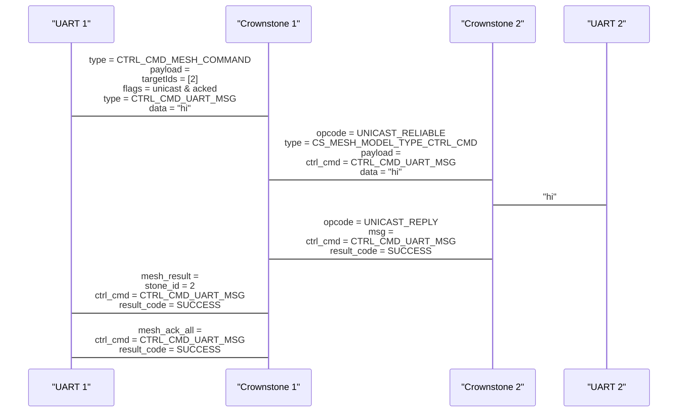

This document shows the code flow for acked mesh messages, based on an example command.

Example case:
- The user sends a mesh command via UART to Crownstone 1.
- The mesh command orders Crownstone 1 to send an acked, single target, mesh message to Crownstone 2.
- The mesh message is a control command to print something ("hi") to UART.
- After Crownstone 2 printed the text, it sends a reply to Crownstone 1.
- Crownstone 1 then reports the result via UART.

The communication is as follows:

<!-- Later when https://github.com/mermaid-js/mermaid/issues/3011 is fixed: %%{init: { 'sequence': {'messageAlign': 'left'} }}%% -->



Now let's dive into the implementation.
Each line shows the next function that is called, for simplification, we don't show the nesting of calls.
Sometimes the most relevant function arguments are shown.
When variables are set in the function, this is shown with `:=`.

We start at the UART command handler of Crownstone 1:
```
UartCommandHandler::handleCommandControl()

CommandHandler::handleEvent(event.type = CMD_CONTROL_CMD)

CommandHandler::handleCommand(type = CTRL_CMD_MESH_COMMAND)

CommandHandler::handleCmdMeshCommand({
	meshCtrlCmd = {
		header = {
			type    = 0,
			flags   = unicast & acked,
			idCount = 1,
		},
		targetIds      = [2],
		controlCommand = {
			type = CTRL_CMD_UART_MSG,
			data = "hi"
		}
	}
})

MeshMsgSender::handleSendMeshCommand()

MeshMsgSender::addToQueue({
	type    = CS_MESH_MODEL_TYPE_CTRL_CMD,
	payload = {
		cmdType = CTRL_CMD_UART_MSG,
		payload = "hi"
	}
})

MeshModelSelector::addToQueue()

MeshModelUnicast::addToQueue()

MeshModelUnicast::sendMsgFromQueue()

MeshModelUnicast::sendMsg({
	msg = [ CS_MESH_MODEL_TYPE_CTRL_CMD, CTRL_CMD_UART_MSG, "h", "i" ]
})

access_model_reliable_publish({
	opcode  = CS_MESH_MODEL_OPCODE_UNICAST_RELIABLE_MSG,
	message = [ CS_MESH_MODEL_TYPE_CTRL_CMD, CTRL_CMD_UART_MSG, "h", "i" ]
})
```
In this case, where the control command is a UART message, a generic control command mesh message of type `CS_MESH_MODEL_TYPE_CTRL_CMD` is sent, with the control command type as payload.
For some control commands, there is a dedicated mesh message. For example: if the control command is `CTRL_CMD_SET_TIME`, a mesh message of type `CS_MESH_MODEL_TYPE_CMD_TIME` is sent instead.
This is decided in the function `MeshMsgSender::handleSendMeshCommand`.


Now that the mesh message has been sent, Crownstone 2 receives the message:
```
MeshModelUnicast::handleMsg({
	opcode  = CS_MESH_MODEL_OPCODE_UNICAST_RELIABLE_MSG,
	message = [ CS_MESH_MODEL_TYPE_CTRL_CMD, CTRL_CMD_UART_MSG, "h", "i" ]
})

MeshMsgHandler::handleMsg({
	msg = {
		opcode  = CS_MESH_MODEL_OPCODE_UNICAST_RELIABLE_MSG,
		message = [ CS_MESH_MODEL_TYPE_CTRL_CMD, CTRL_CMD_UART_MSG, "h", "i" ]
	},
	reply = {
		type     = CS_MESH_MODEL_TYPE_UNKNOWN,
		buf      = [0, 0, 0, 0, 0, 0, 0, 0],
		dataSize = 0
	}
})

MeshMsgHandler::handleControlCommand()
	retCode      := CommandHandler::handleCmdUartMsg(commandData = "hi")
	shortRetCode := MeshUtil::getShortenedRetCode(retCode)
	reply.type   := CS_MESH_MODEL_TYPE_RESULT
	reply.buf    := [ CS_MESH_MODEL_TYPE_CTRL_CMD, shortRetCode, CTRL_CMD_UART_MSG ]


// Resuming in MeshModelUnicast::handleMsg
MeshModelUnicast::sendReply({
	msg = [ CS_MESH_MODEL_TYPE_RESULT, CS_MESH_MODEL_TYPE_CTRL_CMD, shortRetCode, CTRL_CMD_UART_MSG ]
})

access_model_reply({
	accessReplyMsg = {
		opcode = CS_MESH_MODEL_OPCODE_UNICAST_REPLY,
		p_buffer = [ CS_MESH_MODEL_TYPE_RESULT, CS_MESH_MODEL_TYPE_CTRL_CMD, shortRetCode, CTRL_CMD_UART_MSG ]
	}
})
```
When the reply is not NULL in the MeshMsgHandler::handleMsg function, a reply will be sent after the message has been handled.
The handler has to set the reply, this can be anything.


Now that the reply has been sent, Crownstone 1 receives the reply:
```
MeshModelUnicast::handleMsg({
	srcAddress = 2,
	opcode     = CS_MESH_MODEL_OPCODE_UNICAST_REPLY,
	message    = [ CS_MESH_MODEL_TYPE_RESULT, CS_MESH_MODEL_TYPE_CTRL_CMD, shortRetCode, CTRL_CMD_UART_MSG ]
})

MeshMsgHandler::handleMsg({
	msg = {
		srcAddress = 2
		opcode     = CS_MESH_MODEL_OPCODE_UNICAST_REPLY,
		message    = [ CS_MESH_MODEL_TYPE_RESULT, CS_MESH_MODEL_TYPE_CTRL_CMD, shortRetCode, CTRL_CMD_UART_MSG ]
	},
	reply = NULL
})

MeshMsgHandler::handleResult(message, srcId = srcAddress)
	resultHeader := {
		stoneId = srcId
		returnCode = MeshUtil::getInflatedRetCode(shortRetCode)
		commandType = CTRL_CMD_UART_MSG
	}

sendResultToUart(resultHeader)

UartHandler::writeMsg(UART_OPCODE_TX_MESH_RESULT, resultHeader)

// Resuming in MeshModelUnicast:handleMsg
MeshModelUnicast::checkDone()
	ackResult := {
		commandType = CTRL_CMD_UNKNOWN,
		returnCode  = ERR_SUCCESS
	}

UartHandler::writeMsg(UART_OPCODE_TX_MESH_ACK_ALL_RESULT, ackResult)
```
Because a different opcode is used for a reply, the mesh model knows to treat it differently.
The reply message is handled like any other mesh message.

With the current implementation, the reply to all mesh message types (except `CS_MESH_MODEL_TYPE_STONE_MAC`) are of type `CS_MESH_MODEL_TYPE_RESULT`.
The function `MeshMsgHandler::handleResult` expects to be able to determine a control command type, result code, and optionally result data, from the received message.
In this case, it will read the control command type directly from the message payload. But in other cases it determines it based on the mesh message type in the result message payload.

The last `ackResult` is not well implemented yet: it should set the correct returnCode and commandType.
This is because the ackResult comes from the mesh model, which doesn't know anything about the message contents, except for the mesh message type.

