# Bluenet mesh protocol
-----------------------------------

This only documents the latest protocol, older versions can be found in the git history.

## Message types

Type | Name | Length | Description
--- | --- | --- | ---
uint8_t | Message type | 1 | A type of mesh message (see table below)
uint8_t | Payload | 7 | Payload for the mesh message

This is in total 8 bytes (an unsegmented message). There's currently no versioning in use except for bumping the 
identifier of a message.

id | name | Payload | Result data
---|---|---|---
0  | TEST | [cs_mesh_model_msg_test_t](#cs_mesh_model_msg_test_t)
1  | CS_MESH_MODEL_TYPE_ACK | none
3  | CS_MESH_MODEL_TYPE_CMD_TIME | [cs_mesh_model_msg_time_t](#cs_mesh_model_msg_time_t)
4  | CS_MESH_MODEL_TYPE_CMD_NOOP | none
5  | CS_MESH_MODEL_TYPE_CMD_MULTI_SWITCH | [cs_mesh_model_msg_multi_switch_item_t](#cs_mesh_model_msg_multi_switch_item_t)
8  | CS_MESH_MODEL_TYPE_STATE_0 | [cs_mesh_model_msg_state_0_t](#cs_mesh_model_msg_state_0_t)
9  | CS_MESH_MODEL_TYPE_STATE_1 | [cs_mesh_model_msg_state_1_t](#cs_mesh_model_msg_state_1_t)
10 | CS_MESH_MODEL_TYPE_PROFILE_LOCATION | [cs_mesh_model_msg_profile_location_t](#cs_mesh_model_msg_profile_location_t)
11 | CS_MESH_MODEL_TYPE_SET_BEHAVIOUR_SETTINGS | [behaviour_settings_t](#behaviour_settings_t)
12 | CS_MESH_MODEL_TYPE_TRACKED_DEVICE_REGISTER | [cs_mesh_model_msg_device_register_t](#cs_mesh_model_msg_device_register_t)
13 | CS_MESH_MODEL_TYPE_TRACKED_DEVICE_TOKEN | [cs_mesh_model_msg_device_token_t](#cs_mesh_model_msg_device_token_t)
14 | CS_MESH_MODEL_TYPE_SYNC_REQUEST | [cs_mesh_model_msg_sync_request_t](#cs_mesh_model_msg_sync_request_t)
16 | CS_MESH_MODEL_TYPE_TRACKED_DEVICE_LIST_SIZE | [cs_mesh_model_msg_device_list_size_t](#cs_mesh_model_msg_device_list_size_t)
17 | CS_MESH_MODEL_TYPE_STATE_SET | [cs_mesh_model_msg_state_set](#cs_mesh_model_msg_state_set) | [cs-mesh-model-msg-state-header-t](#cs_mesh_model_msg_state_header_t)
18 | CS_MESH_MODEL_TYPE_RESULT | [cs_mesh_model_msg_result](#cs_mesh_model_msg_result)
19 | CS_MESH_MODEL_TYPE_SET_IBEACON_CONFIG_ID | [Ibeacon config ID packet](PROTOCOL.md#ibeacon-config-id-packet)
20 | CS_MESH_MODEL_TYPE_TRACKED_DEVICE_HEARTBEAT | [Device heartbeat packet](#cs_mesh_model_msg_device_heartbeat_t)
22 | CS_MESH_MODEL_TYPE_TIME_SYNC | [cs_mesh_model_msg_time_sync_message_t](#cs_mesh_model_msg_time_sync_message_t)
25 | CS_MESH_MODEL_TYPE_STONE_MAC | [cs_mesh_model_msg_stone_mac_t](#cs_mesh_model_msg_stone_mac_t)
26 | CS_MESH_MODEL_TYPE_ASSET_FILTER_VERSION | [cs_mesh_model_msg_asset_filter_version_t](#cs_mesh_model_msg_asset_filter_version_t)
27 | CS_MESH_MODEL_TYPE_ASSET_RSSI_MAC | [cs_mesh_model_msg_asset_rssi_mac_t](#cs_mesh_model_msg_asset_rssi_mac_t)
28 | CS_MESH_MODEL_TYPE_NEIGHBOUR_RSSI | [cs_mesh_model_msg_neighbour_rssi_t](#cs_mesh_model_msg_neighbour_rssi_t)
29 | CS_MESH_MODEL_TYPE_CTRL_CMD | [cs_mesh_model_msg_ctrl_cmd_t](#cs_mesh_model_msg_ctrl_cmd_t) | [cs_mesh_model_msg_ctrl_cmd_header_t](#cs_mesh_model_msg_ctrl_cmd_header_t)

## Packet descriptors

#### cs_mesh_model_msg_test_t
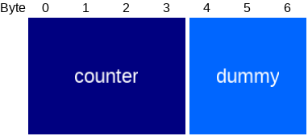

Type | Name | Length | Description
--- | --- | --- | ---
uint32_t | Counter | 4 |
uint8_t[3] | Dummy | 3 |

#### cs_mesh_model_msg_time_t

When a Crownstone receives this message over the mesh, it will synchronize the whole mesh
to the given value. Behaviour is identical to the [set time command](PROTOCOL.md#command-types)

Type | Name | Length | Description
--- | --- | --- | ---
uint32_t | Timestamp | 4 | posix time stamp

#### cs_mesh_model_msg_profile_location_t

Type | Name | Length | Description
--- | --- | --- | ---
uint8_t | Profile | 1 |
uint8_t | Location | 1 |

#### cs_mesh_model_msg_state_0_t

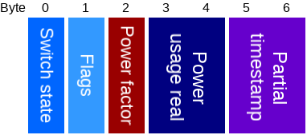

Type | Name | Length | Description
--- | --- | --- | ---
uint8_t | Switch state | 1 |
uint8_t | Flags | 1 |
int8_t | Power factor | 1 |
int16_t | Power usage real | 2 |
uint16_t | Partial timestamp | 2 |

#### cs_mesh_model_msg_state_1_t

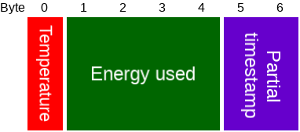

Type | Name | Length | Description
--- | --- | --- | ---
int8 | Temperature | 1 |
int32 | Energy used | 4 |
uint16 | Partial timestamp | 2 |

#### cs_mesh_model_msg_multi_switch_item_t

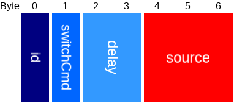

Type     | Name | Length | Description
---      | --- | --- | ---
uint8_t  | Stone ID | 1 |
uint8_t  | Switch value | 1 |
uint16_t | Delay | 2 |
cmd_source_with_counter_t | Source | 3 |

#### behaviour_settings_t

Type | Name | Length | Description
--- | --- | --- | ---
uint32_t | Flags | 4 | only bit 0 is currently in use, as 'behaviour enabled'. Other bits must remain 0.

#### cs_mesh_model_msg_device_register_t

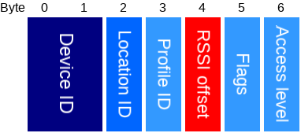

Type | Name | Length | Description
--- | --- | --- | ---
device_id_t | Device ID | 2 |
uint8_t | Location ID | 1 |
uint8_t | Profile ID | 1 |
int8_t | RSSI offset | 1 |
uint8_t | Flags | 1 |
uint8_t | Access level | 1 |

#### cs_mesh_model_msg_device_token_t

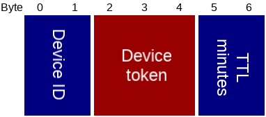

Type | Name | Length | Description
--- | --- | --- | ---
device_id_t | Device ID | 2 |
uint8_t[3] | Device token | 3 |
uint16_t | TTL minutes | 2 |

#### cs_mesh_model_msg_device_heartbeat_t

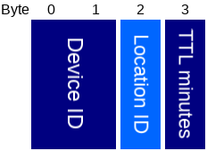

Type | Name | Length | Description
--- | --- | --- | ---
device_id_t | Device ID | 2 |
uint8_t | Location ID | 1 |
uint8_t | TTL minutes | 1 |

#### cs_mesh_model_msg_device_list_size_t

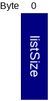

Type | Name | Length | Description
--- | --- | --- | ---
uint8_t | List size | 1 | Size of tracked devices list.

#### cs_mesh_model_msg_sync_request_t

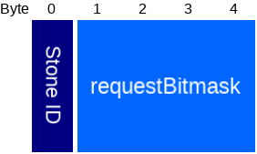

Type | Name | Length | Description
--- | --- | --- | ---
uint8_t | Stone ID | 1 | ID of stone that requests for a sync.
uint32_t | [requestBitmask](#sync-bitmask) | 4 | Bitmask of all things that are requested to be synced.

#### Sync bitmask

Bit | Name |  Description
--- | --- | ---
0 | Time |
1 | Registered devices |
2-31 | Reserved | Reserved for future use, must be 0 for now.

#### cs_mesh_model_msg_state_set

Type | Name | Length | Description
--- | --- | --- | ---
[state header](#cs_mesh_model_msg_state_header_ext_t) | State header | 3 |
uint8_t[] | Payload | N | Payload data, depends on state type.

#### cs_mesh_model_msg_state_header_ext_t

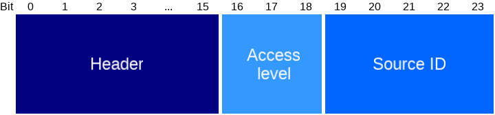

Type | Name | Length in bits | Description
--- | --- | --- | ---
[cs_mesh_model_msg_state_header_t](#cs_mesh_model_msg_state_header_t) | Header | 16 | State header.
uint8_t | Access level | 3 | Shortened version of access level: 0=ADMIN, 1=MEMBER, 2=BASIC, 6=SETUP, 7=NOT_SET.
uint8_t | Source ID | 5 | Shortened version of source ID: 0=NONE, 2=INTERNAL, 3=UART, 4=CONNECTION, 5=SWITCHCRAFT, 30=BROADCAST

#### cs_mesh_model_msg_state_header_t

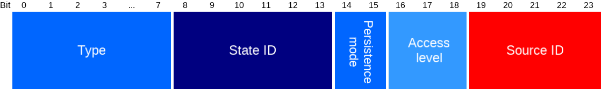

Type | Name | Length in bits | Description
--- | --- | --- | ---
uint8_t | Type | 8 | [State type](PROTOCOL.md#state-types).
uint8_t | State ID | 6 | ID of state to get. Most state types will only have ID 0.
uint8_t | [Persistence mode](PROTOCOL.md#state-set-persistence-mode) | 2 | Type of persistence mode.

#### cs_mesh_model_msg_ctrl_cmd_t

Type | Name | Length | Description
--- | --- | --- | ---
[header](#cs_mesh_model_msg_ctrl_cmd_header_ext_t) | Header | 3 |
uint8_t[] | Payload | N | Payload data, depends on command type.

#### cs_mesh_model_msg_ctrl_cmd_header_ext_t

Type | Name | Length in bits | Description
--- | --- | --- | ---
[header](#cs_mesh_model_msg_ctrl_cmd_header_t) | Header | 16 |
uint8_t | Access level | 3 | Shortened version of access level: 0=ADMIN, 1=MEMBER, 2=BASIC, 6=SETUP, 7=NOT_SET.
uint8_t | Source ID | 5 | Shortened version of source ID: 0=NONE, 2=INTERNAL, 3=UART, 4=CONNECTION, 5=SWITCHCRAFT, 30=BROADCAST

#### cs_mesh_model_msg_ctrl_cmd_header_t

Type | Name | Length | Description
--- | --- | --- | ---
uint16_t | Command type | 2 | [Command type](PROTOCOL.md#Command-types).

#### high_resolution_time_stamp_t

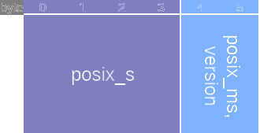

Type | Name | Length | Description
--- | --- | --- | ---
uint32_t | posix_s  | 4 | seconds since epoch
uint16_t | posix_ms, version | 2 | bits 0-9: milliseconds passed since posix_s. bits 10-15: synchronisation version

#### cs_mesh_model_msg_time_sync_message_t

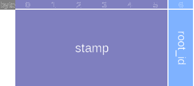

Type | Name | Length | Description
--- | --- | --- | ---
high_resolution_time_stamp_t  | stamp | 6 | current stamp of root clock
uint8_t | root_id | 1 | id of root clock (may differ from sender id)

#### cs_mesh_model_msg_stone_mac_t

Type | Name | Length | Description
--- | --- | --- | ---
uint8_t | Type | 1 | Type: 0 = request, 1 = reply.
uint8_t[] | MAC address | 6 | Mac address of the replier, ignored for request.

#### cs_mesh_model_msg_asset_filter_version_t

Type | Name | Length | Description
--- | --- | --- | ---
uint8_t | Protocol | 1 | Supported protocol.
uint16_t | Master version | 2 | Master version.
uint32_t | Master CRC | 4 | Master CRC.

#### cs_mesh_model_msg_asset_rssi_mac_t

Type | Name | Length | Description
--- | --- | --- | ---
[compressed_rssi_data_t](#compressed_rssi_data_t) | Compressed RSSI data | 1 |
uint8_t[] | MAC address | 6 | Mac address of the asset.

#### compressed_rssi_data_t

Type | Name | Length in bits | Description
--- | --- | --- | ---
uint8_t | Channel | 2 | 0 = unknown, 1 = channel 37, 2 = channel 38, 3 = channel 39.
uint8_t | Rssi halved | 6 | Falf of the absolute value of the original RSSI.

#### cs_mesh_model_msg_neighbour_rssi_t

Type | Name | Length | Description
--- | --- | --- | ---
uint8_t | Type | 1 | Always 0 for now.
uint8_t | Neighbour ID | 1 | ID of the observed neighbour.
int8_t | RSSI channel 37 | 1 | RSSI on channel 37.
int8_t | RSSI channel 38 | 1 | RSSI on channel 38.
int8_t | RSSI channel 39 | 1 | RSSI on channel 39.
uint8_t | Last seen | 1 | How many seconds ago the neighbour was last seen.
uint8_t | Message number | 1 | Message number that increases by 1 each time this message is sent. Used to identify package loss.

#### cs_mesh_model_msg_result

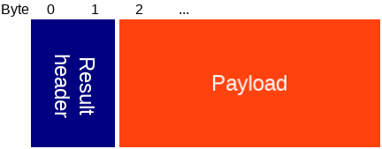

Type | Name | Length | Description
--- | --- | --- | ---
[result header](#cs_mesh_model_msg_result_header_t) | Result header | 2 | Header.
uint8_t[] | Payload | N | Payload data, depends on result type.

#### cs_mesh_model_msg_result_header_t

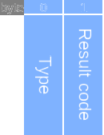

Type | Name | Length | Description
--- | --- | --- | ---
uint8_t | [Type](#message-types) | 1 | The type of mesh msg this is the result of.
uint8_t | [Result code](PROTOCOL.md#result-codes) | 1 | Shortened version of result code.

