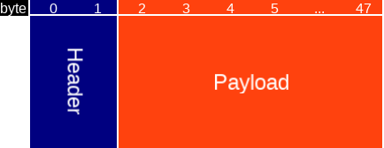
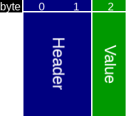
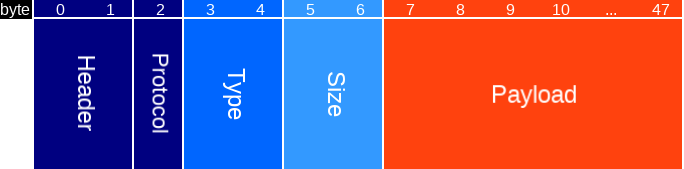
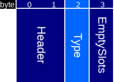

# Microapps

The protocol has to be designed yet. Currently, there are a few functions implemented with a hint of a protocol. At
the microapp code side this will be completely hidden for the user, hence this protocol definition has to be seen as
a definition for someone who wants to understand how the microapp code maps to bluenet functionality. However, for
certain functions there are user-facing results.

This document describes:

* User-facing definitions
* Microapp SDK protocol (to which a microapp/arduino library should adhere to)
* Microapp upload protocol (how to get a microapp on a device that runs bluenet)
* Microapp binary format (a microapp has a binary header with meta-information)
* Implementation details

In the end, as a user of microapps, only the user-facing definitions are important. This document goes way beyond that
and describes everything on a level that would allow someone to write their own libs and/or upload tools.

## User-facing definitions

Microapps are written with Arduino-like syntax, in
a so-called `.ino` file:

```
static int counter = 0;

void setup() {
	Serial.begin();
	Serial.write("Hello world!");
	Serial.write(counter);

	pinMode(LED1_PIN, OUTPUT);
}

int loop() {
	counter++;

	// every 5 seconds
	if (counter % 5 == 0) {
		digitalWrite(LED1_PIN, 1);
		delay(1000);
		digitalWrite(LED1_PIN, 0);
	}
}

```

Here the relay is mapped to pin `LED1_PIN` and the value written with `digitalWrite` turns it on or off. The delay function
can be used to introduce a non-blocking delay. It is perfectly fine to write `delay(1000000)`, delay of 1000 seconds.
The microapp code will then resume 1000 seconds later.

## Microapp SDK protocol

The protocol defines how microapp functions map to bluenet functionality, and how control is shared between the microapp and bluenet.

All microapp libraries that wish to access bluenet functionality have to do this via a call to `sendMessage()`.
This function writes a request (or command) at a shared address in RAM according to the protocol defined below, and then yields to bluenet with a coroutine switch.
Bluenet will handle the request and either resume its own tasks or hand back control to the microapp based on the type of request.

Bluenet can also make requests to the microapp, for example in the case of interrupts.
The microapp may ask to be notified upon certain events within bluenet.
Whenever such an event occurs, bluenet will write relevant event information in the shared RAM, again according to the protocol below.
Then, bluenet calls the microapp which can handle the event and yield back once it has done so.

Shared protocol definitions are located in `/source/shared/cs_MicroappStructs.h`. The bluenet entry and exit points for the microapp are defined in `/source/src/microapp/cs_MicroappController.cpp` and handling the requests happens in `/source/src/microapp/cs_MicroappRequestHandler.cpp`.

The remaining part of this section is dedicated to explaining the protocol for writing to the shared memory for the following functionalities that are supported as of now:
* [Log](#log)
* [Pin](#pin)
* [Switch](#switch)
* [Service data](#service-data)
* [TWI](#twi)
* [BLE](#ble)
* [Mesh](#mesh)
* [Power usage](#power-usage)
* [Presence](#presence)
* [Control commands](#control-commands)
* [Yield](#yield)
* [Continue](#continue)

### Microapp SDK message packet


Type | Name | Length | Description
---     | ---     | ---     | ---
uint8[] | Header  | 2       | Includes message type and ack field
uint8[] | Payload | 46      | Fields depending on message type

This is the base structure of all microapp sdk messages. The header contains the same fields for all types of messages, while the payload is interpreted differently depending on message type.

### Header


Type | Name | Length | Description
---     | ---          | ---     | ---
uint8   | Message type | 1       | Type of message
uint8   | Ack          | 1       | Message acknowledgement and results

The following message types are defined:

Command | Command name                       | Description
---     | ---                                | ---
0x00    | `CS_MICROAPP_SDK_TYPE_NONE`        | Not used / reserved
0x01    | `CS_MICROAPP_SDK_TYPE_LOG`         | Print to serial (a log line in bluenet)
0x02    | `CS_MICROAPP_SDK_TYPE_PIN`         | Write/read to/from a virtual pin
0x03    | `CS_MICROAPP_SDK_TYPE_SWITCH`      | Control the relay/dimmer
0x04    | `CS_MICROAPP_SDK_TYPE_SERVICE_DATA` | Write service data (over the air)
0x05    | `CS_MICROAPP_SDK_TYPE_TWI`         | Read/write from twi/i2c device
0x06    | `CS_MICROAPP_SDK_TYPE_BLE`         | Bluetooth Low Energy related commands
0x07    | `CS_MICROAPP_SDK_TYPE_MESH`        | Bluetooth mesh related commands
0x08    | `CS_MICROAPP_SDK_TYPE_POWER_USAGE` | Read power usage measured by crownstone
0x09    | `CS_MICROAPP_SDK_TYPE_PRESENCE`    | Read presence detected
0x0A    | `CS_MICROAPP_SDK_TYPE_CONTROL_COMMAND` | Control commands following the [control packet protocol](../docs/protocol/PROTOCOL.md#control-packet)
0x0B    | `CS_MICROAPP_SDK_TYPE_YIELD`       | End of microapp setup or loop, or used for async calls
0x0C    | `CS_MICROAPP_SDK_TYPE_CONTINUE`    | Empty message for bluenet handing control to the microapp in non-interrupt context

The ack field is usually (over)written by the receiving party. The sender can set it to either `REQUEST` or `NO_REQUEST`. The receiver can react to this and overwrite it with a result (e.g. `SUCCESS` or a specific error code) or indicate that the message is being handled with `IN_PROGRESS`.

### Log

The logging function accepts a type such as char, int, string, an option and then the data.


Type | Name | Length | Description
---     | ---     | ---    | ---
--      | Header  | 2      | Message type is `CS_MICROAPP_SDK_TYPE_LOG`
uint8   | Type    | 1      | Type of value to be logged (char, int, string, array, float, double, uint, short)
uint8   | Flags   | 1      | Bit 0: yes/no newline. Bit 1-7: reserved
uint8   | Size    | 1      | Size of data
uint8[] | Payload | 43     | Interpretation depending on log type

In the case of a string the last byte is set to 0 on the bluenet side (null-terminated), just an additional precaution.
Note that we never rely on null-termination anyway (we always send along length as well).

### Pin

The pin message is defined for virtual pins. Bluenet
has to be compiled with `BUILD_GPIOTE=1` for this functionality to be available.


Type | Name | Length | Description
---     | ---      | ---    | ---
--      | Header   | 2      | Message type is `CS_MICROAPP_SDK_TYPE_PIN`
uint8   | Pin      | 1      | Pin index (virtual)
uint8   | Type     | 1      | Set a pin mode (`INIT`) or perform read/write (`ACTION`).
uint8   | Direction| 1      | Defines input or output and pullup/pulldown configuration. Only used with pin type `INIT`.
uint8   | Polarity | 1      | Defines when to generate pin event (`NONE`, `CHANGE`, `RISING` or `FALLING`). Only used with pin type `INIT`.
uint8   | Action    | 1      | What action to take (`READ` or `WRITE`). Only used with pin type `ACTION`.
uint8   | Value     | 1      | Value to write/read. Only used with pin type `ACTION`.

The value to write is an on/off value for digitalWrites. It is an 8-bits analog value for analogWrites.

### Switch


The switch message is used to control the dimmer and relay.

Type | Name | Length | Description
---     | ---      | ---    | ---
--      | Header   | 2      | Message type is `CS_MICROAPP_SDK_TYPE_SWITCH`
uint8   | Value    | 1      | Value to write, according to [this](../docs/protocol/PROTOCOL.md#switch-command-value).

### Service data

The service data message can be used to write data to a service data struct.


Type | Name | Length | Description
---     | ---     | ---    | ---
--      | Header  | 2      | Message type is `CS_MICROAPP_SDK_TYPE_SERVICE_DATA`
uint16  | appUuid | 2      | Unique identifier to be advertised along with the data
uint8   | Size    | 1      | Size of the data
uint8[] | Data    | 8      | The data to be advertised

The maximum data size for microapp service data ads is set at `8` at the moment.

### TWI

The twi (two-wire interface) command can be used to control twi devices. This bus is also called an i2c bus. Bluenet
has to be compiled with `BUILD_TWI=1` for this functionality to be available. The bluenet device is always the
initiator. It is possible to have multiple targets on the bus (with different addresses). Check power requirements
in that case.


Type | Name | Length | Description
---     | ---      | ---    | ---
--      | Header   | 2      | Message type is `CS_MICROAPP_SDK_TYPE_TWI`
uint8   | Type     | 1      | Read, write or initialize
uint8   | Address  | 1      | Slave address
uint8   | Flags    | 1      | Bit 0: stop bit. Bit 1-7: reserved
uint8   | Size     | 1      | Length of data to be sent or received
uint8[] | Buf      | 42     | Data to be sent or received

In the microapp code this is available through the `Wire` class.

### BLE

For Bluetooth Low Energy functionalities, for now there is support for scanning advertisements. Mesh functionalities are covered with the `CS_MICROAPP_SDK_TYPE_MESH` message type. The microapp can register a handler when a device is scanned. Note that bluenet throttles the number of scanned devices for which an interrupt is generated. Also, bluenet has to be compiled with `BUILD_MESHING=1` since scanning is implemented in the mesh classes on the bluenet side. In the future, support for connecting to BLE peripherals will be added.


Type | Name | Length | Description
---    | ---       | ---    | ---
--     | Header    | 2      | Message type is `CS_MICROAPP_SDK_TYPE_BLE`
uint8  | Type      | 1      | Ble opcodes such as `SCAN_START` or `SCANNED_DEVICE`.
uint8  | Address type | 1   | Ble address type
uint8[]| Address   | 6      | MAC address of a BLE device
int8   | Rssi      | 1      | Received signal strength
uint8  | Size      | 1      | Data length
uint8[]| Data      | 31     | Advertisement payload

Some fields may be unused depending on the type of ble message. For a `SCAN_START` message, for example, no other fields are required other than the header and ble type.

### Mesh

The supported mesh functionalities at the moment include both sending and receiving mesh messages of the specific microapp type (`CS_MESH_MODEL_TYPE_MICROAPP`). Both broadcast and directed mesh messages are supported.


Type | Name | Length | Description
---    | ---       | ---    | ---
--     | Header    | 2      | Message type is `CS_MICROAPP_SDK_TYPE_MESH`
uint8  | Type      | 1      | Type of mesh message (send, read, info)
uint8  | StoneId   | 1      | Id of stone (to send to, read from, or own id)
uint8  | Size      | 1      | Length of data field
uint8[] | Data     | 7      | 1 to 7 bytes (max mesh message payload length)

### Power usage

The power usage command can be used to read the measured power usage of the device plugged into the outlet of this crownstone.


Type | Name | Length | Description
---    | ---        | ---    | ---
--     | Header     | 2      | Message type is `CS_MICROAPP_SDK_TYPE_POWER_USAGE`
uint8  | Type       | 1      | Specify power, current or voltage
int32  | PowerUsage | 4      | Power usage

As of writing, current or voltage data is not yet supported.

### Presence

The presence command can be used to request presence of profiles in the sphere.


Type | Name | Length | Description
---    | ---       | ---    | ---
--     | Header    | 2      | Message type is `CS_MICROAPP_SDK_TYPE_PRESENCE`
uint8  | ProfileId | 1      | Requested profile
uint64 | PresenceBitMask | 8 | Bitmask of the requested profile in the locations within the sphere

### Control commands

Control commands are defined [here](../docs/protocol/PROTOCOL.md#control-packet). The microapp sdk packet follows the same structure



Type | Name | Length | Description
---    | ---       | ---    | ---
--     | Header    | 2      | Message type is `CS_MICROAPP_SDK_TYPE_CONTROL_COMMAND`
uint8  | Protocol  | 1      | Protocol version of the command
uint16 | Type      | 2      | Command type
uint16 | Size      | 2      | Size of the payload
--     | Payload   | 41     | Control command payload

### Yield

There are three possible instances where a microapp 'yields' to bluenet with the yield message. The first two are at the end of `setup` and `loop`. The third is for asynchronous, nonblocking calls such as `delay`. The yield message contains a field for the remaining number of interrupts that the microapp can process. Bluenet will keep this in mind and stop sending interrupts if the microapp is busy.



Type | Name | Length | Description
---    | ---       | ---    | ---
--     | Header    | 2      | Message type is `CS_MICROAPP_SDK_TYPE_YIELD`
uint8  | Type      | 1      | Either `SETUP_END`, `LOOP_END`, or `ASYNC`
uint8  | EmptySlots | 1     | Number of empty slots for interrupts


### Continue

The continue message has no message-type-specific payload. Only the header is used.

## Microapp upload protocol

The protocol to upload microapps can be found in the [protocol](protocol/PROTOCOL.md) doc.

## Microapp binary format

The binary format of a microapp.

TBD.

## Implementation

### Calling the loop function

The callLoop function in the microapp code will be called with `cntr = 0` the first time. At this moment it sets up
a coroutine. The function in `cs_MicroApp.cpp` is more complex, but if we would call a function locally - within the
same file - it would look like the following:

```
void MicroApp::callLoop(int & cntr, int & skip) {
	if (cntr == 0) {
		_coargs = {&_coroutine, 1, 0};
		start(&_coroutine, &loop_local, &_coargs);
	}
	...
```

You see that a function `loop_local` will be called (later on) with as arguments `_coargs`. This function will be
called using a different stack from the main program! You can check this by logging the stack pointer as shown in
the following possible implementation of a `loop_local` function.

```
#define get_sp(p) asm volatile("mov %0, sp" : "=r"(p) : : )

void loop_local(void *p) {
	LOGi("Loop locally..");
	coargs* args = (coargs*) p;
	void* sp;
	get_sp(sp);
	LOGi("Stack pointer at 0x%x", sp);
	for (int i = 0; i < 2; ++i) {
		args->cntr++;
		args->delay = (i+1)*10;
		yield(args->c);
	}
}
```

The `loop_local` function either just returns or "yields" with `yield` and the coroutine struct as argument. When it
yields it will return to the main bluenet program. Due to the fact that we use a separate stack we do not need to
worry about stack corruption. We just jump back exactly where we were (implementation detail: in `start` or `next`).

### The loop function

The actual loop function jumps to microapp code and back through function pointers stored by the microapp and the
bluenet code in `IPC_RAM_DATA`. In the end it ends up in `microapp_callback`. Here we can `yield` as long as we have
preserved the pointer to the `coargs` struct. In the microapp code we store this pointer on each call and put it in
the payload if we callback with the delay opcode.

