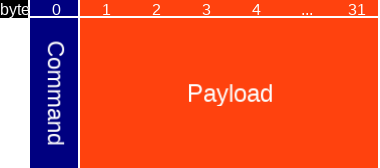
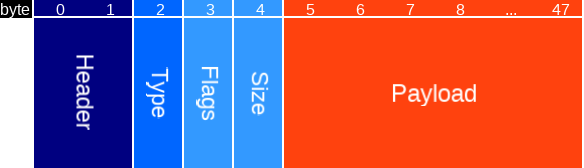
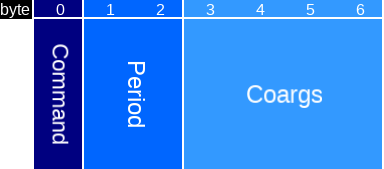
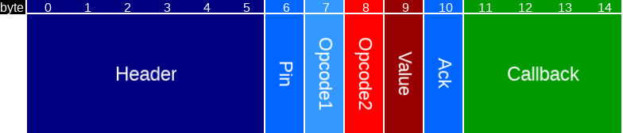
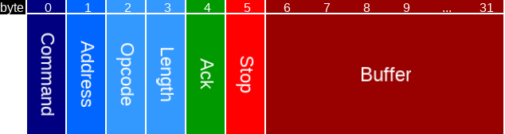

# Microapps

The protocol has to be designed yet. Currently, there are a few functions implemented with a hint of a protocol. At 
the microapp code side this will be completely hidden for the user, hence this protocol definition has to be seen as
a definition for someone who wants to understand how the microapp code maps to bluenet functionality. However, for
certain functions there are user-facing results.

This document describes:

* User-facing definitions
* Microapp SDK protocol (to which a microapp/arduino library should adhere to)
* Microapp upload protocol (how to get a microapp on a device that runs bluenet)
* Microapp binary format (a microapp has a binary header with meta-information)
* Implementation details

In the end, as a user of microapps, only the user-facing definitions are important. This document goes way beyond that
and describes everything on a level that would allow someone to write their own libs and/or upload tools.

## User-facing definitions

An implementation of a microapp can be found [here](https://github.com/mrquincle/crownstone-bluenet-module). It has 
a so-called `.ino` file with Arduino-like syntax:

```
static int counter = 0;

void setup() {
	Serial.begin();
	Serial.write("Hello world!");
	Serial.write(counter);
}

int loop() {
	counter++;

	// every 5 seconds
	if (counter % 5 == 0) {
		digitalWrite(1, 1);
		delay(1000);
		digitalWrite(1, 0);
	}
}

```

Here the relay is mapped to pin `1` and the value written with `digitalWrite` turns it on or off. The delay function
can be used to introduce a non-blocking delay. It is perfectly fine to write `delay(1000000)`, delay of 1000 seconds.
The microapp code will then resume 1000 seconds later.

## Microapp SDK protocol

The protocol itself is implemented on both sides, at the bluenet side in the `microapp_callback` function and at the 
microapp side in for example the `main.c` code. Here we are only concerned in the bluenet side.

The function has the following syntax and is called like this:

```
int (*callback_func)(char*,uint16_t) = (int (*)(char*,uint16_t)) _callback;
int result = callback_func((char*)msg->payload, msg->length);
```

It evokes a callback in the bluenet code with as parameters a pointer to a char buffer and a length field. Here length
is sent separately so we don't need to inspect `msg->payload[i]` for length information. On the bluenet side the
length field is never respected beyond the maximum payload size (`MAX_PAYLOAD`).



Type    | Name    | Length  | Description
---     | ---     | ---     | ---
uint8   | Command | 1       | Command type
uint8[] | Payload | 31      | Fields depending on command type

Opcode | Command name | Description
---    | ---          | ---
0x01   | `CS_MICROAPP_COMMAND_LOG`          | Print to serial (a log line in bluenet)
0x02   | `CS_MICROAPP_COMMAND_DELAY`        | Delay microapp by calling bluenet and later on jumping back
0x03   | `CS_MICROAPP_COMMAND_PIN`          | Write/read to/from a virtual pin
0x04   | `CS_MICROAPP_COMMAND_SERVICE_DATA` | Write service data (over the air)
0x05   | `CS_MICROAPP_COMMAND_TWI`          | Read/write from twi/i2c device

For further details, see the next sections.

### Log

The logging function accepts a type such as char, int, string, an option and then the data.



Type    | Name    | Length | Description
---     | ---     | ---    | ---
uint8   | Command | 1      | Log command (`CS_MICROAPP_COMMAND_LOG`)
uint8   | Type    | 1      | Type of value to be logged (char, int, string, array, float, double, uint, short)
uint8   | Option  | 1      | Yes/no newline
uint8[] | Data    | 28     | Maximum string / array size

In the case of a string the last byte is set to 0 on the bluenet side (null-terminated), just an additional precaution.
Note that we never rely on null-termination anyway (we always send along length as well).

The opcode is called `port` on the microapp side (for this command). The same objects and functions are 
called to write to the logs as to write the service data for example.

### Delay

The delay function accepts a delay in milliseconds. A delay less than one second will be 
ignored. This is a function that requires a pointer to the coroutine argument which is used in `yield`.



Type    | Name    | Length | Description
---     | ---     | ---    | ---
uint8   | Command | 1      | Sleep command (`CS_MICROAPP_COMMAND_DELAY`)
uint16  | Period  | 2      | Period to sleep in milliseconds
uintptr | Coargs  | 4      | Pointer to coroutine arguments

The coroutine arguments with which `loop` is called are passed through, so we can `yield` and later on call `next` to jump back and forth before we finally `yield` at the end of `loop`.

### Pin

The pin command is defined for virtual pins. Currently the relay is set to pin number 0. The dimmer as well.



Type    | Name     | Length | Description
---     | ---      | ---    | ---
uint8   | Command  | 1      | Pin command (`CS_MICROAPP_COMMAND_PIN`)
uint8   | Pin      | 1      | Pin index (virtual)
uint8   | Opcode1  | 1      | Set a pin mode or perform action (read/write)
uint8   | Opcode2  | 1      | If opcode1 = mode (pullup setting), if action (read/write/action)
uint8   | Value    | 1      | Value to write
uint8   | Ack      | 1      | Acknowledgment
uint32  | Callback | 4      | Address of callback (on receiving a GPIO interrupt)

The value to write is an on/off value for digitalWrites. It is an 8-bits analog value for analogWrites. This is useful for writing a value to the dimmer for example.
For a pin mode command the value can be e.g. change, rising, or falling.

The acknowledgment setting is not used yet.

### Service data

The service data command can be used to write data to a service data struct.


Type    | Name    | Length | Description
---     | ---     | ---    | ---
uint8   | Command | 1      | Pin command (`CS_MICROAPP_COMMAND_SERVICE_DATA`)
uint8   | Type    | 1      | Type of value to be logged (char, int, string, array, float, double, uint, short)
uint8   | Option  | 1      | Yes/no newline
uint8[] | Data    | 28     | Maximum string / array size

This uses exactly the same format as for writing logs under the hood. At the microapp side, the class
`SerialServiceData` inherits from `SerialBase_` (just as `Serial` itself does).

### TWI / I2C

The twi (two-wire interface) command can be used to control twi devices. This bus is also called an i2c bus. Bluenet
has to be compiled with `BUILD_TWI=1` for this functionality to be available. The bluenet device is always the
initiator. It is possible to have multiple targets on the bus (with different addresses). Check power requirements
in that case.



Type    | Name     | Length | Description
---     | ---      | ---    | ---
uint8   | Command  | 1      | Pin command (`CS_MICROAPP_COMMAND_TWI`)
uint8   | Address  | 1      | Target address
uint8   | Opcode   | 1      | TWI opcodes such as read, write, init, enable, and disable
uint8   | Length   | 1      | Length of data to be received (or sent)
uint8   | Ack      | 1      | Acknowledgment received
uint8   | Stop     | 1      | Existence of a stop symbol
uint8[] | Buffer   | 26     | Maximum twi payload (1 up to 26 bytes)

In the microapp code this is available through the `Wire` class.

## Microapp upload protocol

The protocol to upload microapps can be found in the [protocol](PROTOCOL.md) doc.

## Microapp binary format

The binary format of a microapp.

TBD.

## Implementation

### Calling the loop function

The callLoop function in the microapp code will be called with `cntr = 0` the first time. At this moment it sets up
a coroutine. The function in `cs_MicroApp.cpp` is more complex, but if we would call a function locally - within the
same file - it would look like the following:

```
void MicroApp::callLoop(int & cntr, int & skip) {
	if (cntr == 0) {
		_coargs = {&_coroutine, 1, 0};
		start(&_coroutine, &loop_local, &_coargs);
	}
	...
```

You see that a function `loop_local` will be called (later on) with as arguments `_coargs`. This function will be 
called using a different stack from the main program! You can check this by logging the stack pointer as shown in 
the following possible implementation of a `loop_local` function.

```
#define get_sp(p) asm volatile("mov %0, sp" : "=r"(p) : : )

void loop_local(void *p) {
	LOGi("Loop locally..");
	coargs* args = (coargs*) p;
	void* sp;
	get_sp(sp);
	LOGi("Stack pointer at 0x%x", sp);
	for (int i = 0; i < 2; ++i) {
		args->cntr++;
		args->delay = (i+1)*10;
		yield(args->c);
	}
}
```

The `loop_local` function either just returns or "yields" with `yield` and the coroutine struct as argument. When it
yields it will return to the main bluenet program. Due to the fact that we use a separate stack we do not need to 
worry about stack corruption. We just jump back exactly where we were (implementation detail: in `start` or `next`).

### The loop function

The actual loop function jumps to microapp code and back through function pointers stored by the microapp and the 
bluenet code in `IPC_RAM_DATA`. In the end it ends up in `microapp_callback`. Here we can `yield` as long as we have
preserved the pointer to the `coargs` struct. In the microapp code we store this pointer on each call and put it in
the payload if we callback with the delay opcode.

