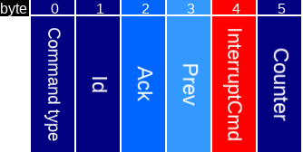
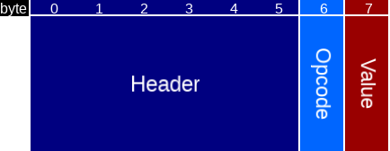
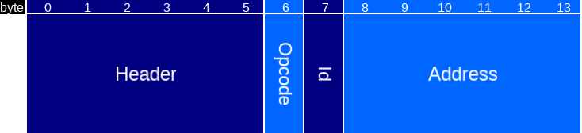
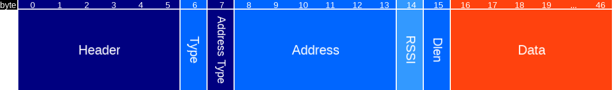
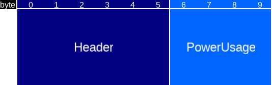
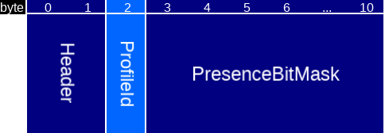
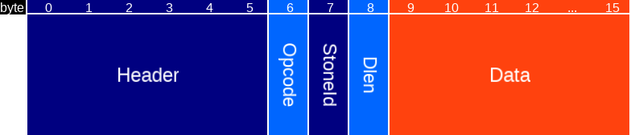
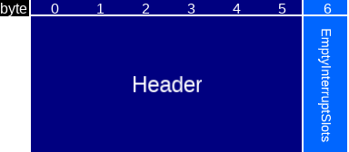

# Microapps

The protocol has to be designed yet. Currently, there are a few functions implemented with a hint of a protocol. At
the microapp code side this will be completely hidden for the user, hence this protocol definition has to be seen as
a definition for someone who wants to understand how the microapp code maps to bluenet functionality. However, for
certain functions there are user-facing results.

This document describes:

* User-facing definitions
* Microapp SDK protocol (to which a microapp/arduino library should adhere to)
* Microapp upload protocol (how to get a microapp on a device that runs bluenet)
* Microapp binary format (a microapp has a binary header with meta-information)
* Implementation details

In the end, as a user of microapps, only the user-facing definitions are important. This document goes way beyond that
and describes everything on a level that would allow someone to write their own libs and/or upload tools.

## User-facing definitions

An implementation of a microapp can be found [here](https://github.com/mrquincle/crownstone-bluenet-module). It has
a so-called `.ino` file with Arduino-like syntax:

```
static int counter = 0;

void setup() {
	Serial.begin();
	Serial.write("Hello world!");
	Serial.write(counter);
}

int loop() {
	counter++;

	// every 5 seconds
	if (counter % 5 == 0) {
		digitalWrite(1, 1);
		delay(1000);
		digitalWrite(1, 0);
	}
}

```

Here the relay is mapped to pin `1` and the value written with `digitalWrite` turns it on or off. The delay function
can be used to introduce a non-blocking delay. It is perfectly fine to write `delay(1000000)`, delay of 1000 seconds.
The microapp code will then resume 1000 seconds later.

## Microapp SDK protocol

The protocol defines how microapp functions map to bluenet functionality, and how control is shared between the microapp and bluenet.

All microapp libraries that wish to access bluenet functionality have to do this via a call to `sendMessage()`.
This function writes a request (or command) at a shared address in RAM according to the protocol defined below, and then yields to bluenet with a coroutine switch.
Bluenet will handle the request and either resume its own tasks or hand back control to the microapp based on the type of request.

Bluenet can also make requests to the microapp, for example in the case of interrupts.
The microapp may ask to be notified upon certain events within bluenet.
Whenever such an event occurs, bluenet will write relevant event information in the shared RAM, again according to the protocol below.
Then, bluenet calls the microapp which can handle the event and yield back once it has done so.

Shared protocol definitions are located in `/source/shared/cs_MicroappStructs.h`. The bluenet entry and exit points for the microapp are defined in `/source/src/microapp/cs_MicroappController.cpp` and handling the requests happens in `/source/src/microapp/cs_MicroappCommandHandler.cpp`.

### Microapp protocol packets
The remaining part of this section is dedicated to explaining the protocol for writing to the shared memory for the following functionalities that are supported as of now:
* Log
* Delay
* Pin (GPIO)
* Relay / Dimmer
* Service data
* TWI
* BLE
* Power usage
* Presence
* Mesh


Type | Name | Length | Description
---     | ---     | ---     | ---
uint8[] | Header  | 6       | Includes command type
uint8[] | Payload | 31      | Fields depending on command type



Type | Name | Length | Description
---     | ---          | ---     | ---
uint8   | Command type | 1       | Type of command determining interpretation of rest of command
uint8   | Id           | 1       | Id used for identifying the command
uint8   | Ack          | 1       | Field that can be used for acking commands (both directions)
uint8   | Prev         | 1       | Reserved for future use
uint8   | InterruptCmd | 1       | For interrupt commands, indicates the type of interrupt
uint8   | Counter      | 1       | Reserved for future use

The following command types are defined:

Command | Command name                       | Description
---     | ---                                | ---
0x00    |                                    | Reserved
0x01    | `CS_MICROAPP_COMMAND_LOG`          | Print to serial (a log line in bluenet)
0x02    | `CS_MICROAPP_COMMAND_DELAY`        | Delay microapp by calling bluenet and later on jumping back
0x03    | `CS_MICROAPP_COMMAND_PIN`          | Write/read to/from a virtual pin
0x04    | `CS_MICROAPP_COMMAND_SWITCH_DIMMER`| Write/read to/from the relay/dimmer
0x05    | `CS_MICROAPP_COMMAND_SERVICE_DATA` | Write service data (over the air)
0x06    | `CS_MICROAPP_COMMAND_TWI`          | Read/write from twi/i2c device
0x07    | `CS_MICROAPP_COMMAND_BLE`          | Bluetooth Low Energy related commands
0x08    | `CS_MICROAPP_COMMAND_POWER_USAGE`  | Read power usage measured by crownstone
0x09    | `CS_MICROAPP_COMMAND_PRESENCE`     | Read presence detected
0x0A    | `CS_MICROAPP_COMMAND_MESH`         | Bluetooth mesh related commands
0x0B    | `CS_MICROAPP_COMMAND_SETUP_END`    | End of microapp setup function
0x0C    | `CS_MICROAPP_COMMAND_LOOP_END`     | End of microapp loop
0x0D    | `CS_MICROAPP_COMMAND_BLE_DEVICE`   | Bluetooth Low Energy device commands
0x0E    | `CS_MICROAPP_COMMAND_SOFT_INTERRUPT_RECEIVED` | Confirm intention to handle interrupt
0x0F    | `CS_MICROAPP_COMMAND_SOFT_INTERRUPT_END` | Handling interrupt has ended without error
0x10    | `CS_MICROAPP_COMMAND_SOFT_INTERRUPT_ERROR` | Error has occured within an interrupt handler
0x11    | `CS_MICROAPP_COMMAND_SOFT_INTERRUPT_DROPPED` | Microapp too busy to handle interrupt


For further details, see the next sections.

### Log

The logging function accepts a type such as char, int, string, an option and then the data.


Type | Name | Length | Description
---     | ---     | ---    | ---
--      | Header  | 6      | Log command (`CS_MICROAPP_COMMAND_LOG`)
uint8   | Type    | 1      | Type of value to be logged (char, int, string, array, float, double, uint, short)
uint8   | Option  | 1      | Yes/no newline
uint8[] | Data    | 28     | Maximum string / array size

In the case of a string the last byte is set to 0 on the bluenet side (null-terminated), just an additional precaution.
Note that we never rely on null-termination anyway (we always send along length as well).

The opcode is called `port` on the microapp side (for this command). The same objects and functions are called to write to the logs as to write the service data for example.

### Delay

The delay function accepts a delay in milliseconds. A delay less than one second will be
ignored. This is a function that requires a pointer to the coroutine argument which is used in `yield`.


Type | Name | Length | Description
---     | ---     | ---    | ---
--      | Header  | 6      | Sleep command (`CS_MICROAPP_COMMAND_DELAY`)
uint16  | Period  | 2      | Period to sleep in milliseconds
uintptr | Coargs  | 4      | Pointer to coroutine arguments

The coroutine arguments with which `loop` is called are passed through, so we can `yield` and later on call `next` to jump back and forth before we finally `yield` at the end of `loop`.

### Pin

The pin command is defined for virtual pins.


Type | Name | Length | Description
---     | ---      | ---    | ---
--      | Header   | 6      | Pin command (`CS_MICROAPP_COMMAND_PIN`)
uint8   | Pin      | 1      | Pin index (virtual)
uint8   | Opcode1  | 1      | Set a pin mode or perform action (read/write)
uint8   | Opcode2  | 1      | If opcode1 = mode (pullup setting), if action (read/write/action)
uint8   | Value    | 1      | Value to write
uint8   | Ack      | 1      | Acknowledgment
uint32  | Callback | 4      | Address of callback (on receiving a GPIO interrupt)

The value to write is an on/off value for digitalWrites. It is an 8-bits analog value for analogWrites.
For a pin mode command the value can be e.g. change, rising, or falling.

The acknowledgment setting is not used yet.

### Dimmer / Switch


The dimmer / switch command is used to control the dimmer and switch.

Type | Name | Length | Description
---     | ---      | ---    | ---
--      | Header   | 6      | Dimmer/Switch command (`CS_MICROAPP_COMMAND_SWITCH_DIMMER`)
uint8   | Opcode   | 1      | `CS_MICROAPP_COMMAND_SWITCH` or `CS_MICROAPP_COMMAND_DIMMER` for controlling the switch or the dimmer respectively.
uint8   | Value    | 1      | Value to write. Binary (0 = off, 1 = on) for the switch, or an 8-bit intensity value for the dimmer.

### Service data

The service data command can be used to write data to a service data struct.


Type | Name | Length | Description
---     | ---     | ---    | ---
--      | Header  | 6      | Pin command (`CS_MICROAPP_COMMAND_SERVICE_DATA`)
uint8   | Type    | 1      | Type of value to be logged (char, int, string, array, float, double, uint, short)
uint8   | Option  | 1      | Yes/no newline
uint8[] | Data    | 28     | Maximum string / array size

This uses exactly the same format as for writing logs under the hood. At the microapp side, the class
`SerialServiceData` inherits from `SerialBase_` (just as `Serial` itself does).

### TWI / I2C

The twi (two-wire interface) command can be used to control twi devices. This bus is also called an i2c bus. Bluenet
has to be compiled with `BUILD_TWI=1` for this functionality to be available. The bluenet device is always the
initiator. It is possible to have multiple targets on the bus (with different addresses). Check power requirements
in that case.


Type | Name | Length | Description
---     | ---      | ---    | ---
--      | Header   | 6      | Twi command (`CS_MICROAPP_COMMAND_TWI`)
uint8   | Address  | 1      | Target address
uint8   | Opcode   | 1      | TWI opcodes such as read, write, init, enable, and disable
uint8   | Length   | 1      | Length of data to be received (or sent)
uint8   | Ack      | 1      | Acknowledgment received
uint8   | Stop     | 1      | Existence of a stop symbol
uint8[] | Buffer   | 26     | Maximum twi payload (1 up to 26 bytes)

In the microapp code this is available through the `Wire` class.

### BLE

For Bluetooth Low Energy functionalities, for now there is support for scanning advertisements. Mesh functionalities are covered in the `CS_MICROAPP_COMMAND_MESH` command type. The microapp can register a handler when a device is scanned. Note that bluenet throttles the number of scanned devices for which an interrupt is generated. Also, bluenet has to be compiled with `BUILD_MESHING=1` since scanning is implemented in the mesh classes on the bluenet side. In the future, support for connecting to BLE peripherals may be added.



Type | Name | Length | Description
---    | ---       | ---    | ---
--     | Header    | 6      | Ble command (`CS_MICROAPP_COMMAND_BLE`)
uint8  | Opcode    | 1      | Ble opcodes such as start, stop, set handler
uint8  | Id        | 1      | Index for handler
uint8  | Address   | 6      | MAC address (reserved for future use)

For ble scanned devices, a different packet structure is used



Type | Name | Length | Description
---    | ---       | ---    | ---
--     | Header    | 6      | Ble device command (`CS_MICROAPP_COMMAND_BLE_DEVICE`)
uint8  | Type      | 1      | Type of scanned device
uint8  | Address Type | 1   | Ble address type
uint8[]| Address   | 6      | MAC address
int8   | RSSI      | 1      | Received signal strength
uint8  | Dlen      | 1      | Data length
uint8[]| Data      | 31     | Payload of scanned device

### Power usage

The power usage command can be used to read the measured power usage of the device plugged into the outlet of this crownstone.



Type | Name | Length | Description
---    | ---        | ---    | ---
--     | Header     | 6      | Power usage command (`CS_MICROAPP_COMMAND_POWER_USAGE`)
int32  | PowerUsage | 4      | Power usage

### Presence

The presence command can be used to request presence of profiles in the sphere.



Type | Name | Length | Description
---    | ---       | ---    | ---
--     | Header    | 6      | Presence command (`CS_MICROAPP_COMMAND_PRESENCE`)
uint8  | ProfileId | 1      | Requested profile
uint64 | PresenceBitMask | 8 | Bitmask of the requested profile in the locations within the sphere

### Mesh

The supported mesh functionalities at the moment include both sending and receiving mesh messages of the specific microapp type (`CS_MESH_MODEL_TYPE_MICROAPP`). Both broadcast and directed mesh messages are supported.



Type | Name | Length | Description
---    | ---       | ---    | ---
--     | Header    | 6      | Mesh command (`CS_MICROAPP_COMMAND_MESH`)
uint8  | Opcode    | 1      | Type of mesh command (send, read, info)
uint8  | StoneId   | 1      | Id of stone (to send to, read from, or own id)
uint8  | Dlen      | 1      | Length of data field
uint8[] | Data     | 7      | 1 to 7 bytes (max mesh message payload length)

### Soft interrupts

For soft interrupts, the microapp has to acknowledge an interrupt from bluenet before handling the interrupt. This acknowledgement contains a field for the remaining number of interrupts that the microapp can process. Bluenet will keep this in mind and stop sending interrupts if the microapp is busy.



Type | Name | Length | Description
---    | ---       | ---    | ---
--     | Header    | 6      | Mesh command (`CS_MICROAPP_COMMAND_SOFT_INTERRUPT_RECEIVED` or `CS_MICROAPP_COMMAND_SOFT_INTERRUPT_DROPPED`)
uint8  | EmptyInterruptSlots | 1 | Number of empty slots for interrupts the microapp has


## Microapp upload protocol

The protocol to upload microapps can be found in the [protocol](protocol/PROTOCOL.md) doc.

## Microapp binary format

The binary format of a microapp.

TBD.

## Implementation

### Calling the loop function

The callLoop function in the microapp code will be called with `cntr = 0` the first time. At this moment it sets up
a coroutine. The function in `cs_MicroApp.cpp` is more complex, but if we would call a function locally - within the
same file - it would look like the following:

```
void MicroApp::callLoop(int & cntr, int & skip) {
	if (cntr == 0) {
		_coargs = {&_coroutine, 1, 0};
		start(&_coroutine, &loop_local, &_coargs);
	}
	...
```

You see that a function `loop_local` will be called (later on) with as arguments `_coargs`. This function will be
called using a different stack from the main program! You can check this by logging the stack pointer as shown in
the following possible implementation of a `loop_local` function.

```
#define get_sp(p) asm volatile("mov %0, sp" : "=r"(p) : : )

void loop_local(void *p) {
	LOGi("Loop locally..");
	coargs* args = (coargs*) p;
	void* sp;
	get_sp(sp);
	LOGi("Stack pointer at 0x%x", sp);
	for (int i = 0; i < 2; ++i) {
		args->cntr++;
		args->delay = (i+1)*10;
		yield(args->c);
	}
}
```

The `loop_local` function either just returns or "yields" with `yield` and the coroutine struct as argument. When it
yields it will return to the main bluenet program. Due to the fact that we use a separate stack we do not need to
worry about stack corruption. We just jump back exactly where we were (implementation detail: in `start` or `next`).

### The loop function

The actual loop function jumps to microapp code and back through function pointers stored by the microapp and the
bluenet code in `IPC_RAM_DATA`. In the end it ends up in `microapp_callback`. Here we can `yield` as long as we have
preserved the pointer to the `coargs` struct. In the microapp code we store this pointer on each call and put it in
the payload if we callback with the delay opcode.

