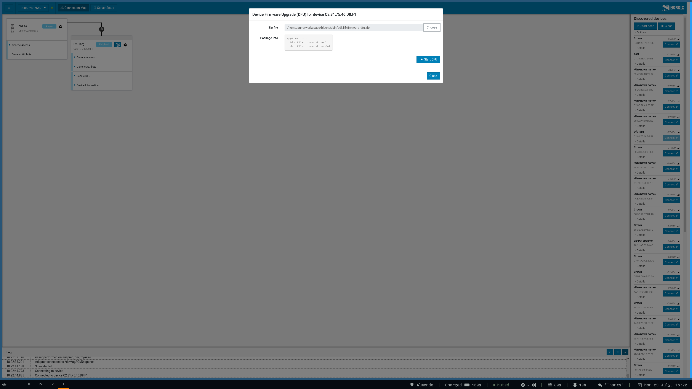
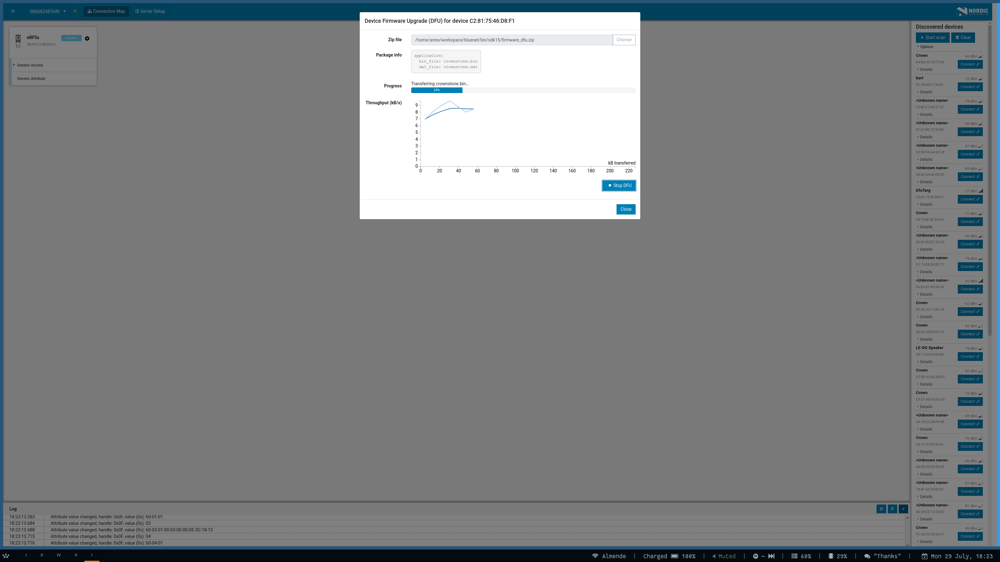

# Core utility

There are a couple of tools that will replace the Android or iOS app to flash new firmware to devices in bootloader
mode. Those can be found on [github](https://github.com/NordicSemiconductor/).

Clone first the core utility:

    git clone git@github.com:NordicSemiconductor/pc-nrfconnect-core

For Linux, navigate to the directory and run the following commands.

    npm install
    npm run dev

In a separate console:

    npm run app

All tools like JLink, nrfjprog, etc. should already be present on your system.

# Connect programmer

You do not need this tool, but it can be used to flash firmware (application, bootloader, software, bootloader 
settings) to a board that is attached over USB.

    git clone git@github.com:NordicSemiconductor/pc-nrfconnect-programmer

And similarly:

    npm install
    npm run dev

# Upload firmware

The utility can be used like this:

You can also use the command line to upload an application. Use something like:

    nrfutil dfu ble -pkg ./firmware_dfu.zip -ic NRF52

# Test

The `npm install` command installs for example the `pc_ble_driver_py`. In its `examples` directory you can find an
advertising.py file. Use it to test the Bluetooth advertising part. Here below we use the `/dev/ttyACM0` port:

    python advertising.py NRF52 /dev/ttyACM0

You can see in the nRF connect app (on your phone) that it is advertising with the name 'Example'.

Do close this test if you run a DFU update or you will get a segmentation fault. 

# Errors

There are quite a few errors you can encounter. 

I found out that without the `./` prefix I get an error code 13. Just re-check your file path.

I run also into the following problem:

      File "/home/anne/.local/lib/python2.7/site-packages/nordicsemi/dfu/dfu_transport_ble.py", line 332, in write_data_point
        self.adapter.write_cmd(self.conn_handle, DFUAdapter.DP_UUID, data)
      File "/home/anne/.local/lib/python2.7/site-packages/pc_ble_driver_py/ble_adapter.py", line 387, in write_cmd
        raise e
    pc_ble_driver_py.exceptions.NordicSemiException: Failed to ble_gattc_write. Error code: 3

This seems to stem from an issue with the MSD component in JLink.

To solve, run:

    JLinkExe
    > MSDDisable

Reset the device and now it should be able to flash another board!
