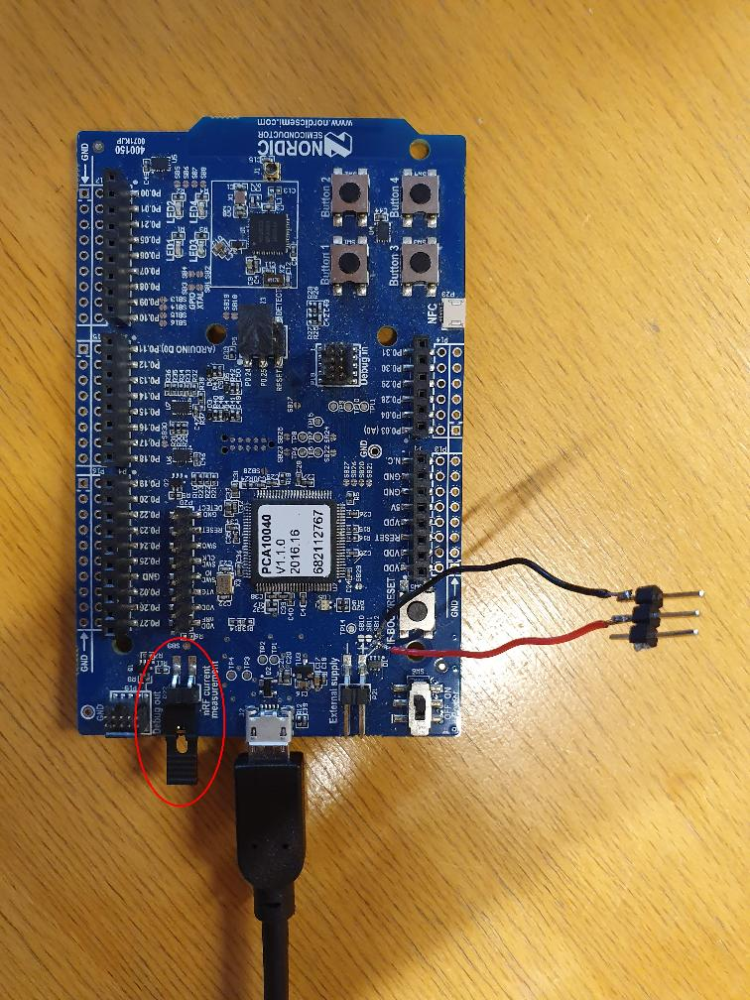
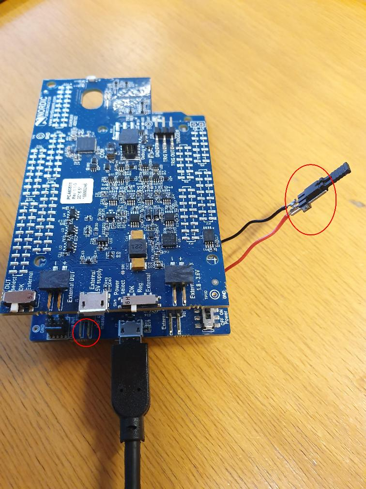

# Measuring chip power usage

Also see the [info center](https://infocenter.nordicsemi.com/topic/ug_ppk/UG/ppk/PPK_user_guide_Intro.html).

## Preparation

- Cut SB9
- Solder wires to SB12
- Set all 3 switches to "DK" on power profiler board.
- Install nRF Connect

## Program

- Connect P22 with a jumper
- Disconnect SB12
- Program the board

## Measure

- Disconnect P22
- Connect SB12 (with a jumper)
- Start nRF Connect -> Power Profiler

