# Bluenet protocol v5.1
-------------------------

This only documents the latest protocol, older versions can be found in the git history.

# Index

- [Setup](#setup-mode). How to setup the crownstone.
- [Encryption](#encryption). How to encrypt and decrypt the data.
- [Advertisements](#advertisements). What data is broadcasted by the crownstones.
- [Broadcast commands](#broadcast-commands). Broadcast commands.
- [Services and characteristics](#services). Which Bluetooth GATT services and characteristics the crownstones have.
- [Data structures](#data-structures). The data structures used for the characteristics, advertisements, and mesh.
    - [Control](#control-packet). Used to send commands to the Crownstone.
    - [Result](#result-packet). The result of a command.
    - [State](#state-types). State variables of the Crownstone.

# Setup mode

When a Crownstone is new or factory reset, it will go into setup mode.

The setup process goes as follows:

- Crownstone is in setup mode ([Setup service](#setup-service) active).
- Phone connects to the Crownstone.
- Phone reads the **session key** from the [setup service](#setup-service).
- Phone reads the [session data](#session-data) from the [setup service](#setup-service).
- From here on, all writes and read are encrypted using the session key and data, as explained [here](#encrypted-write-read).
- Phone subscribes to [result](#setup-service) characteristic.
- Phone commands Crownstone to [setup](#control-packet) via the control characteristic.
- Phone waits for result to become SUCCESS (See [result packet](#result-packet)).
- Crownstone will reboot to normal mode.

# Normal mode

When a Crownstone has been set up, it will run in "normal mode".

To write a command via connection, the process goes as follows:

- Crownstone is in normal mode ([Crownstone service](#crownstone-service) active).
- Phone connects to the Crownstone.
- Phone reads the [session data](#session-data) from the [Crownstone service](#crownstone-service).
- From here on, all writes and read are encrypted using the session key and data, as explained [here](#encrypted-write-read).
- Phone subscribes to [result](#crownstone-service) characteristic.
- Phone writes a [control command](#control-packet) to the [control characteristic](#crownstone-service).
- Phone waits for result, see [result packet](#result-packet).
- Next command can be written.

# Encryption
By default, Crownstones have encryption enabled as a security and privacy measure.

What is encrypted:

- The [service data](SERVICE_DATA.md) is encrypted using the service data key.
- Values that are **read from** the characteristics are encrypted unless specified differently.
- Values that are **written to** the characteristics are encrypted unless specified differently.
- Messages over the mesh.
- Broadcasted commands.

## AES 128 ECB encryption

Some packets are [ECB encrypted](https://en.wikipedia.org/wiki/Block_cipher_mode_of_operation#Electronic-Codebook-.28ECB.29).

## AES 128 CTR encryption

We use the [AES 128 CTR](https://en.wikipedia.org/wiki/Block_cipher_mode_of_operation#Counter-.28CTR.29) method to encrypt everything that is written to- and read from characteristics. For this you need an 8 byte number called a **nonce**. The counter starts at 0 for each packet, and is increased by 1 for every block of 16 bytes in the packet.

### Nonce

The nonce is a combination of 2 pieces: the session nonce and the packet nonce

Type | Name | Length | Description
--- | --- | --- | ---
uint8[] | Packet nonce | 3 | Packet nonce, sent with every packet (see [encrypted packet](#encrypted-packet)). Should be different for each encrypted packet.
uint8[] | Session nonce | 5 | Session nonce, should be [read](#session-data) when connected, each time you connect.

#### Session data

After connecting, you should first read the session data from the [Crownstone service](#crownstone-service).
The session data is [ECB encrypted](#ecb-encryption) with the basic key, or when in setup mode: the session key.
After decryption, you should verify whether you have read and decrypted successfully by checking if the validation is equal to **0xCAFEBABE**.
The session nonce and validation key will be different each time you connect.

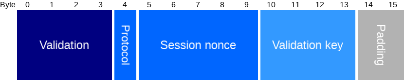

Type | Name | Length | Description
--- | --- | --- | ---
uint32 | Validation | 4 | 0xCAFEBABE as validation.
uint8 | Protocol | 1 | The protocol version to use for communication.
uint8[] | Session nonce | 5 | The session nonce for this session. Used to encrypt or decrypt packets.
uint8[] | Validation key | 4 | The validation key for this session. Used to verify decryption/encryption.
uint8[] | Padding | 2 | Zero-padding so that the whole packet is 16 bytes.

## Reading and writing characteristics

When reading and writing characteristics, the data is wrapped in an [encrypted packet](#encrypted-packet).

After subscribing, notified data will be sent as [multipart notifications](#multipart-notification-packet).

### Multipart notification packet

When data is sent via notifications, it will be done via multiple notification packets.

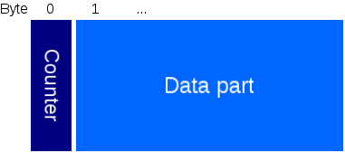

Type | Name | Length | Description
--- | --- | --- | ---
uint8 | Counter | 1 | Part counter: starts at 0, 255 for last packet.
uint8[] | Data part |  | Part of the data.

Once you received the last packet, you should concatenate all data parts to get the payload (which is usually an [encrypted packet](#encrypted-packet)).

### Encrypted packet

Unlike the name suggests, only the payload of this packet is encrypted. The header is used to determine how to decrypt the payload.

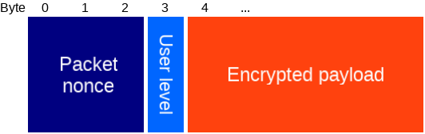

Type | Name | Length | Description
--- | --- | --- | ---
uint8[] | Packet nonce | 3 | First 3 bytes of nonce used for encrypting the payload, see [CTR encryption](#ctr-encryption).
uint8 | User level | 1 | 0: Admin, 1: Member, 2: Basic, 100: Setup. This determines which key has been used for encryption.
[Encrypted payload](#encrypted-payload) | Encrypted payload | N*16 | The encrypted payload of N blocks.

#### Encrypted payload

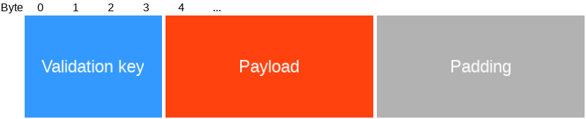

Type | Name | Length | Description
--- | --- | --- | ---
uint32 | Validation key | 4 | Should be equal to the read [validation key](#session-info).
uint8 | Payload |  | Whatever data would have been sent if encryption was disabled.
uint8 | Padding |  | Zero-padding so that the whole packet is of size N*16 bytes.

# Advertisements
By default, [iBeacon advertisements](#ibeacon-adv-packet) will be broadcast  at a regular interval.
On top of that, [advertisements with service data](#service-data-adv-packet) are also broadcasted at regular interval. The [service data](SERVICE-DATA.md) contains useful info about the state of the Crownstone.

The iBeacon advertisements have a different MAC address, since these advertisements need to have the connectable flag to be unset.
The advertisements with service data will use the original MAC address, and will have the connectable flag set.
To calculate the MAC address used for iBeacon advertisements, simply subtract 1 from the first byte of the original MAC address (overflow only that byte, so it only changes the first byte).

### iBeacon advertisement packet

This packet is according to iBeacon spec, see for example [here](http://www.havlena.net/en/location-technologies/ibeacons-how-do-they-technically-work/).

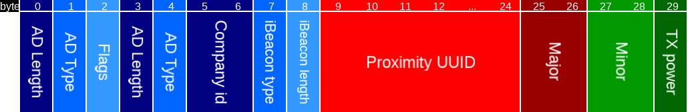

Type | Name | Length | Description
--- | --- | --- | ---
uint8 | AD Length | 1 | Length of the next AD structure.
uint8 | AD Type | 1 | 0x01: flags.
uint8 | Flags | 1 |
uint8 | AD Length | 1 | Length of the next AD structure.
uint8 | AD Type | 1 | 0xFF: manufacturer specific data.
uint16 | Company id | 2 | 0x004C: Apple.
uint8 | iBeacon type | 1 | 0x02: iBeacon.
uint8 | iBeacon length | 1 | iBeacon struct length (0x15).
uint8 | Proximity UUID | 16 | Configurable number.
uint16 | Major | 2 | Configurable number.
uint16 | Minor | 2 | Configurable number.
int8 | TX power | 1 | Received signal strength at 1 meter.

### Service data advertisement
This packet contains the state of the Crownstone.

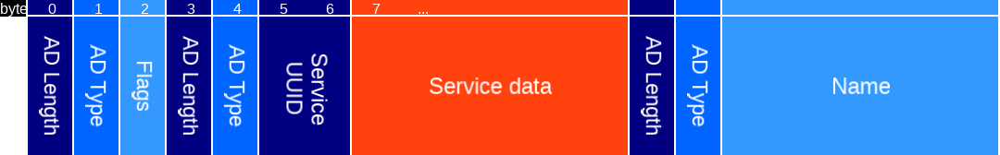

Type | Name | Length | Description
--- | --- | --- | ---
uint8 | AD Length | 1 | Length of the next AD structure.
uint8 | AD Type | 1 | 0x01: flags.
uint8 | Flags | 1 | 
uint8 | AD Length | 1 | Length of the next AD structure.
uint8 | AD Type | 1 | 0x16: service data with 16 bit service UUID.
uint16 | Service UUID | 2 | Service UUID: 0xC001, 0xC002, or 0xC003. The last two are deprecated, see service data doc.
[Service data](SERVICE_DATA.md) | Service data | length-3 | Service data, contains state of the Crownstone.
uint8 | AD Length | 1 | Length of the next AD structure.
uint8 | AD Type | 1 | 0x08: shortened local name.
char[] | Name | length-1 | The shortened name of this device.

# Broadcast commands

Some commands can also be sent via broadcasts. This is the preferred way, as there is no need to connect to the Crownstone, which takes quite some time.
The broadcast protocol is documented in the [broadcast protocol](BROADCAST_PROTOCOL.md) document.

# Services

When connected, the following services are available.

The `A`, `M`, and `B` columns indicate which users can use these characteristics if encryption is enabled. The access can be further restricted per packet.

- A: Admin
- M: Member
- B: Basic

The following services are available (depending on state and config):
- [Crownstone service](#crownstone-service). Contains all you need: control, config and state.
- [Setup service](#setup-service). Similar to the crownstone service, replaces it when in setup mode.

## Crownstone service

The crownstone service has UUID 24f00000-7d10-4805-bfc1-7663a01c3bff and provides all the functionality of the Crownstone through the following characteristics:

Characteristic | UUID | Date type | Description | A | M | B
--- | --- | --- | --- | :---: | :---: | :---:
Session nonce  | 24f0000e-7d10-4805-bfc1-7663a01c3bff | [Session data](#session-data) | Read the session data. |  |  | ECB
Control        | 24f0000c-7d10-4805-bfc1-7663a01c3bff | [Control packet](#control-packet) | Write a command to the crownstone. | x | x | x
Result         | 24f0000d-7d10-4805-bfc1-7663a01c3bff | [Result packet](#result-packet) | Read the result of a command from the crownstone. | x | x | x
Recovery       | 24f00009-7d10-4805-bfc1-7663a01c3bff | uint32 | Used for [recovery](#recovery). | | | 

Every command written to the control characteristic returns a [result packet](#result-packet) on the result characteristic.
If commands have to be executed sequentially, make sure that the result packet of the previous command was received before calling the next (either by polling or subscribing).

#### Recovery
If you lost your encryption keys you can use this characteristic to factory reset the Crownstone.
This method is only available for 60 seconds after the Crownstone powers on.
You need to write **0xDEADBEEF** to it. Then, the Crownstone disconnects and goes into low TX mode so you'll have to be close to continue the factory reset. After this, you reconnect and write **0xDEADBEEF** again to this characteristic to factory reset the Crownstone.

## Setup service

The setup service has UUID 24f10000-7d10-4805-bfc1-7663a01c3bff and is only available after a factory reset or when you first power on the Crownstone.
 When encryption is enabled, the control and both config characteristics are encrypted with AES CTR. The key and session nonce for this are gotten from their
 characteristics.

Characteristic | UUID | Date type | Description
--- | --- | --- | ---
MAC address    | 24f10002-7d10-4805-bfc1-7663a01c3bff | uint8[6] | Read the MAC address of the crownstone.
Session key    | 24f10003-7d10-4805-bfc1-7663a01c3bff | uint8[16] | Read the session key that will be for encryption.
Session data   | 24f1000e-7d10-4805-bfc1-7663a01c3bff | [Session data](#session-data) | Read the session data.
Control        | 24f1000c-7d10-4805-bfc1-7663a01c3bff | [Control packet](#control-packet) | Write a command to the crownstone.
Result         | 24f1000d-7d10-4805-bfc1-7663a01c3bff | [Result packet](#result-packet) | Read the result of a command from the crownstone.

Every command written to the control characteristic returns a [result packet](#result-packet) on the result characteristic.
If commands have to be executed sequentially, make sure that the result packet of the previous command was received before calling the next (either by polling or subscribing).

# Data structures

Index:

- [Control](#control-packet). Used to send commands to the Crownstone.
- [Result](#result-packet). The result of a command.
- [State](#state-types). State variables of the Crownstone.

## Control packet

__If encryption is enabled, this packet must be encrypted using any of the keys where the box is checked.__

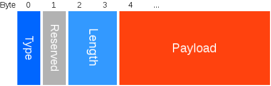

Type | Name | Length | Description
--- | --- | --- | ---
uint8 | Protocol | 1 | Which protocol the command is. Should be similar to the protocol as received in the [session data](#session-data). Older protocols might be supported, but there's no guarantee.
uint16 | [Command type](#command-types) | 2 | Type of the command.
uint16 | Size | 2 | Size of the payload in bytes.
uint8 | Payload | Size | Payload data, depends on command type.

## Command types

The `A`, `M`, `B`, and `S` columns indicate which users have access to these commands if encryption is enabled.
Admin access means the packet is encrypted with the admin key.
Setup access means the packet is available in setup mode, and encrypted with the temporary setup key, see [setup](#setup).

- A: Admin
- M: Member
- B: Basic
- S: Setup

Available command types:

Type nr | Type name | Payload type | Result payload | Description | A | M | B | S
--- | --- | --- | --- | --- | :---: | :---: | :---: | :--:
0 | Setup | [Setup packet](#setup-packet) | - | Perform setup. |  |  |  | x
1 | Factory reset | uint32 | - | Reset device to factory setting, needs Code 0xDEADBEEF as payload | x
2 | Get state | [State get packet](#state-get-packet) | [State get result packet](#state-get-result-packet) | Required access depends on the state type. | x | x | x
3 | Set state | [State set packet](#state-set-packet) | [State set result packet](#state-set-result-packet) | Required access depends on the state type. | x | x | x
4 | Get bootloader version | - | [Bootloader info packet](IPC.md#bootloader-info-packet) | Get bootloader version info. | x | x | x | x
5 | Get UICR data | - | [UICR data packet](#uicr-data-packet) | Get the UICR data. | x | x | x | x
6 | Set ibeacon config ID | [Ibeacon config ID packet](#ibeacon-config-id-packet) | - | Set the ibeacon config ID that is used. The config values can be set via the *Set state* command, with corresponding state ID. You can use this command to interleave between config ID 0 and 1. | x | | | 
7 | Get MAC address | - | uint8[6] | Get the MAC address of this stone (in reverse byte order compared to string representation). | x | x | x | x
10 | Reset | - | - | Reset device | x
11 | Goto DFU | - | - | Reset device to DFU mode | x
12 | No operation | - | - | Does nothing, merely there to keep the crownstone from disconnecting | x | x | x
13 | Disconnect | - | - | Causes the crownstone to disconnect | x | x | x
20 | Switch | [Switch value](#switch-command-value) | - | Switch power. | x | x | x | x |
21 | Multi switch | [Multi switch packet](#multi-switch-packet) | - | Switch multiple Crownstones (via mesh). | x | x | x
22 | Dimmer | uint8 | - | Set dimmer to value, 0 = off, 100 = full on | x | x | x |
23 | Relay | uint8 | - | Switch relay, 0 = off, 1 = on | x | x | x
30 | Set time | uint32 | - | Sets the time. Timestamp is in seconds since epoch (Unix time). | x | x |
31 | Increase TX | - | - | Temporarily increase the TX power when in setup mode |  |  |  | x
32 | Reset errors | [Error bitmask](#state-error-bitmask) | - | Reset all errors which are set in the written bitmask. | x
33 | Mesh command | [Mesh command packet](#mesh-command-packet) | - | Send a generic command over the mesh. Required access depends on the command. | x | x | x
34 | Set sun times | [Sun time packet](#sun-time-packet) | - | Update the reference times for sunrise and sunset | x | x
35 | Get time | - | uint32 | Get the time. Timestamp is in seconds since epoch (Unix time). | x | x | x
36 | Reset RSSI between stones | - | - | Resets the cached RSSI between stones. Will also let the crownstones send the RSSI of their neighbours at a smaller interval. | x
40 | Allow dimming | uint8 | - | Allow/disallow dimming, 0 = disallow, 1 = allow. | x
41 | Lock switch | uint8 | - | Lock/unlock switch, 0 = unlock, 1 = lock. | x
50 | UART message | payload | - | Print the payload to UART. | x
51 | Hub data | [Hub data packet](#hub-data-packet) | - | Send data to hub over UART. You will first get WAIT_FOR_SUCCESS, when it's sent to the hub. Once the hub processed the command, and replied, you will get the final result. | x
60 | Add behaviour | [Add behaviour packet](BEHAVIOUR.md#add-behaviour-packet) | [Index and master hash](BEHAVIOUR.md#add-behaviour-result-packet) | Add a behaviour to an unoccupied index. | x | x
61 | Replace behaviour | [Replace behaviour packet](BEHAVIOUR.md#replace-behaviour-packet) | [Index and master hash](BEHAVIOUR.md#replace-behaviour-result-packet) | Replace the behaviour at given index. | x | x
62 | Remove behaviour | [Remove behaviour packet](BEHAVIOUR.md#remove-behaviour-packet) | [Index and master hash](BEHAVIOUR.md#remove-behaviour-result-packet) | Remove the behaviour at given index. | x | x
63 | Get behaviour | [Index](BEHAVIOUR.md#get-behaviour-packet) | [Index and behaviour packet](BEHAVIOUR.md#get-behaviour-result-packet) | Obtain the behaviour stored at given index. | x | x
64 | Get behaviour indices | - | [Behaviour indices packet](BEHAVIOUR.md#get-behaviour-indices-packet) | Obtain a list of occupied indices in the list of behaviours. | x | x
69 | Get behaviour debug | - | [Behaviour debug packet](#behaviour-debug-packet) | Obtain debug info of the current behaviour state. | x
70 | Register tracked device | [Register tracked device packet](#register-tracked-device-packet) | - | Register or update a device to be tracked. Error codes: ALREADY_EXISTS: another device ID registered the same token. ERR_NO_ACCESS: this device ID was set with a higher access level. ERR_NO_SPACE: max number of devices have been registered. | x | x | x
71 | Tracked device heartbeat | [Tracked device heartbeat packet](#tracked-device-heartbeat-packet) | - | Let the crownstone know where a device is, similar to [background broadcasts](BROADCAST-PROTOCOL.md#background-broadcasts). Error codes: ERR_NOT_FOUND: no device with given device ID was registered. ERR_TIMEOUT: registered device is timed out. ERR_NO_ACCESS: wrong access level, or device token. | x | x | x
72 | Get presence | - | [Presence packet](presence_packet) | Get the current location of each profile. | x | x
80 | Get uptime | - | uint32 | Time in seconds since boot. | x
81 | Get ADC restarts | - | [ADC restarts packet](#adc-restarts-packet) | **Firmware debug.** Number of ADC restarts since boot. | x
82 | Get switch history | - | [Switch history packet](#switch-history-packet) | **Firmware debug.** A history of why the switch state has changed. | x
83 | Get power samples | [Request power samples](#power-samples-request-packet) | [Power samples](#power-samples-result-packet) | **Firmware debug.** Get the current or voltage samples of certain events. | x
84 | Get min scheduler free space | - | uint16 | **Firmware debug.** Get minimum queue space left of app scheduler observed so far. A lower number indicates the CPU has been busy a lot. | x
85 | Get last reset reason | - | uint32 | **Firmware debug.** Contents of POWER->RESETREAS as it was on boot. Bitmask with bit 0=ResetPin, 1=Watchdog, 2=SoftReset, 3=Lockup, 16=GPIO, 17=LPComp, 18=DebugInterface, 19=NFC. | x
86 | Get GPREGRET | Index (uint8) | [Gpregret packet](#gpregret-result-packet) | **Firmware debug.** Get the Nth general purpose retention register as it was on boot. There are currently 2 registers. | x
87 | Get ADC channel swaps | - | [ADC channel swaps packet](#adc-channel-swaps-packet) | **Firmware debug.** Get the number of detected ADC channel swaps. | x
88 | Get RAM statistics | - | [RAM stats packet](#ram-stats-packet) | **Firmware debug.** Get RAM statistics. | x
90 | Get microapp info | - | [Microapp info packet](#microapp-info-packet) | Get info like supported protocol and SDK, maximum sizes, and the state of uploaded microapps. | x
91 | Upload microapp | [Microapp upload packet](#microapp-upload-packet) | - | Upload (a part of) a microapp. | x
92 | Validate microapp | [Microapp header packet](#microapp-header-packet) | - | Validate a microapp. Should be done after upload: checks integrity of the uploaded data. | x
93 | Remove microapp | [Microapp header packet](#microapp-header-packet) | - | Removes a microapp. When result is ERR_WAIT_FOR_SUCCESS, you have to wait for ERR_SUCCESS. In case the microapp is already removed, you will get ERR_SUCCESS_NO_CHANGE. | x
94 | Enable microapp | [Microapp header packet](#microapp-header-packet) | - | Enable a microapp. Should be done after validation: checks SDK version, resets any failed tests, and starts running the microapp. | x
95 | Disable microapp | [Microapp header packet](#microapp-header-packet) | - | Disable a microapp, stops running the microapp. | x
100 | Clean flash | - | - | **Firmware debug.** Start cleaning flash: permanently deletes removed state variables, and defragments the persistent storage. | x
110 | Upload filter | [Upload filter packet](./TRACKABLE_PARSER.md#upload-filter) | - | **Under development.** Uploads a part of a filter for the TrackableParser component. | x
111 | Remove filter | [Remove filter packet](./TRACKABLE_PARSER.md#remove-filter) | - | **Under development.** Deletes a part of a filter for the TrackableParser component. | x
112 | Commit filter changes |  [Commit filter changes packet](./TRACKABLE_PARSER.md#commit-filter-changes) | - | **Under development.** Commit changes made to the filters of the TrackableParser component. | x
113 | Get filter summaries | [Get filter summaries packet](./TRACKABLE_PARSER.md#get-filter-summaries) | - | **Under development.** Obtain summaries of the filters for the TrackableParser component.  | x

#### Setup packet

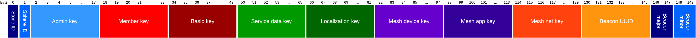

Type | Name | Length | Description
--- | --- | --- | ---
uint8 | Stone ID | 1 | Crownstone ID. Should be unique per sphere.
uint8 | Sphere ID | 1 | Short sphere ID. Should be the same for each Crownstone in the sphere.
uint8[] | Admin key  | 16 | 16 byte key used to encrypt/decrypt admin access functions.
uint8[] | Member key | 16 | 16 byte key used to encrypt/decrypt member access functions.
uint8[] | Basic key  | 16 | 16 byte key used to encrypt/decrypt basic access functions.
uint8[] | Service data key  | 16 | 16 byte key used to encrypt/decrypt service data.
uint8[] | Localization key  | 16 | 16 byte key used to encrypt/decrypt localization messages.
uint8[] | Mesh device key  | 16 | 16 byte key used to encrypt/decrypt mesh config. Should be different for each Crownstone.
uint8[] | Mesh app key  | 16 | 16 byte key used to encrypt/decrypt mesh messages. Should be the same for each Crownstone in the sphere.
uint8[] | Mesh net key  | 16 | 16 byte key used to encrypt/decrypt relays of mesh messages. Should be the same for each Crownstone in the sphere.
uint8[] | iBeacon UUID | 16 | The iBeacon UUID. Should be the same for each Crownstone in the sphere.
uint16 | iBeacon major | 2 | The iBeacon major. Together with the minor, should be unique per sphere.
uint16 | iBeacon minor | 2 | The iBeacon minor. Together with the major, should be unique per sphere.

#### Switch command value (uint8)

Value | Name | Description
--- | --- | ---
0-100 | Percentage | 0 for OFF, 100 fully ON, dimmed in between.
253 | Toggle | Switch `OFF` when currently on, switch to `SMART_ON` when currently off.
254 | Behaviour | Switch to the value according to _behaviour_ rules.
255 | Smart on | Switch on, the value will be determined by _behaviour_ rules.

#### State get packet

Type | Name | Length | Description
--- | --- | --- | ---
uint16 | [State type](#state-types) | 2 | Type of state to get.
uint16 | id | 2 | ID of state to get. Most state types will only have ID 0.
uint8 | [Persistence mode](#state-get-persistence-mode) | 1 | Type of persistence mode.
uint8 | reserved | 1 | Reserved for future use, must be 0 for now.

#### State set packet

Most configuration changes will only be applied after a reboot.

Type | Name | Length | Description
--- | --- | --- | ---
uint16 | [State type](#state-types) | 2 | Type of state to set.
uint16 | id | 2 | ID of state to get. Most state types will only have ID 0.
uint8 | [Persistence mode](#state-set-persistence-mode-set) | 1 | Type of persistence mode.
uint8 | reserved | 1 | Reserved for future use, must be 0 for now.
uint8 | Payload | N | Payload data, depends on state type.

Most configuration changes will only be applied after a reboot.
Available configurations types:

#### State get result packet

Type | Name | Length | Description
--- | --- | --- | ---
uint16 | [State type](#state-types) | 2 | Type of state.
uint16 | id | 2 | ID of state.
uint8 | [Persistence mode](#state-get-persistence-mode) | 1 | Type of persistence mode.
uint8 | reserved | 1 | Reserved for future use, must be 0 for now.
uint8 | Payload | N | Payload data, depends on state type.

#### State set result packet

Type | Name | Length | Description
--- | --- | --- | ---
uint16 | [State type](#state-types) | 2 | Type of state.
uint16 | id | 2 | ID of state that was set.
uint8 | [Persistence mode](#state-set-persistence-mode-set) | 1 | Type of persistence mode.
uint8 | reserved | 1 | Reserved for future use, must be 0 for now.

#### State get persistence mode
Value | Name | Description
--- | --- | ---
0   | CURRENT | Get value from ram if exists, else from flash if exists, else get default. This is the value used by the firmware.
1   | STORED | Get value from flash, else get default. This value will be used after a reboot.
2   | FIRMWARE_DEFAULT | Get default value.

#### State set persistence mode
Value | Name | Description
--- | --- | ---
0   | TEMPORARY | Set value to ram. This value will be used by the firmware, but lost after a reboot.
1   | STORED | Set value to ram and flash. This value will be used by the firmware, also after a reboot. Overwrites the temporary value.

##### UICR data packet

This packet is meant for developers. For more information, see [UICR](UICR.md) and [Naming](NAMING.md).

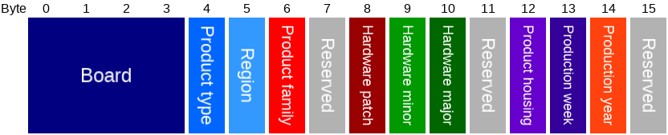

Type | Name | Length | Description
--- | --- | --- | ---
uint32 | Board | 4 | The board version.
uint8 | Product type | 1 | Type of product.
uint8 | Region | 1 | Which region the product is for.
uint8 | Product family | 1 | Product family.
uint8 | Reserved | 1 | Reserved for future use, will be 0xFF for now.
uint8 | Hardware patch | 1 | Hardware version patch.
uint8 | Hardware minor | 1 | Hardware version minor.
uint8 | Hardware major | 1 | Hardware version major.
uint8 | Reserved | 1 | Reserved for future use, will be 0xFF for now.
uint8 | Product housing | 1 |
uint8 | Production week | 1 | Week number.
uint8 | Production year | 1 | Last 2 digits of the year.
uint8 | Reserved | 1 | Reserved for future use, will be 0xFF for now.

##### Ibeacon config ID packet

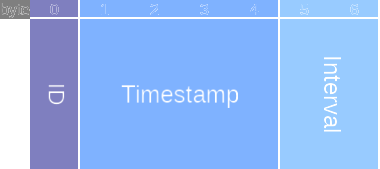

Type | Name | Length | Description
--- | --- | --- | ---
uint8 | ID | 1 | The ibeacon config ID to set.
uint32 | Timestamp | 4 | Unix timestamp when the ibeacon config ID should be set (the first time).
uint16 | Interval | 2 | Interval in seconds when the ibeacon config ID should be set again, after the given timestamp.

- ID can only be 0 or 1.
- Set the interval to 0 if you want to set the ibeacon config ID only once, at the given timestamp. Use timestamp 0 if you want it to be set immediately.
- To interleave between two config IDs every 60 seconds, you will need two commands. First set ID=0, at timestamp=0 with interval=60, then set ID=1 at timestamp=30 with interval=60.

##### Sun time packet

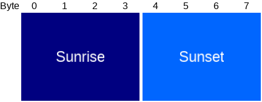

Type | Name | Length | Description
--- | --- | --- | ---
uint32 | Sunrise | 4 | The moment when the upper limb of the sun appears on the horizon. Units: seconds since midnight.
uint32 | Sunset | 4 | The moment when the upper limb of the Sun disappears below the horizon. Units: seconds since midnight.

##### Multi switch packet

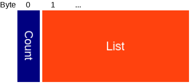

Type | Name | Length | Description
--- | --- | --- | ---
uint8 | Count | 1 | Number of valid entries.
[Multi switch entry](#multi-switch-entry-packet)[] | List | Count * 2 | A list of switch commands.

##### Multi switch entry

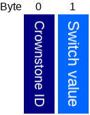

Type | Name | Length | Description
--- | --- | --- | ---
uint8 | Crownstone ID | 1 | The identifier of the crownstone to which this item is targeted.
uint8 | [Switch value](#switch-command-value) | 1 | The switch value to be set by the targeted crownstone.

#### Error Bitmask

Bit | Name |  Description
--- | --- | ---
0 | Overcurrent | If this is 1, overcurrent was detected.
1 | Overcurrent dimmer | If this is 1, overcurrent for the dimmer was detected.
2 | Chip temperature | If this is 1, the chip temperature is too high.
3 | Dimmer temperature | If this is 1, the dimmer temperature is too high.
4 | Dimmer on failure | If this is 1, the dimmer is broken, in an always (partial) on state.
5 | Dimmer off failure | If this is 1, the dimmer is broken, in an always (partial) off state.
6-31 | Reserved | Reserved for future use.

#### Mesh command packet
This will not work for every command, because the payload size is limited, and the commands are white listed to be sent via mesh.
Current white list:
- Factory reset
- Reset errors
- Reset
- Set time
- Set state
- Uart msg
- Set iBeacon config ID
- Reset RSSI between stones
- Lock switch
- Allow dimming

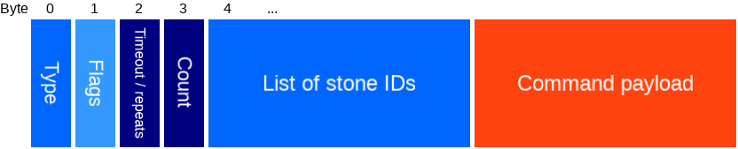

Type | Name | Length | Description
--- | --- | --- | ---
uint8 | [Type](#mesh-command-types) | 1 | Type of command, see table below.
uint8 | [Flags](#mesh-command-flags) | 1 | Options.
uint8 | Timeout / transmissions | 1 | When acked: timeout time in seconds. Else: number of times to send the command. 0 to use the default (10s timeout or 3 transmissions).
uint8 | ID count | 1 | The number of stone IDs provided.
uint8[] | List of stone IDs | Count | IDs of the stones at which this message is aimed. Can be empty, then the command payload follows directly after the count field.
uint8 | Command payload | N | The command payload data, which depends on the [type](#mesh-command-types).

##### Mesh command types

Type nr | Type name | Payload type | Payload description
--- | --- | --- | ---
0 | Control | [Control](#control-packet) | Send a control command over the mesh, see control packet.

##### Mesh command flags

For now there are only a couple of combinations possible:

- If you want to send a command to all stones in the mesh, without acks and retries, set: `Broadcast=true`, `AckIDs=false`, `KnownIDs=false`.
- If you want to send a command to all stones in the mesh, with acks and retries, set: `Broadcast=true`, `AckIDs=true`, `KnownIDs=false`. You will have to provide the list of IDs yourself.
- If you want to send a command to 1 stone, with acks and retries, set: `Broadcast=false`, `AckIDs=true`, `KnownIDs=false`.

Bit | Name |  Description
--- | --- | ---
0 | Broadcast | Send command to all stones. Else, its only sent to all stones in the list of stone IDs, which will take more time.
1 | Ack all IDs | Retry until an ack is received from all stones in the list of stone IDs, or until timeout. If you specify more than 1 IDs, only small command payloads will work for most command types.
2 | Use known IDs | Instead of using the provided stone IDs, use the stone IDs that this stone has seen. **Not implemented yet.**

#### Hub data packet

Type | Name | Length | Description
--- | --- | --- | ---
uint8 | Encrypted | 1 | Whether the data should be sent encrypted over the UART: 0 = not encrypted, 1 = encrypt when encryption is enabled, 2 = encrypt or fail.
uint8 | Reserved | 1 | Reserved for future use. Must be 0 for now.
uint8 | Payload | N | Payload data to be sent to hub.

#### Presence packet

A profile can be present at multiple locations/rooms.

Type | Name | Length | Description
--- | --- | --- | ---
uint64[] | Presence | 64 | Bitmask per profile (there are 8 profiles) of occupied rooms. Nth bit is Nth room.

#### Behaviour debug packet

Type | Name | Length | Description
--- | --- | --- | ---
uint32 | Time | 4 | Current time. 0 if not set.
uint32 | Sunrise | 4 | Sunrise time, seconds after midnight. 0 if not set.
uint32 | Sunset | 4 | Sunset time, seconds after midnight. 0 if not set.
uint8 | Override state | 1 | Override state. 254 if not set.
uint8 | Behaviour state | 1 | Behaviour state. 254 if not set.
uint8 | Aggregated state | 1 | Aggregated state. 254 if not set.
uint8 | Dimmer powered | 1 | Whether the dimmer is powered.
uint8 | Behaviour enabled | 1 | Whether behaviour is enabled.
uint64 | Stored behaviours | 8 | Bitmask of behaviours that are stored. Nth bit is Nth behaviour index.
uint64 | Active behaviours | 8 | Bitmask of behaviours that are currently active. Nth bit is Nth behaviour index.
uint64 | Active end conditions | 8 | Bitmask of behaviours with active end conditions. Nth bit is Nth behaviour index.
uint64 | Active timeout periods | 8 | Bitmask of behaviours that are in (presence) timeout period. Nth bit is Nth behaviour index.
uint64[] | Presence | 64 | Bitmask per profile (there are 8 profiles) of occupied rooms. Nth bit is Nth room.

#### ADC restarts packet

Type | Name | Length | Description
--- | --- | --- | ---
uint32 | Restart count | 4 | Number of ADC restarts since boot.
uint32 | Timestamp | 4 | Unix timestamp of the last ADC restart.

#### ADC channel swaps packet

Type | Name | Length | Description
--- | --- | --- | ---
uint32 | Swap count | 4 | Number of detected ADC channel swaps since boot.
uint32 | Timestamp | 4 | Unix timestamp of the last detected ADC channel swap.

#### GPREGRET result packet

Type | Name | Length | Description
--- | --- | --- | ---
uint8 | Index | 1 | Which GPREGRET.
uint32 | Value | 4 | Value of this GPREGRET. For index 0: bits 0-4 are used to count resets, bit 5 is set on brownout (doesn't work yet), bit 6 is set to go to DFU mode, bit 7 is set after storage was recovered.

#### RAM stats packet

Type | Name | Length | Description
--- | --- | --- | ---
uint32 | Min stack end | 4 | Minimal observed stack end pointer since boot. It might take some time before this reflects the actual minimum.
uint32 | Max heap end | 4 | Maximal observed heap end pointer since boot.
uint32 | Min free | 4 | Minimal observed free RAM in bytes. It might take some time before this reflects the actual minimum.
uint32 | Sbrk fail count | 4 | Number of times sbrk failed to hand out space.

#### Switch history packet

Type | Name | Length | Description
--- | --- | --- | ---
uint8 | Count | 1 | Number of items in the list.
[Switch history item](#switch-history-item-packet)[] | List |

##### Switch history item packet

Type | Name | Length | Description
--- | --- | --- | ---
uint32 | Timestamp | 4 | Unix timestamp of the switch command.
[Switch command](#switch-command-value) | Switch command | 1 | The switch command value.
[Switch state](#switch-state-packet) | Switch state | 1 | The switch state after the command was executed.
[Command source](#command-source-packet) | Source | 2 | The source of the switch command.

#### Command source packet

Type | Name | Length in bits | Description
--- | --- | --- | ---
uint8 | [Source type](#command-source-type) | 3 | What type of source ID. Bits 5-7.
uint8 | Reserved | 4 | Reserved for future use, must be 0 for now. Bits 1-4.
bool | External | 1 | Whether the command was received via the mesh. Bit 0.
uint8 | [Source ID](#command-source-ID) | 8 | The ID of the source.

##### Command source type

Value | Name | Description
--- | --- | ---
0 | Enum | ID is one of the [list](#command-source-ID).
1 | Behaviour | ID is the behaviour index, or 255 when unknown.
3 | Broadcast | ID is the [device ID](BROADCAST_PROTOCOL.md#command-adv-header)
4 | Uart | ID is the device ID

##### Command source ID

Value | Name | Description
--- | --- | ---
0 | None | No source was set.
2 | Internal | Some internal source, not very specific.
3 | UART | Command came from UART.
4 | Connection | Command came from a BLE connection.
5 | Switchcraft | Switchcraft triggered this command.
6 | Tap to toggle | Tap to toggle triggered this command.

#### Power samples request packet

Type | Name | Length | Description
--- | --- | --- | ---
uint8 | [Type](#power-samples-type) | 1 | Type of samples.
uint8 | Index | 1 | Some types have multiple lists of samples.

#### Power samples type

Value | Name| Description
--- | --- | ---
0 | Triggered switchcraft | Last samples that triggered switchcraft. Has N lists of subsequent voltage samples (index 0 is the first list). You can assume the time between the last sample of the first list and the first sample of the second list is equal to sample interval. Keep reading the next index until you get result code WRONG_PARAMETER.
1 | Non-triggered switchcraft | Last samples that almost triggered switchcraft. Has N lists of subsequent voltage samples (index 0 is the first list). You can assume the time between the last sample of the first list and the first sample of the second list is equal to sample interval. Keep reading the next index until you get result code WRONG_PARAMETER.
2 | Now filtered | Last sampled values, after smoothing. Has 2 lists: index 0 for voltage, index 1 for current.
3 | Now unfiltered | Last sampled values, before smoothing. Has 2 lists: index 0 for voltage, index 1 for current.
4 | Soft fuse | Last samples that triggered a soft fuse. Has 1 list: index 0 for current.
5 | Switch event | Last samples around a switch event. Has N lists: even index for voltage samples, uneven index for current samples.

#### Power samples result packet
background broadcast
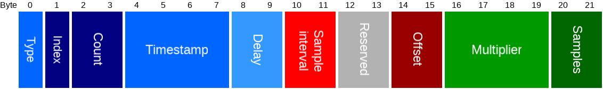

Type | Name | Length | Description
--- | --- | --- | ---
uint8 | [Type](#power-samples-type) | 1 | Type of samples, also determines whether the samples are voltage or current samples.
uint8 | Index | 1 | Some types have multiple lists of samples, see the type description.
uint16 | Count | 2 | Number of samples in the list.
uint32 | Timestamp | 4 | Unix timestamp of time the samples have been set.
uint16 | Delay | 2 | Measurement delay in μs, due to hardware. A sample measured now, will get the value of delay μs ago. Not set yet, will be 0.
uint16 | Sample interval | 2 | Sample interval in μs.
uint16 | Reserved | 2 | Reserved for future use, should be 0 for now.
int16 | Offset | 2 | Calculated offset of the samples. (Sort of the average of the sample values). Not set yet, will be 0.
float | Multiplier | 4 | Multiply the sample value minus offset with this value to get a value in ampere (when samples are current), or volt (when samples are voltage). Not set yet, will be 0.
int16[] | Samples | 2 | List of samples.

#### Register tracked device packet

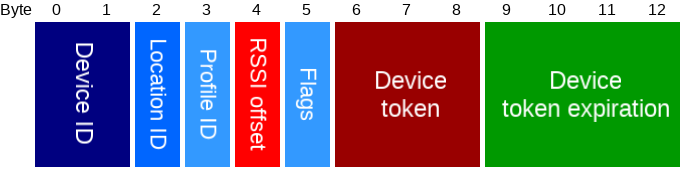

Type | Name | Length | Description
--- | --- | --- | ---
uint16 | Device ID | 2 | Unique ID of the device.
uint8 | Location ID | 1 | ID of the location where the device is. 0 for in sphere, but no specific location.
uint8 | Profile ID | 1 | Profile ID of the device.
int8 | RSSI offset | 1 | Offset from standard signal strength.
uint8 | Flags | 1 | [Flags](BROADCAST_PROTOCOL.md#background-adv-flags).
uint24 | Device token | 3 | Token that will be advertised by the device.
uint16 | Time to live | 2 | Time in minutes after which the device token will be invalid.

#### Tracked device heartbeat packet

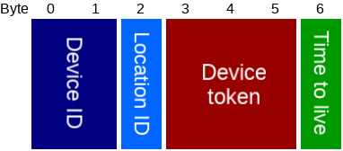

Type | Name | Length | Description
--- | --- | --- | ---
uint16 | Device ID | 2 | Unique ID of the device.
uint8 | Location ID | 1 | ID of the location where the device is. 0 for in sphere, but no specific location.
uint24 | Device token | 3 | Token that has been registered.
uint8 | Time to live | 1 | How long (in minutes) the crownstone assumes the device is at the given location, so should best be larger than the interval at which the heartbeat is sent. Setting this to 0 is similar to sending a single [background broadcast](BROADCAST_PROTOCOL.md#background-broadcasts). Currently the max is 60, a longer time will result in an error WRONG_PARAMETER.

#### Microapp header packet

Type | Name | Length | Description
--- | --- | --- | ---
uint8 | Protocol | 1 | Protocol of the microapp command and result packets, should match what you get from the [microapp info packet](#microapp-info-packet).
uint8 | App index | 1 | Index of the microapp on this Crownstone.

#### Microapp upload packet

Type | Name | Length | Description
--- | --- | --- | ---
[Microapp header](#microapp-header-packet) | Header | 2 |
uint16 | Offset | 2 | Offset in bytes of this chunk of data. Must be a multiple of 4.
uint8[] | Data chunk | N | A chunk of the binary.

For example, if the microapp binary is 299 byte, and your chunks are 128 byte, then you have 3 upload commands with offsets: 0, 128, 256. The last command will have 44 byte of data: the remaining 43 byte, padded to 44 byte, so it is a multiple of 4.

From the get info command, you know which index to use, and what protocol, sdk, and sizes are supported.

When result is ERR_WAIT_FOR_SUCCESS, you have to wait for the result to change to ERR_SUCCESS.
In case the stored data matches what you upload, you will get ERR_SUCCESS_NO_CHANGE.
If the stored data does not match, you will get ERR_WRITE_DISABLED, meaning you should first remove the current microapp.

#### Microapp info packet

Type | Name | Length | Description
--- | --- | --- | ---
uint8 | Protocol | 1 | Supported protocol of the microapp command and result packets.
uint8 | Max apps | 1 | Maximum number of microapps.
uint16 | Max app size | 2 | Maximum binary size of a microapp.
uint16 | Max chunk size | 2 |  Maximum chunk size for uploading a microapp.
uint16 | Max ram usage | 2 | Maximum RAM usage of a microapp.
[SDK version](#microapp-sdk-version-packet) | SDK version | 2 | SDK version the firmware supports.
[App status](#microapp-status-packet)[] | App status |  | Status of all microapps, no matter how many have been uploaded.

#### Microapp SDK version packet

The microapp SDK version determines the API for communication between bluenet firmware and microapps.

Type | Name | Length | Description
--- | --- | --- | ---
uint8 | Major | 1 | Major version: different major indicates breaking changes.
uint8 | Minor | 1 | Minor version: higher minor means more features.

#### Microapp status packet

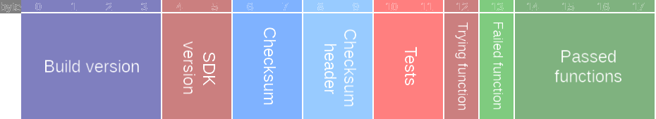

Type | Name | Length | Description
--- | --- | --- | ---
uint32 | Build version | 4 | Build version of this microapp, should increase each release.
[SDK version](#microapp-sdk-version-packet) | SDK version | 2 | SDK version this microapp was built for.
uint16 | Checksum | 2 | CRC-16-CCITT of the binary, after the header.
uint16 | Checksum header | 2 | CRC-16-CCITT of the binary header.
[tests](#microapp-tests-packet) | Tests | 2 | State of tests that have been performed.
uint8 | Trying function | 1 | Index of registered function that didn't pass yet, and that we are calling now. 255 for none.
uint8 | Failed function | 1 | Index of registered function that was tried, but didn't pass. 255 for none.
uint32 | Passed functions | 4 | Bitmask of registered functions that were called and returned to firmware successfully.

#### Microapp tests packet

Bit  | Name     | Description
---- | -------- | -----------
0    | hasData  | Whether the storage space of this app contains data.
1-2  | checksum | 0=untested, 1=trying, 2=failed, 3=passed.
3    | enabled  | 0=disabled, 1=enabled.
4-5  | boot     | 0=untested, 1=trying, 2=failed, 3=passed.
6    | memory   | 0=ok, 1=excessive
7-15 | reserved | Reserved, must be 0 for now.

## Result packet

__If encryption is enabled, this packet will be encrypted using any of the keys where the box is checked.__

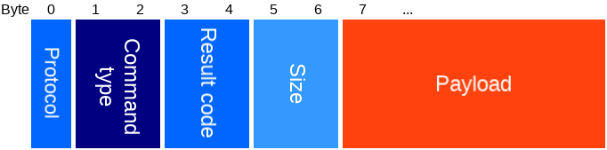

Type | Name | Length | Description
--- | --- | --- | ---
uint8 | Protocol | 1 | Which protocol the result is. Should be similar to the protocol in the [control packet](#control-packet).
uint16 | [Command type](#command-types) | 2 | Type of the command of which this packet is the result.
uint16 | [Result code](#result-codes) | 2 | The result code.
uint16 | Size | 2 | Size of the payload in bytes.
uint8 | Payload | Size | Payload data, depends on command type.

#### Result codes

Value | Name | Description
--- | --- | ---
0   | SUCCESS | Completed successfully.
1   | WAIT_FOR_SUCCESS | Command is successful so far, but you need to wait for SUCCESS.
2   | SUCCESS_NO_CHANGE | Command is successful, but nothing changed.
16  | BUFFER_UNASSIGNED | No buffer was assigned for the command.
17  | BUFFER_LOCKED | Buffer is locked, failed queue command.
18  | BUFFER_TOO_SMALL | Buffer is too small for operation.
19  | NOT_ALIGNED | Buffer is not aligned.
32  | WRONG_PAYLOAD_LENGTH | Wrong payload length provided.
33  | WRONG_PARAMETER | Wrong parameter provided.
34  | INVALID_MESSAGE | invalid message provided.
35  | UNKNOWN_OP_CODE | Unknown operation code provided.
36  | UNKNOWN_TYPE | Unknown type provided.
37  | NOT_FOUND | The thing you were looking for was not found.
38  | NO_SPACE | There is no space for this command.
39  | BUSY | Wait for something to be done. You can usually retry later.
40  | WRONG_STATE | The crownstone is in a wrong state.
41  | ALREADY_EXISTS | Item already exists.
42  | TIMEOUT | Operation timed out.
43  | CANCELED | Operation was canceled.
44  | PROTOCOL_UNSUPPORTED | The protocol is not supported.
45  | MISMATCH | There is a mismatch, usually in CRC/checksum/hash.
46  | WRONG_OPERATION | Another operation was expected.
48  | NO_ACCESS | Invalid access for this command.
49  | UNSAFE | It's unsafe to execute this command.
64  | NOT_AVAILABLE | Command currently not available.
65  | NOT_IMPLEMENTED | Command not implemented (not yet or not anymore).
67  | NOT_INITIALIZED | Something must first be initialized.
68  | NOT_STARTED | Something must first be started.
69  | NOT_POWERED | Something must first be powered.
70  | WRONG_MODE | Something is in the wrong operation mode.
80  | WRITE_DISABLED | Write is disabled for given type.
81  | WRITE_NOT_ALLOWED | Direct write is not allowed for this type, use command instead.
82  | READ_FAILED | Failed to read.
96  | ADC_INVALID_CHANNEL | Invalid adc input channel selected.
112 | EVENT_UNHANDLED | The event or command was not handled.
128 | GATT_ERROR | An error occured during a BLE connection.
65535 | UNSPECIFIED | Unspecified error.

## State types

The `A`, `M`, `B`, and `S` columns indicate which users have access to these states: `r` for read access, `w` for write access.
Admin access means the packet is encrypted with the admin key.
Setup access means the packet is available in setup mode, and encrypted with the temporary setup key, see [setup](#setup).

- A: Admin
- M: Member
- B: Basic
- S: Setup

Type nr | Type name | Payload type | Payload description | A | M | B
------- | ---------- | ------------- | ------------ | --- | --- | ---
5 | PWM period | uint32 | Sets PWM period in μs for the dimmer. **Setting this to a wrong value may cause damage.**  | rw |  | 
6 | iBeacon major | uint16 | iBeacon major number.  | rw |  | 
7 | iBeacon minor | uint16 | iBeacon minor number.  | rw |  | 
8 | iBeacon UUID | uint8 [16] | iBeacon UUID.  | rw |  | 
9 | iBeacon TX power | int8 | iBeacon signal strength at 1 meter.  | rw |  | 
11 | TX power | int8 | TX power, can be: -40, -20, -16, -12, -8, -4, 0, or 4.  | rw |  | 
12 | Advertisement interval | uint16 | Advertisement interval between 0x0020 and 0x4000 in units of 0.625 ms.  | rw |  | 
16 | Scan duration | uint16 | Scan duration in ms. Only used by interval scanner, which isn't used by default. **Deprecated**  | rw |  | 
18 | Scan break duration | uint16 | Waiting time in ms to start next scan. Only used by interval scanner, which isn't used by default. **Deprecated**  | rw |  | 
19 | Boot delay | uint16 | Time to wait with radio after boot (ms). **Setting this to a wrong value may cause damage.**  | rw |  | 
20 | Max chip temp | int8 | If the chip temperature (in degrees Celcius) goes above this value, the power gets switched off. **Setting this to a wrong value may cause damage.**  | rw |  | 
24 | Mesh enabled | uint8 | Whether mesh is enabled.  | rw |  | 
25 | Encryption enabled | uint8 | Whether encryption is enabled. **Not implemented** |  |  | 
26 | iBeacon enabled | uint8 | Whether iBeacon is enabled. **Not implemented** |  |  | 
27 | Scanner enabled | uint8 | Whether device scanning is enabled. | rw |  | 
33 | Sphere id | uint8 | Short id of the sphere this Crownstone is part of. | rw |  | 
34 | Crownstone id | uint8 | Crownstone identifier used in advertisement package. | rw |  | 
35 | Admin key | uint8 [16] | 16 byte key used to encrypt/decrypt owner access functions. |  |  | 
36 | Member key | uint8 [16] | 16 byte key used to encrypt/decrypt member access functions. |  |  | 
37 | Basic key | uint8 [16] | 16 byte key used to encrypt/decrypt basic access functions. |  |  | 
39 | Scan interval | uint16 | The scan interval in units of 0.625 millisecond. Only used by interval scanner, which isn't used by default. | rw |  | 
40 | Scan window | uint16 | The scan window to in units of 0.625 millisecond. Only used by interval scanner, which isn't used by default. | rw |  | 
41 | Relay high duration | uint16 | The time/duration that the relay is powered for a switch (ms). **Setting this to a wrong value may cause damage.** | rw |  | 
42 | Low TX power | int8 | The TX power used when in low transmission power for bonding (can be: -40, -20, -16, -12, -8, -4, 0, or 4). | rw |  | 
43 | Voltage multiplier | float | Voltage multiplier (for power measurement). **Setting this to a wrong value may cause damage.** | rw |  | 
44 | Current multiplier | float | Current multiplier (for power measurement). **Setting this to a wrong value may cause damage.** | rw |  | 
45 | Voltage zero | int32 | Voltage zero level (for power measurement).      **Setting this to a wrong value may cause damage.** | rw |  | 
46 | Current zero | int32 | Current zero level (for power measurement).      **Setting this to a wrong value may cause damage.** | rw |  | 
47 | Power zero | int32 | Power zero level in mW (for power measurement).    **Setting this to a wrong value may cause damage.** | rw |  | 
50 | Current consumption threshold | uint16 | At how much mA the switch will be turned off (soft fuse).            **Setting this to a wrong value may cause damage.** | rw |  | 
51 | Current consumption threshold dimmer | uint16 | At how much mA the dimmer will be turned off (soft fuse).     **Setting this to a wrong value may cause damage.** | rw |  | 
52 | Dimmer temp up voltage | float | Voltage of upper threshold of the dimmer thermometer.                         **Setting this to a wrong value may cause damage.** | rw |  | 
53 | Dimmer temp down voltage | float | Voltage of lower threshold of the dimmer thermometer.                       **Setting this to a wrong value may cause damage.** | rw |  | 
54 | Dimming allowed | uint8 | Whether this Crownstone is allowed to dim. | rw |  | 
55 | Switch locked | uint8 | Whether this Crownstone is allowed to change the switch state. | rw |  | 
56 | Switchcraft enabled | uint8 | Whether this Crownstone has switchcraft enabled. | rw |  | 
57 | Switchcraft threshold | float | Sets the threshold for switchcraft. A higher threshold will generally make it less likely to detect a switch (less true and false positives). **Setting this to a wrong value may cause damage.** | rw |  | 
59 | UART enabled | uint8 | Whether UART is enabled, 0 = none, 1 = RX only, 3 = TX and RX. | rw |  | 
60 | Device name | char[] | Name of the device. | rw |  | 
61 | Service data key | uint8 [16] | 16 byte key used to encrypt/decrypt service data. |  |  | 
62 | Mesh device key | uint8 [16] | 16 byte key used to encrypt/decrypt mesh messages to configure this Crownstone. |  |  | 
63 | Mesh application key | uint8 [16] | 16 byte key used to encrypt/decrypt mesh messages for the application of this Crownstone. |  |  | 
64 | Mesh network key | uint8 [16] | 16 byte key used to encrypt/decrypt mesh messages to be received or relayed by this Crownstone. |  |  | 
65 | Localization key | uint8 [16] | 16 byte key used to encrypt/decrypt messages to tell your location to this Crownstone. |  |  | 
66 | Start dimmer on zero crossing | uint8 | Whether the dimmer should start on a zero crossing or not. | rw |  | 
67 | Tap to toggle enabled | uint8 | Whether tap to toggle is enabled on this Crownstone. | rw |  | 
68 | Tap to toggle RSSI threshold offset | int8 | RSSI threshold offset from default, above which tap to toggle will respond. | rw |  | 
128 | Reset counter | uint16 | Counts the number of resets. | r | r | 
129 | [Switch state](#switch-state-packet) | uint8 | Current switch state. | r | r | 
130 | Accumulated energy | int64 | Accumulated energy in μJ. | r | r | 
131 | Power usage | int32 | Current power usage in mW. | r | r | 
134 | Operation Mode | uint8 | Internal usage. |  |  | 
135 | Temperature | int8 | Chip temperature in °C. | r | r | 
139 | [Error bitmask](#state-error-bitmask) | uint32 | Bitmask with errors. | r | r | 
149 | Sun time | [Sun time packet](#sun-time-packet) | Packet with sun rise and set times. | r | r | 
150 | Behaviour settings | [Behaviour settings](#behaviour-settings-packet) | Behaviour settings. | rw | rw | r
156 | Soft on speed | uint8 | Speed at which the dimmer goes towards the target value. Range: 1-100. | rw
157 | Hub mode | uint8 | Whether hub mode is enabled. | rw
158 | UART key | uint8 [16] | 16 byte key used to encrypt/decrypt UART messages. | rw

#### Switch state
To be able to distinguish between the relay and dimmer state, the switch state is a bit struct with the following layout:

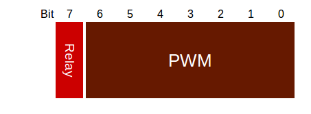

Type | Name | Length in bits | Description
--- | --- | --- | ---
bool | Relay | 1 | Value of the relay, where 0 = OFF, 1 = ON.
uint8 | Dimmer | 7 | Value of the dimmer, where 100 if fully on, 0 is OFF, dimmed in between.

##### Behaviour settings

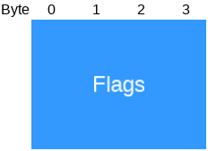

Type | Name | Length | Description
--- | --- | --- | ---
uint32 | [Flags](#behaviour-settings-flags) | 4 | Flags.

##### Behaviour settings flags

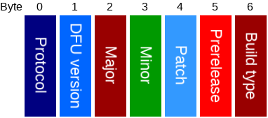

Type | Name | Length in bits | Description
--- | --- | --- | ---
bool | Enabled | 1 | Whether behaviours are enabled.
uint32 | Reserved | 31| Reserved for future use, should be 0 for now.
