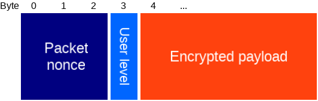

# Bluenet protocol v0.7.0
-------------------------

# Encryption
By default, Crownstones have encryption enabled as a security and privacy measure.

### Setup mode
When a Crownstone is new or factory reset, it will go into setup mode.

Setup mode turns down the power of the antenna (low TX) so you can only communicate with it when you're close by. The purpose of this mode
is to configure the Crownstone so only you, or people in your group, can communicate with it.

The protocol here is as follows:

1. Crownstone is in setup mode (low TX, [Setup Service active](#setup_service))
- Phone is close and connects to the Crownstone
- Phone reads the Crownstone [MAC address](#setup_service) (required for iOS). This characteristic is not encrypted.
- Phone reads the session key and session nonce from the [setup service](#setup_service). These characteristics are not encrypted.
The values are only valid for this connection session. The session key and the session nonce will be used to encrypt the rest of the setup phase using AES 128 CTR as explained [here](#encrypted_write_read).
- Phone starts setting up the Crownstone using the [config control](#setup_service) characteristic
    - Phone gives Crownstone [its identifier](#crownstone_identifier)
    - Phone gives Crownstone [the Admin key](#admin_key)
    - Phone gives Crownstone [the User key](#user_key)
    - Phone gives Crownstone [the Guest key](#guest_key)
    - Phone gives Crownstone [the Mesh Access Address](#mesh_access_address)
    - Phone gives Crownstone [its iBeacon UUID](#ibeacon_uuid)
    - Phone gives Crownstone [its iBeacon Major](#ibeacon_major)
    - Phone gives Crownstone [its iBeacon Minor](#ibeacon_minor)
- Phone commands Crownstone [to leave setup mode](#validate_setup)

### Using encryption after setup (normal mode)

When encryption is enabled the following changes:

- The [scan response packet service data](#scan_response_servicedata_packet) will be encrypted using the Guest key.
- Values that are **read from** the characteristics will be encrypted
- Values that are **written to** the characteristics will have to be encrypted

#### Session nonce

After connecting, you first have to read the session nonce from the [Crownstone service](#crownstone_service). The session nonce is [ECB encrypted](https://en.wikipedia.org/wiki/Block_cipher_mode_of_operation#Electronic_Codebook_.28ECB.29) with the guest key. After decryption, you should verify whether you have read and decrypted succesfully by checking if the validation key in the [data](#encrypted_session_nonce) is equal to **0xCAFEBABE**. If so, you now have the correct session nonce.

The session nonce has two purposes:
- Validation: the first 4 bytes of the session nonce is what we call the validation key, it is used for any [encrypted packet](#encrypted_packet).
- Encryption: the whole 5 bytes are used for the nonce, which is used for CTR encryption. The first 3 bytes of the nonce are the packet nonce (which should be randomly generated each time you write to a characteristic), the last 5 are the session nonce.
The session nonce and validation key are only valid during the connection.

##### Session nonce after ECB decryption
Type | Name | Length | Description
--- | --- | --- | ---
uint 32 | Validation key | 4 | 0xCAFEBABE as validation.
byte array | Session nonce | 5 | The session nonce for this session.
byte array | Padding | 7 | Zero-padding so that the whole packet is 16 bytes.

### Reading and writing characteristics

We use the [AES 128 CTR](https://en.wikipedia.org/wiki/Block_cipher_mode_of_operation#Counter_.28CTR.29) method to encrypt everything that is written to- and read from characteristics. For this you need an 8 byte number called a **nonce**. The first 3 bytes of the nonce are sent with each packet, we call this the packet nonce. When writing to a characteristic, you should generate a new random packet nonce each time. The last 5 bytes of the nonce are called the session nonce, which should be read after connecting. When reading a characteristic, you should check if the (decrypted) validation key is equal to the validation key that was read [after connecting](#session_nonce).

##### Encrypted Packet

Type | Name | Length | Description
--- | --- | --- | ---
byte array | Packet nonce | 3 | First 3 bytes of nonce used in the encryption of this message.
uint 8 | User level | 1 | 0: Admin, 1: User, 2: Guest
[Encrypted Payload](#encrypted_payload) | Encrypted Payload | N*16 | The encrypted payload of N blocks.

##### Encrypted payload

Type | Name | Length | Description
--- | --- | --- | ---
uint 32 | Validation key | 4 | Used to verify that the correct key was used for decryption/encryption.
byte array | Payload |  | Whatever data would have been sent if encryption was disabled.
byte array | Padding |  | Zero-padding so that the whole packet is of size N*16 bytes.

# Advertisements and scan response
When no device is connected, [advertisements](#ibeacon_packet) will be sent at a regular interval (100ms by default). A device that actively scans, will also receive a [scan response packet](#scan_response_packet). This contains useful info about the state.

### iBeacon advertisement packet
This packet is according to iBeacon spec, see for example [here](http://www.havlena.net/en/location-technologies/ibeacons-how-do-they-technically-work/).

Type | Name | Length | Description
--- | --- | --- | ---
uint 8 | AD Length | 1 | Length of the Flags AD Structure (0x02)
uint 8 | AD Type | 1 | Flags (0x01)
uint 8 | Flags | 1 |
uint 8 | AD Length | 1 | Length of the Manufacturer AD Structure  (0x1A)
uint 8 | AD Type | 1 | Manufacturer Specific Data (0xFF)
uint 8 | Company Id | 2 | Apple (0x004C)
uint 8 | iBeacon Type | 1 | IBeacon Type (0x02)
uint 8 | iBeacon Length | 1 | IBeacon Length (0x15)
uint 8 | Proximity UUID | 16 |
uint 16 | Major | 2 |
uint 16 | Minor | 2 |
int 8 | TX Power | 1 | Received signal strength at 1 meter.

### Scan response packet
The packet that is sent when a BLE central scans.

Type | Name | Length | Description
--- | --- | --- | ---
uint 8 | AD Length | 1 | Length of the Name AD Structure (0x0A)
uint 8 | AD Type | 1 | Shortened Local Name (0x08)
char [] | Name Bytes | 8 | The shortened name of this device.
uint 8 | AD Length | 1 | Length of the Service Data AD Structure (0x13)
uint 8 | AD Type | 1 | Service Data (0x16)
uint 16 | Service UUID | 2 | Service UUID
[Service data](#scan_response_servicedata_packet) | Service Data | 17 | Service data, state info.

### Scan response service data packet
This packet contains the state info. If encryption is enabled, the last 16 bytes will be encrypted using [AES 128 ECB](https://en.wikipedia.org/wiki/Block_cipher_mode_of_operation#Electronic_Codebook_.28ECB.29) using the guest key.
You receive a MAC address on Android and an UUID on iOS for each advertisement packet. This allows you to get the Crownstone ID associated with the packet and you verify the decryption by checking the expected Crownstone ID against the one in the packet.

Type | Name | Length | Description
--- | --- | --- | ---
uint 8 | Protocol Version | 1 | Service data protocol version
uint 16 | Crownstone ID | 2 | ID that identifies this Crownstone.
uint 8 | [Switch state](#switch_state_packet) | 1 | The state of the switch.
uint 8 | [Event bitmask](#event_bitmask) | 1 | Bitflags to indicate a certain state of the Crownstone.
int 8 | Temperature | 1 | Chip temperature (°C)
int 32 | Power usage | 4 | The power usage at this moment (mW).
int 32 | Accumulated energy | 4 | The accumulated energy (Wh).
uint 8[] | Rand | 3 | Random bytes.

#### Event Bitmask

Bit | Name |  Description
--- | --- | ---
0 | New data available | If you request something from the Crownstone and the result is available, this will be 1.
1 | Showing external data |  If this is 1, the shown ID and data is from another Crownstone.
2 | Reserved |  Reserved for future use.
3 | Reserved  |  Reserved for future use.
4 | Reserved |  Reserved for future use.
5 | Reserved  |  Reserved for future use.
6 | Reserved |  Reserved for future use.
7 | Setup mode active |  If this is 1, the Crownstone is in setup mode.

#### Switch State Packet

To be able to distinguish between switching with relay and switching with PWM, the switch state is a bit struct with
the following layout

Bit 7 is used for the relay flag, where 0 = OFF, 1 = ON.
Bits 6-0 are used for PWM, where 100 is fully ON, 0 is OFF, dimmed in between.

# Services
When connected, the following services are available.

The AUG columns indicate which users can use these characteristics if encryption is enabled. The access can be further restricted per packet. Dots (..)  indicate  encryption is not enabled for that characteristic.

- A = Admin
- U = User
- G = Guest

## Crownstone service

The crownstone service has UUID 24f00000-7d10-4805-bfc1-7663a01c3bff and provides all the functionality of the Crownstone through the following services

Characteristic | UUID | Date type | Description | A | U | G
--- | --- | --- | --- | :---: | :---: | :---:
Control        | 24f00001-7d10-4805-bfc1-7663a01c3bff | [Control packet](#control_packet) | Write a command to the control characteristic | x | x | x
Mesh control   | 24f00002-7d10-4805-bfc1-7663a01c3bff | [Mesh control packet](#mesh_control_packet) | Write a command to the mesh control characteristic to send into the mesh | x | x |
Config control | 24f00004-7d10-4805-bfc1-7663a01c3bff | [Config packet](#config_packet) | Write or select a config setting | x |
Config read    | 24f00005-7d10-4805-bfc1-7663a01c3bff | [Config packet](#config_packet) | Read or Notify on a previously selected config setting | x |
State control  | 24f00006-7d10-4805-bfc1-7663a01c3bff | [State packet](#state_packet) | Select a state variable | x | x |
State read     | 24f00007-7d10-4805-bfc1-7663a01c3bff | [State packet](#state_packet) | Read or Notify on a previously selected state variable | x | x |
Session nonce  | 24f00008-7d10-4805-bfc1-7663a01c3bff | uint 8 [5] | Read the [session nonce](#session_nonce). First 4 bytes are also used as session key. |  |  | ECB
Recovery       | 24f00009-7d10-4805-bfc1-7663a01c3bff | uint32 | Used for [recovery](#recovery). |

##### Recovery
If you lose your encryption keys you can use this characteristic to factory reset the Crownstone.
This method is only available for 20 seconds after the Crownstone powers on.
You need to write **0xDEADBEEF** to it. After this, the Crownstone disconnects and goes into Low TX mode so you'll have to be close to continue the factory reset. After this, you reconnect and write **0xDEADBEEF** again to this characteristic to factory reset the Crownstone.

##### Return values
The control characteristics (Control, Mesh Control, Config Control and State Control) of the Crownstone service return a uint16 code on execution of the command.
The code determines success or failure of the command. If commands have to be executed sequentially, make sure that the return value of the previous command
was received before calling the next (either by polling or subscribing). The possible values of the return values are listed in the table below

Value | Name | Description
--- | --- | ---
0 | SUCCESS | completed successfully
1 | VALUE_UNDEFINED | no value provided
2 | WRONG_PAYLOAD_LENGTH | wrong payload lenght provided
3 | UNKNOWN_OP_CODE | unknown operation code, e.g. notify for config read
5 | BUFFER_LOCKED | buffer is locked, failed queue command
6 | BUFFER_TOO_SMALL | buffer is too small to execute command
256 | COMMAND_NOT_FOUND | command type not found
257 | NOT_AVAILABLE | command not available in this mode
258 | WRONG_PARAMETER | wrong parameter provided
259 | COMMAND_FAILED | other failure
260 | NOT_IMPLEMENTED | command not implemented (only debug version)
512 | INVALID_MESSAGE | invalid mesh message provided
768 | READ_CONFIG_FAILED | read configuration failed
769 | WRITE_CONFIG_DISABLED | write configuration disalbed for this type
770 | CONFIG_NOT_FOUND |  config type not found
1024 | STATE_NOT_FOUND | state type not found
1025 | STATE_WRITE_DISABLED | writing to state disabled

## Setup service

The setup service has UUID 24f10000-7d10-4805-bfc1-7663a01c3bff and is only available after a factory reset or when you first power on the Crownstone.
 When encryption is enabled, the control and both config characteristics are encrypted with AES CTR. The key and session Nonce for this are gotten from their
 characteristics.

Characteristic | UUID | Date type | Description
--- | --- | --- | ---
Control        | 24f10001-7d10-4805-bfc1-7663a01c3bff | [Control packet](#control_packet) | Write a command to the control characteristic
MAC address    | 24f10002-7d10-4805-bfc1-7663a01c3bff | uint 8 [6] | Read the MAC address of the device
Session key    | 24f10003-7d10-4805-bfc1-7663a01c3bff | uint 8 [16] | Read the session key that will be used to encrypt the control and config characteristics.
Config control | 24f10004-7d10-4805-bfc1-7663a01c3bff | [Config packet](#config_packet) | Write or select a config setting
Config read    | 24f10005-7d10-4805-bfc1-7663a01c3bff | [Config packet](#config_packet) | Read or Notify on a previously selected config setting
GoTo DFU       | 24f10006-7d10-4805-bfc1-7663a01c3bff | uint 8 | Write 66 to go to DFU
Session nonce  | 24f10008-7d10-4805-bfc1-7663a01c3bff | uint 8 [5] | Read the session nonce. First 4 bytes are also used as validation key.

The control characteristics (Control, and Config Control) of the Setup Service return a uint 16 code on execution of the command. The code determines success or failure of the command. If commands have to be executed sequentially, make sure that the return value of the previous command was received before calling the next (either by polling or subscribing). The possible values are the same as for the Crownstone Service, see above.

## General service

The general service has UUID 24f20000-7d10-4805-bfc1-7663a01c3bff.

Characteristic | UUID | Date type | Description | A | U | G
--- | --- | --- | --- | :---: | :---: | :---:
Temperature    | 24f20001-7d10-4805-bfc1-7663a01c3bff | int 32 | Chip temperature in Celcius. Notifications are available. | x
Reset          | 24f20002-7d10-4805-bfc1-7663a01c3bff | uint 8 | Write 1 to reset. Write 66 to go to DFU mode. | x

## Power service

The power service has UUID 24f30000-7d10-4805-bfc1-7663a01c3bff. **Should be encrypted but it is not at the moment due to implementation.**

Characteristic | UUID | Date type | Description | A | U | G
--- | --- | --- | --- | :---: | :---: | :---:
PWM                | 24f30001-7d10-4805-bfc1-7663a01c3bff | uint 8 | Set PWM value. Value of 0 is completely off, 255 (100 on new devices) is completely on. | x
Relay              | 24f30002-7d10-4805-bfc1-7663a01c3bff | uint 8 | Switch Relay. Value of 0 is off, other is on. | x
Power samples      | 24f30003-7d10-4805-bfc1-7663a01c3bff | [Power Samples](#power_samples_packet) | List of sampled current and voltage values. | ...
Power consumption  | 24f30004-7d10-4805-bfc1-7663a01c3bff | uint 16 | The current power consumption. | x

## Indoor localization service

The localization service has UUID 24f40000-7d10-4805-bfc1-7663a01c3bff.

Characteristic | UUID | Date type | Description | A | U | G
--- | --- | --- | --- | :---: | :---: | :---:
Track control           | 24f40001-7d10-4805-bfc1-7663a01c3bff | [Tracked device](#tracked_device_packet) | Add or overwrite a tracked device. Set threshold larger than 0 to remove the tracked device from the list. | x
Tracked devices         | 24f40002-7d10-4805-bfc1-7663a01c3bff | [Tracked device list](#tracked_device_list_packet) | Read the current list of tracked devices. | x
Scan control            | 24f40003-7d10-4805-bfc1-7663a01c3bff | uint 8 | Start or stop scanning. write 0 to stop, 1 to start. | x
Scanned devices         | 24f40004-7d10-4805-bfc1-7663a01c3bff | [Scan result list](#scan_result_list_packet) | After stopping the scan, you can read the results here. | x
RSSI                    | 24f40005-7d10-4805-bfc1-7663a01c3bff | uint 8 | RSSI to connected device. Notifications are available. | x

## Schedule service

The schedule service has UUID 24f50000-7d10-4805-bfc1-7663a01c3bff.

Characteristic | UUID | Date type | Description | A | U | G
--- | --- | --- | --- | :---: | :---: | :---:
Set time        | 24f50001-7d10-4805-bfc1-7663a01c3bff | uint 32 | Sets the time. Timestamp is in seconds since epoch. | x
Schedule write  | 24f50002-7d10-4805-bfc1-7663a01c3bff | [Schedule entry](#schedule_entry_packet) | Add or modify a schedule entry. Set nextTimestamp to 0 to remove the entry from the list. | x
Schedule read   | 24f50003-7d10-4805-bfc1-7663a01c3bff | [Schedule list](#schedule_list_packet) | Get a list of all schedule entries. | x

## Mesh Service

The mesh service comes with [OpenMesh](https://github.com/NordicSemiconductor/nRF51-ble-bcast-mesh) and has UUID 0000fee4-0000-1000-8000-00805f9b34fb

Characteristic | UUID | Date type | Description | A | U | G
--- | --- | --- | --- | :---: | :---: | :---:
Meta data   | 2a1e0004-fd51-d882-8ba8-b98c0000cd1e | | Get mesh configuration. | x
Value       | 2a1e0005-fd51-d882-8ba8-b98c0000cd1e | | Characteristic where the mesh values can be read. | x

# Data structures

### Control packet

#####If encryption is enabled, this packet must be encrypted using any of the keys where the box is checked.
In the case of the setup mode, only the Validate Setup command is available unencrypted.

Type | Name | Length | Description
--- | --- | --- | ---
uint 8  | Type | 1 | Command type, see table below.
uint 8  | Reserved | 1 | Not used: reserved for alignment.
uint 16 | Length | 2 | Length of the payload in bytes.
uint 8 | Payload | Length | Payload data, depends on type.

The AUG columns indicate which users have access to these commands if encryption is enabled.
 Admin access means the packet is encrypted with the admin key.
- A: Admin
- U: User
- G: Guest

Available command types:

Type nr | Type name | Payload type | Payload Description | A | U | G
--- | --- | --- | --- | :---: | :---: | :---:
0 | Switch | uint 8 | Switch power, 0 = OFF, 100 = FULL ON | x | x | x
1 | PWM | uint 8 | Set PWM to value, 0 = OFF, 100 = FULL ON | x | x | x
2 | Set Time | uint 32 | Set time to value, where value is seconds since 1970-01-01 00:00:00 UTC | x | x |
3 | Goto DFU | - | Reset device to DFU mode | x
4 | Reset | uint 8 | Reset device | x
5 | Factory reset | uint 32 | Reset device to factory setting, needs Code 0xdeadbeef as payload | x
6 | Keep alive state | [Keep alive payload](#cmd_keep_alive_payload) | Keep alive with state | x | x |
7 | Keep alive | - | Keep alive without state, uses last state transmitted with Keep alive state command | x | x | x
8 | Enable mesh | uint 8 | Enable/Disable Mesh, 0 = OFF, other = ON | x
9 | Enable encryption | uint 8 | Enable/Disable Encryption, 0 = OFF, other = ON | x
10 | Enable iBeacon | uint 8 | Enable/Disable iBeacon, 0 = OFF, other = ON | x
11 | Enable continuous power measurement | uint 8 | Enable/Disable continuous power measurement, 0 = OFF, other = ON, TBD | x
12 | Enable scanner | [Enable Scanner payload](#cmd_enable_scanner_payload) | Enable/Disable scanner | x
13 | Scan for devices | uint 8 | Scan for devices, 0 = OFF, other = ON | x |
14 | User feedback | ... | User feedback ..., TBD | x |
15 | Schedule entry | ... | Schedule entry ..., TBD | x | x
16 | Relay | uint 8 | Switch relay, 0 = OFF, 1 = ON | x | x | x
17 | Validate setup | - | Validate Setup, only available in setup mode, makes sure everything is configured, then reboots to normal mode | ..| .. | ..
18 | Request Service Data | - | Causes the crownstone to send it's service data over the mesh | x | x |
19 | Disconnect | - | Causes the crownstone to send it's service data over the mesh | .. | .. | ..

#### Enable Scanner payload

Type | Name | Description
--- | --- | ---
uint 8 | enable | 0 = OFF, other = ON
uint 16 | delay | start scanner with delay in ms

#### Keep alive payload

Type | Name | Description
--- | --- | ---
uint 8 | Action | Action, 0 = No Change, 1 = Change
uint 8 | Switch | Switch power, 0 = OFF, 100 = FULL ON
uint 16 | Timeout | Timeout in seconds after which the Switch should be adjusted to the Switch value

### Configuration packet

#####If encryption is enabled, this packet must be encrypted using the admin key.

Type | Name | Length | Description
--- | --- | --- | ---
uint 8  | Type | 1 | Type, see table with configuration types below.
uint 8  | OpCode | 1 | The op code determines if it's a write or a read operation, see table with op codes below
uint 16 | Length | 2 | Length of the payload in bytes.
uint 8 | Payload | Length | Payload data, depends on type.

Available configurations types:

Type nr | Type name | Payload type | Description
--- | --- | --- | ---
0 | Device name | char [] | Name of the device.
1 | Device type | char [] | **Deprecated.**
2 | Room | uint 8 | **Deprecated.**
3 | Floor | uint 8 | Floor number. **Deprecated**
4 | Nearby timeout | uint 16 | Time in ms before switching off when none is nearby
5 | PWM period | uint 32 | Sets PWM period in μs. **Setting this to a wrong value may cause damage.**
6 | iBeacon major | uint 16 | iBeacon major number.
7 | iBeacon minor | uint 16 | iBeacon minor number.
8 | iBeacon UUID | uint 8 [16] | iBeacon UUID.
9 | iBeacon Tx Power | int 8 | iBeacon signal strength at 1 meter.
11 | TX power | int 8 | TX power, can be: -40, -30, -20, -16, -12, -8, -4, 0, or 4.
12 | Advertisement interval | uint 16 | Advertisement interval between 0x0020 and 0x4000 in units of 0.625 ms.
13 | Passkey | uint 8 [6] | Passkey of the device: must be 6 digits.
14 | Min env temp | int 8 | If temperature (in degrees Celcius) goes below this value, send an alert (not implemented yet).
15 | Max env temp | int 8 | If temperature (in degrees Celcius) goes above this value, send an alert (not implemented yet).
16 | Scan duration | uint 16 | Scan duration in ms. *Setting this too high may cause the device to reset during scanning.*
17 | Scan send delay | uint 16 | Time in ms to wait before sending scan results over the mesh. *Setting this too low may cause the device to reset during scanning.*
18 | Scan break duration | uint 16 | Waiting time in ms between sending results and next scan. *Setting this too low may cause the device to reset during scanning.*
19 | Boot delay | uint 16 | Time to wait with radio after boot, **Setting this too low may cause the device to reset on boot.**
20 | Max chip temp | int 8 | If the chip temperature (in degrees Celcius) goes above this value, the power gets switched off.
21 | Scan filter | uint 8 | Filter out certain types of devices from the scan results (1 for GuideStones, 2 for CrownStones, 3 for both).
22 | Scan filter fraction | uint 16 | If scan filter is set, do *not* filter them out each every X scan results.
23 | Current limit | uint 8 | Set current limit to **not implemented**
24 | Mesh enabled | uint 8 | Stores if mesh is enabled. *read only*
25 | Encryption enabled | uint 8 | Stores if encryption is enabled. *read only*
26 | iBeacon enabled | uint 8 | Stores if iBeacon is enabled. *read only*
27 | Scanner enabled | uint 8 | Stores if device scanning is enabled. *read only*
28 | Continuous power measurement enabled | uint 8 | Stores if continuous power measurement is enabled. *read only*
29 | Tracker enabled | uint 8 | Stores if device tracking is enabled. *read only*
30 | ADC sample rate | ... | TBD
31 | Power sample burst interval | ... | TBD
32 | Power sample continuous interval | ... | TBD
33 | Power sample continuous number samples | ... | TBD
34 | Crownstone Identifier | uint 16 | Crownstone identifier used in advertisement package
35 | Admin encryption key | uint 8 [16] | 16 byte key used to encrypt/decrypt owner access functions
36 | Member encryption key | uint 8 [16] | 16 byte key used to encrypt/decrypt member access functions
37 | Guest encryption key | uint 8 [16] | 16 byte key used to encrypt/decrypt guest access functions
38 | Default ON | uint 8 | Set's the default switch state to 255 if true, or to 0 if false. Value is 0 for false, or any other for true
39 | Scan Interval | uint 16 | Set the scan interval to ...
40 | Scan Window | uint 16 | Set the scan window to ...
41 | Relay High Duration | uint 16 | Set the time/duration that the relay is set to high
42 | Low Tx Power | int 8 | Set the tx power used when in low transmission power for bonding
43 | Voltage Multiplier | float | Set the voltage multiplier (for power measurement)
44 | Current Multiplier | float | Set the current multiplier (for power measurement)
45 | Voltage Zero | int 32 | Set the voltage zero level (for power measurement)
46 | Current Zero | int 32 | Set the current zero level (for power measurement)
47 | Power Zero | int 32 | Set the power zero level in mW (for power measurement)
48 | Power Average Window | uint16 | Deprecated
49 | Mesh Access Address | uint32 | The access address of the mesh messages. This ensures that mesh messages of other groups will not interfere with your group.

OpCodes:

OpCode | Name | Description
--- | --- | ---
0 | Read | Select the configuration setting for reading. will load it from storage, then write it to the Config Read Characteristic. Length and payload of the configuration packet will be ignored
1 | Write | Write the configuration setting to storage.

Note: On the Config Read Characteristic, the OpCode is set to Read (0), and the length and payload will have actual data depending on the type.

### State packet

Type | Name | Length | Description
--- | --- | --- | ---
uint 8  | Type | 1 | Type, see table with configuration types below.
uint 8  | OpCode | 1 | The op code determines if it's a write, read, or notify operation, see table with op codes below
uint 16 | Length | 2 | Length of the payload in bytes.
uint 8 | Payload | Length | Payload data, depends on type.

Available state variables:

Type nr | Type name | Payload type | Description | Persistent
--- | --- | --- | --- | :---:
128 | Reset counter | uint 32 | Counts the number of resets (DEBUG) | x
129 | Switch state | uint 8 | Current Switch state, 0 = OFF, 100 = FULL ON |
130 | Accumulated energy | uint 32 | Accumulated energy in ... over time, TBD | x
131 | Power usage | uint 32 | Current power usage in ..., TBD |
132 | Tracked devices | [Tracked devices](#tracked_device_list_packet) | List of tracked devices | x
133 | Schedule | [Schedule List](#schedule_list_packet) | Schedule, TBD | x
134 | Operation Mode | uint 8 | ..., TBD | x
135 | Temperature | int 32 | Chip temperature in °C |
136 | Time | uint 32 | Get the current time

OpCodes:

OpCode | Name | Description
--- | --- | ---
0 | Read | Select the configuration setting for reading. will load it from storage, then write it to the Config Read Characteristic. Length and payload of the configuration packet will be ignored
1 | Write | Write the state variable **disabled**
2 | Notify | Enable/Disable notifications for state variable. Every time the state variable is updated, the new value is written to the State Read Characteristic. To use effectively, enable GATT Notifications on the State Read Characteristic. Length has to be 1, and payload is 0 = disable, other = enable

Note: On the State Read Characteristic, the OpCode is also set to distinguish between a one time read, and a continuous notification. In return, the length and payload will have actual data depending on the type.

### Power samples packet

Type | Name | Length | Description
--- | --- | --- | ---
uint 16   | numCurrentSamples     | 2                      | Number of current samples.
uint 16 []| currentSamples        | numCurrentSamples * 2  | Array of current samples.
uint 16   | numVoltageSamples     | 2                      | Number of voltage samples.
uint 16 []| voltageSamples        | numVoltageSamples * 2  | Array of voltage samples.
uint 16   | numCurrentTimeStamps  | 2                      | Number of current timestamps.
uint 32   | firstCurrentTimeStamp | 4                      | Timestamp of first current sample.
uint 32   | lastCurrentTimeStamp  | 4                      | Timestamp of last current sample.
int 8 []  | currentTimeDiffs      | numCurrentTimeStamps-1 | Array of differences with previous timestamp.
uint 16   | numVoltageTimeStamps  | 2                      | Number of voltage timestamps.
uint 32   | firstVoltageTimeStamp | 4                      | Timestamp of first voltage sample.
uint 32   | lastVoltageTimeStamp  | 4                      | Timestamp of last voltage sample.
int 8 []  | voltageTimeDiffs      | numVoltageTimeStamps-1 | Array of differences with previous timestamp.

### Power curve packet, deprecated

Type | Name | Length | Description
--- | --- | --- | ---
uint 16 | numSamples     | 2              | Number of current samples + voltage samples, including the first samples.
uint 16 | firstCurrent   | 2              | First current sample.
uint 16 | lastCurrent    | 2              | Last current sample.
uint 16 | firstVoltage   | 2              | First voltage sample.
uint 16 | lastVoltage    | 2              | Last voltage sample.
uint 32 | firstTimeStamp | 4              | Timestamp of first current sample.
uint 32 | lastTimeStamp  | 4              | Timestamp of last sample.
int 8 []| currentDiffs   | numSamples/2-1 | Array of differences with previous current sample.
int 8 []| voltageDiffs   | numSamples/2-1 | Array of differences with previous voltage sample.
int 8 []| timeDiffs      | numSamples-1   | Array of differences with previous timestamp.

### Scan result packet

Type | Name | Length | Description
--- | --- | --- | ---
uint 8 [] | Address | 6 | Bluetooth address of the scanned device.
int 8 | RSSI | 1 | Average RSSI to the scanned device.
uint 16 | Occurrences | 2 | Number of times the devices was scanned.

### Scan result list packet

Type | Name | Length | Description
--- | --- | --- | ---
uint 8 | size | 1 | Number of scanned devices in the list.
[Scan result](#scan_result_packet) | size * 9 | Array of scan result packets.

### Tracked device packet

Type | Name | Length | Description
--- | --- | --- | ---
uint 8 [] | Address | 6 | Bluetooth address of the tracked device.
int 8 | RSSI threshold | 1 | If the RSSI to this device is above the threshold, then switch on the power.

### Tracked device list packet

Type | Name | Length | Description
--- | --- | --- | ---
uint 8 | size | 1 | Number of tracked devices in the list.
[Tracked device](#tracked_device_packet) | size * 7 | Array of tracked device packets.
uint 16 [] | Counters | size * 2 | Counter that keeps up how long ago the RSSI of a device was above the threshold (for internal use).

### Schedule repeat packet

#### Repeat type 0
Perform action every X minutes.

Type | Name | Length | Description
--- | --- | --- | ---
uint 16 | Repeat time | 2 | Repeat every `<repeat time>` minutes, 0 is not allowed.

#### Repeat type 1
Perform action every 24h, but only on certain days these days of the week.

Type | Name | Length | Description
--- | --- | --- | ---
uint 8 | Day of week | 1 | Bitmask, with bits 0-6 for Sunday-Saturday and bit 7 for all days.
uint 8 | Next day of week | 1 | Remember what day of week comes next. 0-6, where 0=Sunday.

#### Repeat type 2
Perform action only once. Entry gets removed after action was performed.

Type | Name | Length | Description
--- | --- | --- | ---
uint 8 | Reserved | 2 | Unused.

### Schedule action packet

#### Action type 0
Set power switch to a given value.

Type | Name | Length | Description
--- | --- | --- | ---
uint 8 | Pwm | 1 | Power switch value. Range 0-100, where 0 is off and 100 is fully on.
uint 8 | Reserved | 2 | Unused.

#### Action type 1
Fade from current power switch value to a given power switch value, in X seconds.

Type | Name | Length | Description
--- | --- | --- | ---
uint 8 | Pwm end | 1 | Power switch value after fading.
uint 16 | Fade duration | 2 | Fade duration in seconds.

#### Action type 2
Toggle the power switch.

Type | Name | Length | Description
--- | --- | --- | ---
uint 8 | Reserved | 3 | Unused.

### Schedule entry packet

Type | Name | Length | Description
--- | --- | --- | ---
uint 8 | ID | 1 | Unique id of this schedule entry.
uint 8 | Override mask | 1 | Bitmask of states to override. Presence mask = 1.
uint 8 | Type | 1 | Combined repeat and action type. Defined as `repeatType + (actionType << 4)`.
uint 32 | Next timestamp | 4 | Timestamp of the next time this entry triggers.
[schedule repeat](#schedule_repeat_packet) | Repeat data | 2 | Repeat time data, depends on the repeat type.
[schedule action](#schedule_action_packet) | Action data | 3 | Action data, depends on the action type.

### Schedule list packet

Type | Name | Length | Description
--- | --- | --- | ---
uint 8 | Size | 1 | Number of entries in the list.
[schedule entry](#schedule_entry_packet) | Entries | 12 | Schedule entry list.

### Mesh message
This packet is a slightly modified version of the one used in [OpenMesh](https://github.com/NordicSemiconductor/nRF51-ble-bcast-mesh); we simply increased the content size.

Type | Name | Length | Description
--- | --- | --- | ---
uint 8 | Preamble | 1 |
uint 32 | Access address | 4 | Number used to find relevant messages, set by application.
uint 8 | Type | 1 |
uint 8 | Length | 1 |
uint 8 [] | Source address | 6 | Address of the node that put this message into the mesh.
uint 8 | AD Length | 1 | Length of data after this field, excluding CRC.
uint 8 | AD type | 1 |
uint 16 | Service UUID | 2 | Mesh service UUID.
uint 16 | Handle | 2 | Handle of this message.
uint 16 | Version | 2 | Used internally.
[Encrypted mesh packet](#encrypted_mesh_packet) | Payload | 104 | The encrypted mesh message.
uint 8 [] | CRC | 3 | Checksum.

### Encrypted mesh packet

This packet is sent over the mesh as payload in the mesh message.

Type | Name | Length | Description
--- | --- | --- | ---
uint 32 | Message counter | 4 | The message counter used to identify the message. Counter values are kept up seperately per handle. Note: This value is in plain text (unencrypted)
uint 32 | Random number | 4 | The random number used for encryption/decryption, is sent itself unencrypted
[Mesh packet](#mesh-packet) | Encrypted payload | 96 | The encrypted mesh packet.

### Mesh packet

This packet is encrypted and sent as payload in the encrypted mesh packet.

Type | Name | Length | Description
--- | --- | --- | ---
uint 32 | Message counter | 4 | The message counter used to identify the message. Counter values are kept up seperately per handle. Note: This value will be compared after decryption to the message counter of the encrypted mesh message to make sure the message was not tampered with.
[Mesh Payload](#mesh_payload_packet) | Payload | 92 | Payload data

### Mesh control packet

This packet is sent to the [Mesh control characteristic](#mesh_control_characteristic)

Type | Name | Length | Description
--- | --- | --- | ---
uint 8 | Handle | 1 | Handle on which to send the message.
uint 8 | Reserved | 1 | Not used: reserved for alignment.
uint 16 | Length | 2 | Length of the data.
[Mesh Payload](#mesh_payload_packet) | Payload | 0 - 92 | Payload data, max 92 bytes, but actual length is determined by the handle

### Mesh payload packet

The mesh payload packet is defined by the handle. We have the following handles

Handle | Name | Type | Description
--- | --- | --- | ---
1 | Keep Alive Channel | [Keep Alive](#keep_alive_mesh_packet) | Channel on which the keep alive messages are sent. A message consists of a global timeout and a number of keep alive items (on per stone which is addressed)
2 | State Broadcast Channel | [State](#state_mesh_packet) | Each stone sends it's state periodically over the mesh. The message is designed as a circular buffer and a new item is added at the end (throwing out the oldest if full)
3 | State Change Channel | [State](#state_mesh_packet) | Each stone sends its' state on this channel if the state changes significantly, e.g. switch state changes.
4 | Command Channel | [Command](#command_mesh_packet) | Commands can be sent to one, multiple or all stones sharing the mesh network. Once a stone receives a command it will send a reply on the reply channel
5 | Command Reply Channel | [Command Reply](#command_reply_packet) | Every stone that was targeted with a command adds its reply to the reply message.
6 | Scan Result Channel | [Scan Result](#scan_result_packet) | If a stone is scanning for devices it adds it's scanned devices periodically to this list to be sent over the mesh
7 | Big Data Channel | - | This channel is for the case when a stone needs to send big data, such as the history of eneregy usage, etc.

#### Keep Alive packet

Type | Name | Length | Description
--- | --- | --- | ---
uint 16 | Timeout | 2 | Timeout (in seconds), applies to all stones present in the list
uint 8 | Size | 1 | Number of Keep Alive items in the list
[Keep Alive item](#keep_alive_mesh_item) [] | List | N | The Keep Alive items are defined as Crownstone Identifier and a combined action + switch state

##### Keep Alive Item

Type | Name | Length | Description
--- | --- | --- | ---
uint 16 | Crownstone ID | 2 | The identifier of the crownstone to which this keep alive item is targeted
[Action + Switch State](#action_switch_state_keep_alive) | Action + Switch State | 1 | A combined element for action and switch state, which should be executed by the targeted crownstone when the keep alive times out

##### Action + Switch State

Value | Name
--- | ---
255 | No Action
... | ...
default | see [Switch State](#switch_state_packet)

#### Crownstone State Packet

Type | Name | Length | Description
--- | --- | --- | ---
uint 8 | Head | 1 | Keeps the index of the oldest element in the list (read pointer)
uint 8 | Tail | 1 | Keeps the index where the next element can be inserted in the list (write pointer)
uint 8 | Size | 1 | Number of elements in the list
[Crownstone State item](#state_mesh_item) [] | List | N | Circular list with Crownstone state items

##### Crownstone State Item

Type | Name | Length | Description
--- | --- | --- | ---
uint 16 | Crownstone ID | 2 | The identifier of the crownstone which has this state
uint 8 | Switch State | 1 | The current [Switch State](#switch_state_packet) of the crownstone
int 32 | Power Usage | 4 | The current power usage of the crownstone (mW)
int 32 | Accumulated Energy | 4 | The accumulated energy since setup (Wh)

#### Command Packet

Type | Name | Length | Description
--- | --- | --- | ---
uint 16 | [Command Type](#mesh_command_types) | 2 | Type of command, see table below.
uint 8 | Number of IDs | 1 | The number of IDs provided as targets, 0 for broadcast
uint16 [] | List of target IDs | Number of IDs | Crownstone Identifiers of the devices at which this message is aimed, for broadcast, no IDs are provided and the command follows directly after the Number of IDs element
uint 8 | Command payload | N | The command payload data, which depends on the message type

##### Command Types

Type nr | Type name | Payload type | Payload description
--- | --- | --- | ---
0 | Control | [Control](#control_packet) | Send a control command over the mesh, see control packet
1 | Beacon | [Beacon Config](#beacon_mesh_data_packet) | Configure the iBeacon settings.
2 | Config | [Configuration](#config_packet) | Send/Request a configuration setting, see configuration packet
3 | State | [State](#state_packet) | Send/Request a state variable, see state packet

##### Beacon config packet

Type | Name | Length | Description
--- | --- | --- | ---
uint 16 | Major | 1 |
uint 16 | Minor | 1 |
uint 8 | Proximity UUID | 16 |
int 8 | TX Power | 1 | Received signal strength at 1 meter.

#### Command Reply packet

Type | Name | Length | Description
--- | --- | --- | ---
uint 16 | [Reply Type](#mesh_reply_types) | 2 | Type of reply, see table below
uint 32 | Message Counter | 4 | The message number of the command to which this reply belongs
uint 8 | Number of Replies | 1 | Number of reply items in the list
uint 8 | List of Replies | 85 | List of replies, the format is defined by the type of reply

##### Reply Types

Type nr | Type name | Payload type | Payload description
--- | --- | --- | ---
0 | Status Reply | [Status Reply](#mesh_status_reply) | Send a status code back, used to report errors. And to report success for control and config write commands.
1 | Config Reply | [Config Reply](#mesh_config_reply) | Return the requested config.
2 | State Reply | [State Reply](#mesh_state_reply) | Return the requested state variable.

###### Status Reply

Type | Name | Length | Description
--- | --- | --- | ---
uint 16 | Crownstone ID | 2 | The identifier of the crownstone which sent the status reply
uint 16 | Status | 2 | The status code of the reply, see [Return Values](#return_values)

###### Config Reply

Type | Name | Length | Description
--- | --- | --- | ---
uint 16 | Crownstone ID | 2 | The identifier of the crownstone which sent the status reply
uint 8 | Type | 1 | see [Configuration Packet](#config_packet)
uint 8 | OpCode | 1 | see [Configuration Packet](#config_packet)
uint 16 | Length | 2 | see [Configuration Packet](#config_packet)
uint 8 | Payload | Length | see [Configuration Packet](#config_packet)

###### State Reply

Type | Name | Length | Description
--- | --- | --- | ---
uint 16 | Crownstone ID | 2 | The identifier of the crownstone which sent the status reply
uint 8 | Type | 1 | see [State Packet](#state_packet)
uint 8 | OpCode | 1 | see [State Packet](#state_packet)
uint 16 | Length | 2 | see [State Packet](#state_packet)
uint 8 | Payload | Length | see [State Packet](#state_packet)

#### Scan Result packet

Type | Name | Length | Description
--- | --- | --- | ---
uint 8 | Number of Results | 1 | Number of Scan results in the list
[Scan Result item](#scan_result_item) [] | List | Number of Results | A list of scanned devices with the ID of the crownstone that scanned the device

##### Scan Result item

Type | Name | Length | Description
--- | --- | --- | ---
uint 16 | Crownstone ID | 2 | The identifier of the Crownstone which scanned the device
uint 8 [6] | Scanned device address | 6 | The MAC address of the scanned device
int 8 | RSSI | 1 | The averaged RSSI value of the scanned device

### Mesh notification packet
This packet is used to get the [mesh messages](#mesh_message_packet) pushed over GATT notifications.

Type | Name | Length | Description
--- | --- | --- | ---
uint 8 | OpCode | 1 | See available op codes in table below
uint 8 | Payload | |

Opcode | Type name | Payload type | Payload Description
--- | --- | --- | ---
0 | Data | [Mesh data update](#mesh_data_update_packet) | Single part notification (if all data fits in one packet).
1 | Flag Set | | Not used.
2 | Flag Req | | Not used.
17 | Cmd Rsp | | Not used.
18 | Flag Rsp | | Not used.
32 | MultipartStart | [Mesh data update](#mesh_data_update_packet) | First part of the multi part notification.
33 | MultipartMid | [Mesh data update](#mesh_data_update_packet) | Middle part of the multi part notification.
34 | MultipartEnd | [Mesh data update](#mesh_data_update_packet) | Last part of the multi part notification.

### Mesh data update packet
Each mesh data message is notified in multiple pieces, as a notification can only be 20 bytes. The op code of the [Mesh notification](#mesh_notification_packet) tells whether it is a single, or the first, last or a middle piece of a multipart message.

Type | Name | Length | Description
--- | --- | --- | ---
uint 16 | Handle | 2 | Handle on which the messages was sent or received.
uint 8 | Length | 1 | Length of the data of this part.
uint 8 | Data | Length | Data of this part. If OpCode is Data, it is the length of the whole mesh message, otherwise it is the length of the current part.

