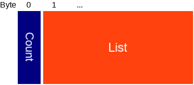
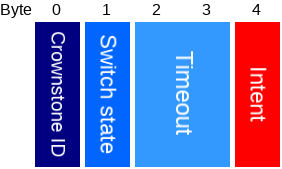
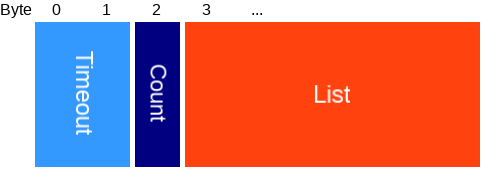
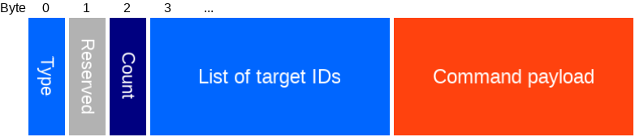

# Bluenet protocol v3.0.0
-------------------------

This only documents the latest protocol, older versions can be found in the git history.

# Index

- [Setup](#setup). How to setup the crownstone.
- [Encryption](#encryption). How to encrypt and decrypt the data.
- [Advertisements](#advertisement_data). What data is broadcasted by the crownstones.
- [Broadcast commands](#broadcasts). Broadcast commands.
- [Services and characteristics](#services). Which Bluetooth GATT services and characteristics the crownstones have.
- [Data structures](#data_structs). The data structures used for the characteristics, advertisements, and mesh.

# Setup mode
When a Crownstone is new or factory reset, it will go into setup mode.

The setup process goes as follows:

- Crownstone is in setup mode ([Setup service](#setup_service) active).
- Phone connects to the Crownstone.
- Phone reads the **session key** and **session nonce** from the [setup service](#setup_service). These characteristics are not encrypted.
The values are only valid for this connection session. The session key and the session nonce will be used to encrypt the rest of the setup phase using AES 128 CTR as explained [here](#encrypted_write_read).
- Phone subscribes to [control](#setup_service) characteristic.
- Phone commands Crownstone to setup via the control characteristic.
- Phone waits for control characteristic result to become SUCCESS (See [result packet](#command_result_packet)).
- Crownstone will reboot to normal mode.

# Encryption
By default, Crownstones have encryption enabled as a security and privacy measure.

What is encrypted:

- The [service data](SERVICE_DATA.md) is encrypted using the service data key.
- Values that are **read from** the characteristics are encrypted unless specified differently.
- Values that are **written to** the characteristics are encrypted unless specified differently.
- Messages over the mesh.
- Broadcasted commands.

## AES 128 ECB encryption

Some packets are [ECB encrypted](https://en.wikipedia.org/wiki/Block_cipher_mode_of_operation#Electronic_Codebook_.28ECB.29).

## AES 128 CTR encryption

We use the [AES 128 CTR](https://en.wikipedia.org/wiki/Block_cipher_mode_of_operation#Counter_.28CTR.29) method to encrypt everything that is written to- and read from characteristics. For this you need an 8 byte number called a **nonce**. The counter starts at 0 for each packet, and is increased by 1 for every block of 16 bytes in the packet.

### Nonce

The nonce is a combination of 2 pieces: the session nonce and the packet nonce

Type | Name | Length | Description
--- | --- | --- | ---
uint8 [] | Packet nonce | 3 | Packet nonce, sent with every packet (see [encrypted packet](#encrypted_packet)).
uint8 [] | Session nonce | 5 | Session nonce, can be [read](#session_nonce) once after connect (only changes on connect).

### Session nonce

After connecting, you first have to read the session nonce from the [Crownstone service](#crownstone_service). The session nonce is [ECB encrypted](#ecb_encryption) with the basic key. After decryption, you should verify whether you have read and decrypted succesfully by checking if the validation in the [data](#encrypted_session_nonce) is equal to **0xCAFEBABE**. If so, you now have the correct session nonce.

The session nonce has two purposes:

- Validation: the first 4 bytes of the session nonce is what we call the **validation key**, it is used in every [encrypted packet](#encrypted_packet), to verify that the correct key was used for decryption/encryption.
- Encryption: the whole 5 bytes are used for the nonce, which is used for CTR encryption.

The session nonce and validation key are only valid during the connection.

#### Session nonce after ECB decryption

Type | Name | Length | Description
--- | --- | --- | ---
uint 32 | Validation | 4 | 0xCAFEBABE as validation.
uint8 [] | Session nonce | 5 | The session nonce for this session.
uint8 [] | Padding | 7 | Zero-padding so that the whole packet is 16 bytes.

## Reading and writing characteristics

When reading and writing characteristics, the data is wrapped in an [encrypted packet](#encrypted_packet).

After subscribing, notified data will be sent as [multipart notifications](#multipart_notifaction_packet).

### Multipart notification packet

When data is sent via notifications, it will be done via multiple notification packets.

Type | Name | Length | Description
--- | --- | --- | ---
uint8 | Counter | 1 | Part counter: starts at 0, 255 for last packet.
uint8 [] | Data part |  | Part of the data.

Once you received the last packet, you should concatenate all data parts to get the payload (which is usually an [encrypted packet](#encrypted_packet)).

### Encrypted Packet

Type | Name | Length | Description
--- | --- | --- | ---
uint8 [] | Packet nonce | 3 | First 3 bytes of nonce used in the encryption of this message (see [CTR encryption](#ctr_encryption)).
uint8 | User level | 1 | 0: Admin, 1: Member, 2: Basic, 100: Setup
[Encrypted payload](#encrypted_payload) | Encrypted payload | N*16 | The encrypted payload of N blocks.

#### Encrypted payload

Type | Name | Length | Description
--- | --- | --- | ---
uint32 | Validation key | 4 | Should be equal to the read [validation key](#session_nonce).
uint8 | Payload |  | Whatever data would have been sent if encryption was disabled.
uint8 | Padding |  | Zero-padding so that the whole packet is of size N*16 bytes.

# Advertisements
By default, [iBeacon advertisements](#ibeacon_adv_packet) will be broadcast  at a regular interval.
On top of that, [advertisements with service data](#service_data_adv_packet) are also broadcasted at regular interval. The [service data](SERVICE_DATA.md) contains useful info about the state of the Crownstone.

The iBeacon advertisements have a different MAC address, since these advertisements need to have the connectable flag to be unset.
The advertisements with service data will use the original MAC address, and will have the connectable flag set.
To calculate the MAC address used for iBeacon advertisements, simply subtract 1 from the first byte of the original MAC address (overflow only that byte, so it only changes the first byte).

### iBeacon advertisement packet
This packet is according to iBeacon spec, see for example [here](http://www.havlena.net/en/location-technologies/ibeacons-how-do-they-technically-work/).

Type | Name | Length | Description
--- | --- | --- | ---
uint 8 | AD Length | 1 | Length of the next AD structure.
uint 8 | AD Type | 1 | 0x01: flags.
uint 8 | Flags | 1 |
uint 8 | AD Length | 1 | Length of the next AD structure.
uint 8 | AD Type | 1 | 0xFF: manufacturer specific data.
uint 8 | Company id | 2 | 0x004C: Apple.
uint 8 | iBeacon type | 1 | 0x02: iBeacon.
uint 8 | iBeacon length | 1 | iBeacon struct length (0x15).
uint 8 | Proximity UUID | 16 | Configurable number.
uint 16 | Major | 2 | Configurable number.
uint 16 | Minor | 2 | Configurable number.
int 8 | TX power | 1 | Received signal strength at 1 meter.

### Service data advertisement
This packet contains the state of the Crownstone.

Type | Name | Length | Description
--- | --- | --- | ---
uint 8 | AD Length | 1 | Length of the next AD structure.
uint 8 | AD Type | 1 | 0x01: flags.
uint 8 | Flags | 1 |
uint 8 | AD Length | 1 | Length of the next AD structure.
uint 8 | AD Type | 1 | 0x16: service data with 16 bit service UUID.
uint 16 | Service UUID | 2 | Service UUID: 0xC001, 0xC002, or 0xC003. The last two are deprecated, see service data doc.
[Service data](SERVICE_DATA.md) | Service data | length-3 | Service data, contains state of the Crownstone.
uint 8 | AD Length | 1 | Length of the next AD structure.
uint 8 | AD Type | 1 | 0x08: shortened local name.
char [] | Name | length-1 | The shortened name of this device.

# Broadcast commands

Some commands can also be sent via broadcasts. This is the prefered way, as there is no need to connect to the Crownstone, which takes quite some time.
The broadcast protocol is documented in the [broadcast protocol](BROADCAST_PROTOCOL.md) document.

# Services
When connected, the following services are available.

The AMB columns indicate which users can use these characteristics if encryption is enabled. The access can be further restricted per packet.

- A: Admin
- M: Member
- B: Basic

The following services are available (depending on state and config):
- [Crownstone service](#crownstone_service). Contains all you need: control, config and state.
- [Setup service](#setup_service). Similar to the crownstone service, replaces it when in setup mode.

## Crownstone service

The crownstone service has UUID 24f00000-7d10-4805-bfc1-7663a01c3bff and provides all the functionality of the Crownstone through the following characteristics:

Characteristic | UUID | Date type | Description | A | M | B
--- | --- | --- | --- | :---: | :---: | :---:
Control        | 24f00001-7d10-4805-bfc1-7663a01c3bff | [Control packet](#control_packet) | Write a command to the crownstone. | x | x | x
Config control | 24f00004-7d10-4805-bfc1-7663a01c3bff | [Config packet](#config_packet) | Write or select a config setting | x |
Config read    | 24f00005-7d10-4805-bfc1-7663a01c3bff | [Config packet](#config_packet) | Read or notify on a previously selected config setting | x |
State control  | 24f00006-7d10-4805-bfc1-7663a01c3bff | [State packet](#state_packet) | Select a state variable | x | x |
State read     | 24f00007-7d10-4805-bfc1-7663a01c3bff | [State packet](#state_packet) | Read or notify on a previously selected state variable | x | x |
Session nonce  | 24f00008-7d10-4805-bfc1-7663a01c3bff | uint 8 [5] | Read the [session nonce](#session_nonce). First 4 bytes are also used as validation key. |  |  | ECB
Recovery       | 24f00009-7d10-4805-bfc1-7663a01c3bff | uint32 | Used for [recovery](#recovery). |

The control characteristics (Control, Mesh Control, Config Control and State Control) can return a [result packet](#command_result_packet).
If commands have to be executed sequentially, make sure that the result packet of the previous command was received before calling the next (either by polling or subscribing).

#### Recovery
If you lost your encryption keys you can use this characteristic to factory reset the Crownstone.
This method is only available for 20 seconds after the Crownstone powers on.
You need to write **0xDEADBEEF** to it. After this, the Crownstone disconnects and goes into Low TX mode so you'll have to be close to continue the factory reset. After this, you reconnect and write **0xDEADBEEF** again to this characteristic to factory reset the Crownstone.

## Setup service

The setup service has UUID 24f10000-7d10-4805-bfc1-7663a01c3bff and is only available after a factory reset or when you first power on the Crownstone.
 When encryption is enabled, the control and both config characteristics are encrypted with AES CTR. The key and session nonce for this are gotten from their
 characteristics.

Characteristic | UUID | Date type | Description
--- | --- | --- | ---
MAC address    | 24f10002-7d10-4805-bfc1-7663a01c3bff | uint 8 [6] | Read the MAC address of the crownstone.
Session key    | 24f10003-7d10-4805-bfc1-7663a01c3bff | uint 8 [16] | Read the session key that will be for encryption.
GoTo DFU       | 24f10006-7d10-4805-bfc1-7663a01c3bff | uint 8 | Write 66 to go to DFU.
Session nonce  | 24f10008-7d10-4805-bfc1-7663a01c3bff | uint 8 [5] | Read the session nonce. First 4 bytes are also used as validation key.
Control        | 24f10009-7d10-4805-bfc1-7663a01c3bff | [Control packet](#control_packet) | Write a command to the crownstone.

The control characteristics (Control, Config control) can return a [result packet](#command_result_packet).
If commands have to be executed sequentially, make sure that the result packet of the previous command was received before calling the next (either by polling or subscribing).

# Data structures

Index:

- [Result](#command_result_packet). Tells you about the result of a command.
- [Control](#control_packet). Used to send commands to the crownstone.
- [Config](#config_packet). Used to configure a crownstone.
- [State](#state_packet). Used to read the state of a crownstone.
    - [Scheduler](#schedule_list_packet). Scheduler packets.
- [Mesh](#mesh_packets). Packets sent over the mesh.

#### Switch state
To be able to distinguish between the relay and dimmer state, the switch state is a bit struct with the following layout:

Bit | Name |  Description
--- | --- | ---
0 | Relay | Value of the relay, where 0 = OFF, 1 = ON.
1-7 | Dimmer | Value of the dimmer, where 100 if fully on, 0 is OFF, dimmed in between.

#### Flags bitmask

Bit | Name |  Description
--- | --- | ---
0 | Dimming available | When dimming is physically available, this will be 1.
1 | Marked as dimmable | When dimming is configured to be allowed, this will be 1.
2 | Error |  If this is 1, the Crownstone has an error, you can check what error it is in the [error service data](SERVICE_DATA.md#service_data_encrypted_error), or by reading the [error state](#state_packet).
3 | Switch locked | When the switch state is locked, this will be 1.
4 | Time set | If this is 1, the time is set on this Crownstone.
5 | Switchcraft | If this is 1, switchcraft is enabled on this Crownstone.
6 | Reserved | Reserved for future use.
7 | Reserved | Reserved for future use.

## Command result packet

Type | Name | Length | Description
--- | --- | --- | ---
uint 8 | Type | 1 | Type of the command.
uint 8 | OpCode | 1 | Always 3.
uint 16 | Length | 2 | Length of the payload in bytes.
uint 8 | Payload | Length | A [result code packet](#result_code_packet).

### Result code packet

Type | Name | Length | Description
--- | --- | --- | ---
uint 16 | [Result code](#result_codes) | 2 | The result code.

#### Result codes

Value | Name | Description
--- | --- | ---
0 | SUCCESS | Completed successfully.
1 | WAIT_FOR_SUCCESS | Command is successful so far, but you need to wait for SUCCESS.
16 | BUFFER_UNASSIGNED | No buffer was assigned for the command.
17 | BUFFER_LOCKED | Buffer is locked, failed queue command.
18 | BUFFER_TOO_SMALL | Buffer is too small for operation.
32 | WRONG_PAYLOAD_LENGTH | Wrong payload lenght provided.
33 | WRONG_PARAMETER | Wrong parameter provided.
34 | INVALID_MESSAGE | invalid message provided.
35 | UNKNOWN_OP_CODE | Unknown operation code provided.
36 | UNKNOWN_TYPE | Unknown type provided.
37 | NOT_FOUND | The thing you were looking for was not found.
38 | NO_SPACE | There is no space for this command.
39 | BUSY | Wait for something to be done.
48 | NO_ACCESS | Invalid access for this command.
64 | NOT_AVAILABLE | Command currently not available.
65 | NOT_IMPLEMENTED | Command not implemented (not yet or not anymore).
66 | NOT_INITIALIZED | Something must first be initialized.
80 | WRITE_DISABLED | Write is disabled for given type.
81 | ERR_WRITE_NOT_ALLOWED | Direct write is not allowed for this type, use command instead.
96 | ADC_INVALID_CHANNEL | Invalid adc input channel selected.

## Control packet

__If encryption is enabled, this packet must be encrypted using any of the keys where the box is checked.__
In the case of the setup mode, only the Validate Setup command is available unencrypted.

Type | Name | Length | Description
--- | --- | --- | ---
uint 8  | Type | 1 | Command type, see table below.
uint 8  | Reserved | 1 | Not used: reserved for alignment.
uint 16 | Length | 2 | Length of the payload in bytes.
uint 8 | Payload | Length | Payload data, depends on type.

The AUBS columns indicate which users have access to these commands if encryption is enabled.
Admin access means the packet is encrypted with the admin key.
Setup access means the packet is available in setup mode, and encrypted with the temporary setup key, see [setup](#setup).
- A: Admin
- M: Member
- B: Basic
- S: Setup

Available command types:

Type nr | Type name | Payload type | Payload Description | A | M | B | S
--- | --- | --- | --- | :---: | :---: | :---: | :--:
0 | Switch | uint 8 | Switch power, 0 = OFF, 100 = FULL ON | x | x | x | x |
1 | Dimmer | uint 8 | Set dimmer to value, 0 = OFF, 100 = FULL ON | x | x | x |
2 | Set time | uint 32 | Sets the time. Timestamp is in seconds since epoch (Unix time). | x | x |
3 | Goto DFU | - | Reset device to DFU mode | x
4 | Reset | - | Reset device | x
5 | Factory reset | uint 32 | Reset device to factory setting, needs Code 0xdeadbeef as payload | x
6 | Keep alive state | [Keep alive payload](#cmd_keep_alive_payload) | Keep alive with state | x | x |
7 | Keep alive | - | Keep alive without state, uses last state transmitted with Keep alive state command | x | x | x
8 | Enable mesh | uint 8 | Enable/Disable mesh, 0 = OFF, other = ON **Not tested** | x
9 | Enable encryption | uint 8 | Enable/Disable encryption, 0 = OFF, other = ON. Only has effect after a reset. **Deprecated** | x
10 | Enable iBeacon | uint 8 | Enable/Disable iBeacon, 0 = OFF, other = ON **Not tested** | x
12 | Enable scanner | uint 8 | Enable/Disable interval scanner, 0 = OFF, other = ON. By default off, as the mesh is already scanning. **Deprecated** | x
14 | User feedback | ... | User feedback. **Not implemented yet** | x |
15 | Schedule set | [Schedule command payload](#schedule_command_packet) | Set (overwrite) a schedule entry | x | x
16 | Relay | uint 8 | Switch relay, 0 = OFF, 1 = ON | x | x | x
18 | Request Service Data | - | Causes the crownstone to send its service data over the mesh. **Not implemented yet** | x | x |
19 | Disconnect | - | Causes the crownstone to disconnect | x | x | x
21 | No operation | - | Does nothing, merely there to keep the crownstone from disconnecting | x | x | x
22 | Increase TX | - | Temporarily increase the TX power when in setup mode |  |  |  | x
23 | Reset errors | [Error bitmask](#state_error_bitmask) | Reset all errors which are set in the written bitmask. | x
24 | Keepalive repeat | - | Repeat the last keep alive message on the mesh. | x | x | x
25 | Multi switch | [Multi switch packet](#multi_switch_mesh_packet) | Switch multiple crownstones with a command over the mesh. | x | x | x
26 | Schedule remove | uint 8 | Clear the Nth schedule entry of the [list](#schedule_list_packet). | x | x
27 | Keepalive mesh | [Keep alive mesh packet](#keep_alive_mesh_packet) | Send keep alives via the mesh. | x | x |
28 | Mesh command | [Command mesh packet](#command_mesh_packet) | Send a generic command over the mesh. Required access depends on the command. **Only no_operation, and set_time are implemented at this moment.** | x | x | x
29 | Allow dimming | uint 8 | Allow/disallow dimming, 0 = disallow, 1 = allow. | x
30 | Lock switch | uint 8 | Lock/unlock switch, 0 = unlock, 1 = lock. | x
31 | Setup | [Setup packet](#setup_packet) | Perform setup. |  |  |  | x
32 | Enable switchcraft | uint 8 | Enable/disable switchcraft. | x
33 | UART message | payload | Print the payload to UART. | x
34 | UART enable | uint 8 | Set UART enabled, 0 = none, 1 = RX only, 3 = TX and RX | x

#### Setup packet

Type | Name | Length | Description
--- | --- | --- | ---
uint 8 | Stone ID | 1 | Crownstone ID. Should be unique per sphere.
uint 8 | Sphere ID | 1 | Short sphere ID. Should be the same for each Crownstone in the sphere.
uint 8[] | Admin key  | 16 | 16 byte key used to encrypt/decrypt admin access functions.
uint 8[] | Member key | 16 | 16 byte key used to encrypt/decrypt member access functions.
uint 8[] | Basic key  | 16 | 16 byte key used to encrypt/decrypt basic access functions.
uint 8[] | Service data key  | 16 | 16 byte key used to encrypt/decrypt service data.
uint 8[] | Localization key  | 16 | 16 byte key used to encrypt/decrypt localization messages.
uint 8[] | Mesh device key  | 16 | 16 byte key used to encrypt/decrypt mesh config. Should be different for each Crownstone.
uint 8[] | Mesh app key  | 16 | 16 byte key used to encrypt/decrypt mesh messages. Should be the same for each Crownstone in the sphere.
uint 8[] | Mesh net key  | 16 | 16 byte key used to encrypt/decrypt relays of mesh messages. Should be the same for each Crownstone in the sphere.
uint 8[] | iBeacon UUID | 16 | The iBeacon UUID. Should be the same for each Crownstone in the sphere.
uint 16 | iBeacon major | 2 | The iBeacon major. Together with the minor, should be unique per sphere.
uint 16 | iBeacon minor | 2 | The iBeacon minor. Together with the major, should be unique per sphere.

#### Keep alive payload

Type | Name | Description
--- | --- | ---
uint 8 | Action | Action, 0 = No Change, 1 = Change.
uint 8 | Switch | Switch power, 0 = OFF, 100 = FULL ON.
uint 16 | Timeout | Timeout in seconds after which the Switch should be adjusted to the Switch value.

## Configuration packet

__If encryption is enabled, this packet must be encrypted using the admin key.__

Type | Name | Length | Description
--- | --- | --- | ---
uint 8  | Type | 1 | Type, see table with configuration types below.
uint 8  | OpCode | 1 | The op code determines if it's a write or a read operation, see table with op codes below
uint 16 | Length | 2 | Length of the payload in bytes.
uint 8 | Payload | Length | Payload data, depends on type.

Most configuration changes will only be applied after a reboot.
Available configurations types:

Type nr | Type name | Payload type | Description
--- | --- | --- | ---
5 | PWM period | uint 32 | Sets PWM period in μs for the dimmer. **Setting this to a wrong value may cause damage.**
6 | iBeacon major | uint 16 | iBeacon major number.
7 | iBeacon minor | uint 16 | iBeacon minor number.
8 | iBeacon UUID | uint 8 [16] | iBeacon UUID.
9 | iBeacon TX power | int 8 | iBeacon signal strength at 1 meter.
11 | TX power | int 8 | TX power, can be: -40, -20, -16, -12, -8, -4, 0, or 4.
12 | Advertisement interval | uint 16 | Advertisement interval between 0x0020 and 0x4000 in units of 0.625 ms.
16 | Scan duration | uint 16 | Scan duration in ms. Only used by interval scanner, which isn't used by default. **Deprecated**
18 | Scan break duration | uint 16 | Waiting time in ms to start next scan. Only used by interval scanner, which isn't used by default. **Deprecated**
19 | Boot delay | uint 16 | Time to wait with radio after boot (ms).                                                          **Setting this to a wrong value may cause damage.**
20 | Max chip temp | int 8 | If the chip temperature (in degrees Celcius) goes above this value, the power gets switched off. **Setting this to a wrong value may cause damage.**
24 | Mesh enabled | uint 8 | Stores if mesh is enabled. *read only*
25 | Encryption enabled | uint 8 | Stores if encryption is enabled. *read only*
26 | iBeacon enabled | uint 8 | Stores if iBeacon is enabled. *read only*
27 | Scanner enabled | uint 8 | Stores if device scanning is enabled. *read only*
33 | Sphere id | uint 8 | Short id of the sphere this Crownstone is part of.
34 | Crownstone id | uint 8 | Crownstone identifier used in advertisement package.
35 | Admin key | uint 8 [16] | 16 byte key used to encrypt/decrypt owner access functions.
36 | Member key | uint 8 [16] | 16 byte key used to encrypt/decrypt member access functions.
37 | Basic key | uint 8 [16] | 16 byte key used to encrypt/decrypt basic access functions.
38 | Default on | uint 8 | Set's the default switch state to 255 if true, or to 0 if false. Value is 0 for false, or any other for true. **Deprecated**
39 | Scan interval | uint 16 | Set the scan interval in units of 0.625 millisecond. Only used by interval scanner, which isn't used by default.
40 | Scan window | uint 16 | Set the scan window to in units of 0.625 millisecond. Only used by interval scanner, which isn't used by default.
41 | Relay high duration | uint 16 | Set the time/duration that the relay is powered for a switch (ms). **Setting this to a wrong value may cause damage.**
42 | Low TX power | int 8 | Set the tx power used when in low transmission power for bonding (can be: -40, -20, -16, -12, -8, -4, 0, or 4).
43 | Voltage multiplier | float | Set the voltage multiplier (for power measurement). **Setting this to a wrong value may cause damage.**
44 | Current multiplier | float | Set the current multiplier (for power measurement). **Setting this to a wrong value may cause damage.**
45 | Voltage zero | int 32 | Set the voltage zero level (for power measurement).      **Setting this to a wrong value may cause damage.**
46 | Current zero | int 32 | Set the current zero level (for power measurement).      **Setting this to a wrong value may cause damage.**
47 | Power zero | int 32 | Set the power zero level in mW (for power measurement).    **Setting this to a wrong value may cause damage.**
50 | Current consumption threshold | uint 16 | At how much mA the switch will be turned off (soft fuse).            **Setting this to a wrong value may cause damage.**
51 | Current consumption threshold dimmer | uint 16 | At how much mA the dimmer will be turned off (soft fuse).     **Setting this to a wrong value may cause damage.**
52 | Dimmer temp up voltage | float | Voltage of upper threshold of the dimmer thermometer.                         **Setting this to a wrong value may cause damage.**
53 | Dimmer temp down voltage | float | Voltage of lower threshold of the dimmer thermometer.                       **Setting this to a wrong value may cause damage.**
54 | Dimming allowed | uint8 | Stores whether this Crownstone is allowed to dim. *read only*
55 | Switch locked | uint8 | Stores whether this Crownstone is allowed to change the switch state. *read only*
56 | Switchcraft enabled | uint8 | Stores whether this Crownstone has switchcraft enabled. *read only*
57 | Switchcraft threshold | float | Sets the threshold for switchcraft. A higher threshold will usually make it less likely to detect a switch (less true and false positives). However, there are cases (for example when the net frequency is off or when the net is noisy) where a higher threshold may increase the likeliness switch being detected. **Setting this to a wrong value may cause damage.**
59 | UART enabled | uint 8 | Whether UART is enabled, 0 = none, 1 = RX only, 3 = TX and RX.
60 | Device name | char [] | Name of the device.
61 | Service data key | uint 8 [16] | 16 byte key used to encrypt/decrypt service data.
62 | Mesh device key | uint 8 [16] | 16 byte key used to encrypt/decrypt mesh messages to configure this Crownstone.
63 | Mesh application key | uint 8 [16] | 16 byte key used to encrypt/decrypt mesh messages for the application of this Crownstone.
64 | Mesh network key | uint 8 [16] | 16 byte key used to encrypt/decrypt mesh messages to be received or relayed by this Crownstone.
65 | Localization key | uint 8 [16] | 16 byte key used to encrypt/decrypt messages to tell your location to this Crownstone.

OpCodes:

OpCode | Name | Description
--- | --- | ---
0 | Read | Select the configuration setting for reading. will load it from storage, then write it to the Config Read Characteristic. Length and payload of the configuration packet will be ignored
1 | Write | Write the configuration setting to storage.

Note: On the Config Read Characteristic, the OpCode is set to Read (0), and the length and payload will have actual data depending on the type.

## State packet

Type | Name | Length | Description
--- | --- | --- | ---
uint 8  | Type | 1 | Type, see table with configuration types below.
uint 8  | OpCode | 1 | The op code determines if it's a write, read, or notify operation, see table with op codes below
uint 16 | Length | 2 | Length of the payload in bytes.
uint 8 | Payload | Length | Payload data, depends on type.

Available state variables:

Type nr | Type name | Payload type | Description | Persistent
--- | --- | --- | --- | :---:
128 | Reset counter | uint 16 | Counts the number of resets (DEBUG). | x
129 | [Switch state](#switch_state_packet) | uint 8 | Current Switch state. |
130 | Accumulated energy | int 64 | Accumulated energy in μJ | x
131 | Power usage | int 32 | Current power usage in mW |
133 | Schedule | [Schedule List](#schedule_list_packet) | Schedule list. | x
134 | Operation Mode | uint 8 | ..., TBD | x
135 | Temperature | int 8 | Chip temperature in °C. |
136 | Time | uint 32 | Get the current time.
139 | [Error bitmask](#state_error_bitmask) | uint 32 | Get the current error bitmask.

OpCodes:

OpCode | Name | Description
--- | --- | ---
0 | Read | Select the configuration setting for reading. Will load it from storage, then write it to the Config read characteristic. Length and payload of the configuration packet will be ignored.
1 | Write | Write the state variable **disabled**.

#### Error Bitmask

Bit | Name |  Description
--- | --- | ---
0 | Overcurrent | If this is 1, overcurrent was detected.
1 | Overcurrent dimmer | If this is 1, overcurrent for the dimmer was detected.
2 | Chip temperature | If this is 1, the chip temperature is too high.
3 | Dimmer temperature | If this is 1, the dimmer temperature is too high.
4 | Dimmer on failure | If this is 1, the dimmer is broken, in an always (partial) on state.
5 | Dimmer off failure | If this is 1, the dimmer is broken, in an always (partial) off state.
6-31 | Reserved | Reserved for future use.

### Schedule list packet

Type | Name | Length | Description
--- | --- | --- | ---
uint 8 | Size | 1 | Number of entries in the list.
[schedule entry](#schedule_entry_packet) | Entries | size * 12 | Schedule entry list. Entries with timestamp=0 can be considered empty.

### Schedule command packet

Type | Name | Length | Description
--- | --- | --- | ---
uint 8 | index | 1 | Index of the entry (corresponds to the Nth entry in the list).
[schedule entry](#schedule_entry_packet) | Entry | 12 | Schedule entry.

### Schedule entry packet

Type | Name | Length | Description
--- | --- | --- | ---
uint 8 | reserved | 1 | Reserved for future use.
uint 8 | Type | 1 | Combined repeat and action type. Defined as `repeatType + (actionType << 4)`.
uint 8 | [Override mask](#schedule_override_mask) | 1 | Bitmask of switch commands to override.
uint 32 | Next timestamp | 4 | Unix timestamp of the next time this entry triggers. Set to 0 to remove this entry.
[schedule repeat](#schedule_repeat_packet) | Repeat data | 2 | Repeat time data, depends on the repeat type.
[schedule action](#schedule_action_packet) | Action data | 3 | Action data, depends on the action type.

### Schedule override mask

Bit | Name |  Description
--- | --- | ---
0 | All | Ignore any switch command. ** Not implemented yet. **
1 | Location | Ignore any switch command that comes from location updates (enter/exit room/sphere). ** Not implemented yet. **
2-7 | Reserved | Reserved for future use.

### Schedule repeat packet

#### Repeat type 0
Perform action every X minutes.

Type | Name | Length | Description
--- | --- | --- | ---
uint 16 | Repeat time | 2 | Repeat every `<repeat time>` minutes, 0 is not allowed.

#### Repeat type 1
Perform action every 24h, but only on certain days these days of the week.

Type | Name | Length | Description
--- | --- | --- | ---
uint 8 | Day of week | 1 | Bitmask, with bits 0-6 for Sunday-Saturday and bit 7 for all days.
uint 8 | Reserved | 1 | Reserved for future use.

#### Repeat type 2
Perform action only once. Entry gets removed after action was performed.

Type | Name | Length | Description
--- | --- | --- | ---
uint 8 | Reserved | 2 | Reserved for future use.

### Schedule action packet

#### Action type 0
Set power switch to a given value.

Type | Name | Length | Description
--- | --- | --- | ---
uint 8 | Switch | 1 | Power switch value. Range 0-100, where 0 is off and 100 is fully on.
uint 8 | Reserved | 2 | Unused.

#### Action type 1
Fade from current power switch value to a given power switch value, in X seconds. Starts fading at *next timestamp*.
** Not implemented yet. **

Type | Name | Length | Description
--- | --- | --- | ---
uint 8 | Switch end | 1 | Power switch value after fading (at timestamp + fade duration).
uint 16 | Fade duration | 2 | Fade duration in seconds.

#### Action type 2
Toggle the power switch.

Type | Name | Length | Description
--- | --- | --- | ---
uint 8 | Reserved | 3 | Reserved for future use.

## Mesh packets

Packets which are sent via the mesh.

### Mesh multi switch

Switch multiple Crownstones at once.

##### Multi switch packet

Type nr | Type name | Payload type | Description
--- | --- | --- | ---
0 | [List](#multi_switch_list_mesh_packet) | Multi switch list | Different switch command for each Crownstone.

##### Multi switch list packet

Type | Name | Length | Description
--- | --- | --- | ---
uint 8 | Count | 1 | Number of multi switch list items in the list.
[Multi switch list item](#multi_switch_list_mesh_item) [] | List | N | A list of switch commands.

##### Multi switch list item

Type | Name | Length | Description
--- | --- | --- | ---
uint 8 | Crownstone ID | 1 | The identifier of the crownstone to which this item is targeted.
uint 8 | Switch state | 1 | The switch state to be set by the targeted crownstone after the timeout expires. 0 = off, 100 = fully on.
uint 16 | Timeout | 2 | The timeout (in seconds) after which the state should be set.
uint 8 | [Intent](#multi_switch_intent) | 1 | The intent of the switch, see the table below. **Not used.**

###### Intent

Value | Name
--- | ---
0 | Sphere Enter
1 | Sphere Exit
2 | Enter
3 | Exit
4 | Manual

### Mesh keep alive

Send keep alive to multiple Crownstones at once.

#### Mesh keep alive packet

Type | Name | Length | Description
--- | --- | --- | ---
uint 8 | type | 1 | Determines type of packet, see below.
uint 8 [] | payload | N | Depends on type of packet, see below.

Type nr | Type name | Payload type | Description
--- | --- | --- | ---
1 | [Same timeout](#keep_alive_same_timeout_mesh_packet) | Keep alive same timeout | Keep alive with same timeout for each Crownstone.

#### Mesh keep alive same timeout packet

Type | Name | Length | Description
--- | --- | --- | ---
uint 16 | Timeout | 2 | Timeout (in seconds), applies to all stones present in the list.
uint 8 | Count | 1 | Number of items in the list.
[Keep alive item](#keep_alive_mesh_item) [] | List | N | The keep alive same timeout items.

##### Mesh keep alive same timeout item

Type | Name | Length | Description
--- | --- | --- | ---
uint 8 | Crownstone ID | 1 | The identifier of the crownstone to which this keep alive item is targeted.
[Action + switch state](#action_switch_state_keep_alive) | Action + switch state | 1 | A combined element for action and switch state, which should be executed by the targeted crownstone when the keep alive times out.

##### Action + switch state

Value | Name
--- | ---
255 | No action
... | ...
0-100 | Switch power: 0 = off, 100 = on, dimmed in between.

### Mesh command

Send a generic command to multiple Crownstones at once.

#### Mesh command packet

Type | Name | Length | Description
--- | --- | --- | ---
uint 8 | [Type](#mesh_command_types) | 1 | Type of command, see table below.
uint 8 | Reserved | 1 | Reserved for future use.
uint 8 | Count | 1 | The number of IDs provided as targets, 0 for broadcast.
uint8 [] | List of target IDs | Count | Crownstone identifiers of the devices at which this message is aimed. For broadcast, no IDs are provided and the command follows directly after the Count element.
uint 8 | Command payload | N | The command payload data, which depends on the type.

##### Mesh command types

Type nr | Type name | Payload type | Payload description
--- | --- | --- | ---
0 | Control | [Control](#control_packet) | Send a control command over the mesh, see control packet.
1 | Beacon | [Beacon Config](#beacon_mesh_data_packet) | Configure the iBeacon settings. **Not implemented.**
2 | Config | [Configuration](#config_packet) | Send/Request a configuration setting, see configuration packet. **Not implemented.**
3 | State | [State](#state_packet) | Send/Request a state variable, see state packet. **Not implemented.**
