# Bluenet service data v3.0.0
-----------------------------

The service data contains the state of the Crownstone.

This only documents the latest service data protocol. The old versions are kept up in a separate [document](SERVICE_DATA_DEPRECATED.md).

# Service data header
The first byte of the service data determines how to parse the remaining bytes.

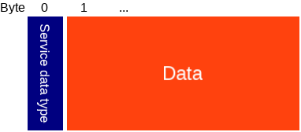

Type | Name | Length | Description
--- | --- | --- | ---
uint 8 | Service data type | 1 | Type of service data, see below.
uint 8[] | Data |  | Remaining data, length depends on type.

Type | Packet
---- | ---
0-5  | Deprecated, see this [document](SERVICE_DATA_DEPRECATED.md)
6    | [Device type + data](#device-type-and-setup-service-data). Advertised when in setup mode.
7    | [Device type + data](#device-type-and-encrypted-service-data). Advertised when in normal mode.

# Device type and setup service data
This packet contains the state info, it is unencrypted.

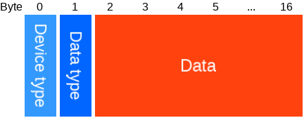

Type | Name | Length | Description
--- | --- | --- | ---
uint 8 | [Device type](#device-type) | 1 | Type of stone: plug, builtin, guidestone, etc.
uint 8 | Data type | 1 | Type of data, see below.
uint 8[] | Data | 15 | Data, depends on type, see below.

Type | Packet
---- | ---
0    | [State](#setup-state-packet).
5    | [Hub state](#hub-state-packet).

## Setup state packet

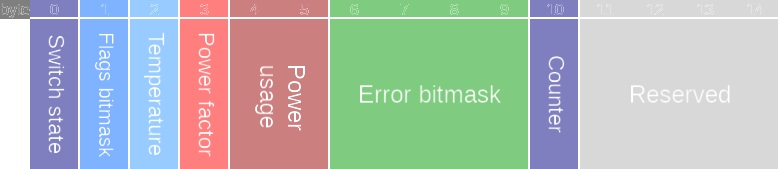

Type | Name | Length | Description
--- | --- | --- | ---
uint 8 | [Switch state](#switch-state-packet) | 1 | The state of the switch.
uint 8 | [Flags bitmask](#flags-bitmask) | 1 | Bitflags to indicate a certain state of the Crownstone.
int 8 | Temperature | 1 | Chip temperature (°C).
int 8 | Power factor | 1 | The power factor at this moment. Divide by 127 to get the actual power factor.
int 16 | Power usage | 2 | The real power usage at this moment. Divide by 8 to get power usage in Watt. Divide real power usage by the power factor to get apparent power usage in VA.
uint 32 | [Error bitmask](#state-error-bitmask) | 4 | Error bitmask of the Crownstone.
uint 8 | Counter | 1 | Simply counts up and overflows.
uint 8 | Reserved | 4 | Reserved for future use, will be 0 for now.

# Device type and encrypted service data

This packet contains the device type and encrypted data (if encryption is enabled), which is encrypted using [AES 128 ECB](https://en.wikipedia.org/wiki/Block_cipher_mode_of_operation#Electronic-Codebook-.28ECB.29) using the service data key.
You can verify if you can decrypt the service data by checking if the validation is the correct value, and if the Crownstone ID remains the same after decryption (while the encrypted service data changes).

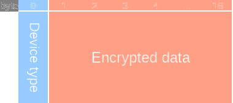

Type | Name | Length | Description
--- | --- | --- | ---
uint 8 | [Device type](#device-type) | 1 | Type of stone: plug, builtin, guidestone, etc.
uint 8[] | [Encrypted data](#encrypted-data) | 16 | Encrypted data, see below.

## Encrypted data

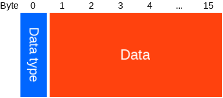

Type | Name | Length | Description
--- | --- | --- | ---
uint 8 | Data type | 1 | Type of data, see below.
uint 8[] | Data | 15 | Data, see below.

The following data types are available:

Type | Packet
---- | ---
0    | [State](#state-packet).
1    | [Error](#error-packet).
2    | [External state](#external-state-packet).
3    | [External error](#external-error-packet).
4    | [Alternative state](#alternative-state-packet).
5    | [Hub state](#hub-state-packet).
6    | [Microapp data](#microapp-packet).

## State packet

The following type gives the latest state of the Crownstone.

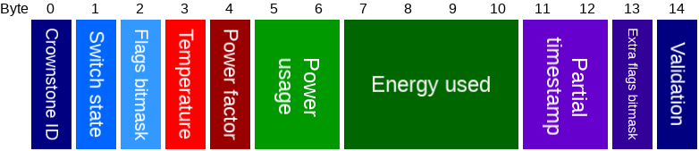

Type | Name | Length | Description
--- | --- | --- | ---
uint 8 | Crownstone ID | 1 | ID that identifies this Crownstone.
uint 8 | [Switch state](#switch-state-packet) | 1 | The state of the switch.
uint 8 | [Flags bitmask](#flags-bitmask) | 1 | Bitflags to indicate a certain state of the Crownstone.
int 8 | Temperature | 1 | Chip temperature (°C).
int 8 | Power factor | 1 | The power factor at this moment. Divide by 127 to get the actual power factor.
int 16 | Power usage | 2 | The real power usage at this moment. Divide by 8 to get power usage in Watt. Divide real power usage by the power factor to get apparent power usage in VA.
int 32 | Energy used | 4 | The total energy used. Multiply by 64 to get the energy used in Joule.
uint 16 | Partial timestamp | 2 | The least significant bytes of the timestamp when this was the state of the Crownstone. If the time was not set on the Crownstone (can be seen in flags), this will be replaced by a counter.
uint 8 | [Extra flags bitmask](#extra-flags-bitmask) | 1 | Bitflags to indicate a certain state of the Crownstone.
uint 8 | Validation | 1 | Value is always `0xFA`. Can be used to help validating that the decryption was successful.

## Error packet

The following type only gets advertised in case there is an error. It will be interleaved with the state type.

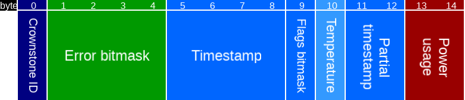

Type | Name | Length | Description
--- | --- | --- | ---
uint 8 | Crownstone ID | 1 | The identifier of the crownstone which has this state.
uint 32 | [Error bitmask](#state-error-bitmask) | 4 | Error bitmask of the Crownstone.
uint 32 | Timestamp | 4 | The timestamp when the first error occurred.
uint 8 | [Flags bitmask](#flags-bitmask) | 1 | Bitflags to indicate a certain state of the Crownstone.
int 8 | Temperature | 1 | Chip temperature (°C).
uint 16 | Partial timestamp | 2 | The least significant bytes of the timestamp when this were the flags and temperature of the Crownstone. If the time was not set on the Crownstone (can be seen in flags), this will be replaced by a counter.
int 16 | Power usage | 2 | The real power usage at this moment. Divide by 8 to get power usage in Watt. Divide real power usage by the power factor to get apparent power usage in VA.servicedata_device_type

## External state packet

The following type sends out the last known state of another Crownstone. It will be interleaved with the state type (unless there's an error).

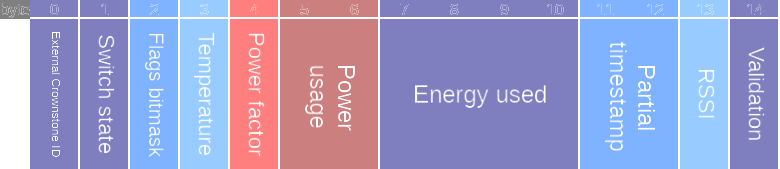

Type | Name | Length | Description
--- | --- | --- | ---
uint 8 | External Crownstone ID | 1 | The identifier of the crownstone which has the following state.
uint 8 | [Switch state](#switch-state-packet) | 1 | The state of the switch.
uint 8 | [Flags bitmask](#flags-bitmask) | 1 | Bitflags to indicate a certain state of the Crownstone.
int 8 | Temperature | 1 | Chip temperature (°C).
int 8 | Power factor | 1 | The power factor at this moment. Divide by 127 to get the actual power factor.
int 16 | Power usage | 2 | The real power usage at this moment. Divide by 8 to get power usage in Watt. Divide real power usage by the power factor to get apparent power usage in VA.
int 32 | Energy used | 4 | The total energy used. Multiply by 64 to get the energy used in Joule.
uint 16 | Partial timestamp | 2 | The least significant bytes of the timestamp when this was the state of the Crownstone. If the time was not set on the Crownstone (can be seen in flags), this will be replaced by a counter.
int 8 | RSSI | 1 | RSSI to the external crownstone. 0 when unknown, usually means the external Crownstone is out of direct reach.
uint 8 | Validation | 1 | Value is always `0xFA`. Can be used to help validating that the decryption was successful.

## External error packet

The following type sends out the last known error of another Crownstone. It will be interleaved with the state type (unless there's an error).

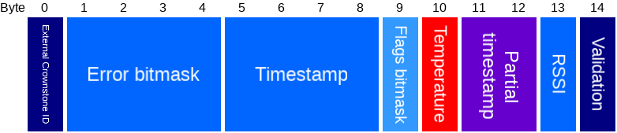

Type | Name | Length | Description
--- | --- | --- | ---
uint 8 | External Crownstone ID | 1 | The identifier of the crownstone which has the following state.
uint 32 | [Error bitmask](#state-error-bitmask) | 4 | Error bitmask of the Crownstone.
uint 32 | Timestamp | 4 | The timestamp when the first error occurred.
uint 8 | [Flags bitmask](#flags-bitmask) | 1 | Bitflags to indicate a certain state of the Crownstone.
int 8 | Temperature | 1 | Chip temperature (°C).
uint 16 | Partial timestamp | 2 | The least significant bytes of the timestamp when this were the flags and temperature of the Crownstone. If the time was not set on the Crownstone (can be seen in flags), this will be replaced by a counter.
int 8 | RSSI | 1 | RSSI to the external crownstone. 0 when unknown, usually means the external Crownstone is out of direct reach.
uint 8 | Validation | 1 | Value is always `0xFA`. Can be used to help validating that the decryption was successful.

## Alternative state packet

The following type gives the latest state of the Crownstone.
It's similar to the normal state, but replaces some less essential fields with other data.

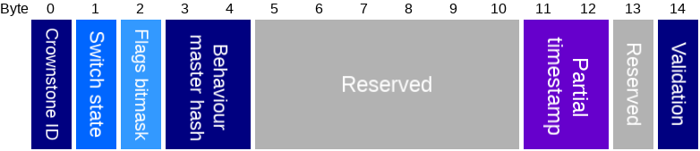

Type | Name | Length | Description
--- | --- | --- | ---
uint 8 | Crownstone ID | 1 | ID that identifies this Crownstone.
uint 8 | [Switch state](#switch-state-packet) | 1 | The state of the switch.
uint 8 | [Flags bitmask](#flags-bitmask) | 1 | Bitflags to indicate a certain state of the Crownstone.
uint 16 | Behaviour master hash | 2 | Part of behaviour master hash: divide hash by 65536.
uint 16 | Asset filters version | 2 | Master version of the asset filters.
uint 32 | Asset filters CRC | 4 | Master CRC of the asset filters.
uint 16 | Partial timestamp | 2 | The least significant bytes of the timestamp when this was the state of the Crownstone. If the time was not set on the Crownstone (can be seen in flags), this will be replaced by a counter.
uint 8 | Reserved | 1 | Reserved for future use, 0 for now.
uint 8 | Validation | 1 | Value is always `0xFA`. Can be used to help validating that the decryption was successful.

## Hub state packet

When a Crownstone dongle is set to hub mode, the hub state service data replaces the normal state.

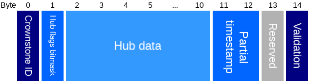

Type | Name | Length | Description
--- | --- | --- | ---
uint 8 | Crownstone ID | 1 | ID that identifies this Crownstone.
uint 8 | [Hub flags bitmask](#hub-flags-bitmask) | 1 | Flags.
uint 8[] | Hub data | 9 | Data, protocol defined by hub.
uint 16 | Partial timestamp | 2 | The least significant bytes of the timestamp when this was the state of the Crownstone. If the time was not set on the Crownstone (can be seen in flags), this will be replaced by a counter.
uint 8 | Reserved | 1 | Reserved for future use, 0 for now.
uint 8 | Validation | 1 | Value is always `0xFA`. Can be used to help validating that the decryption was successful.

#### Hub flags bitmask

Bit | Name |  Description
--- | --- | ---
0   | UART alive | Whether the UART connection is alive (heartbeats are received).
1   | UART alive encrypted | Whether the UART connection is alive (encrypted heartbeats are received).
2   | UART encryption required by Crownstone | Whether the encrypted UART is required by this Crownstone.
3   | UART encryption required by hub | Whether the encrypted UART is required by the hub.
4   | Hub has been set up | Whether the hub has been set up.
5   | Hub has internet | Whether the hub has internet connection.
6   | Hub has error | Whether the hub has some error.
7   | Time set | Whether the time is set on this Crownstone.

## Microapp packet

When a microapp requests to advertise encrypted data, this packet will be interleaved with the Crownstone state packets.

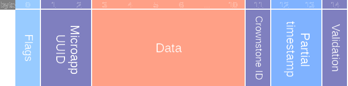

Type | Name | Length | Description
--- | --- | --- | ---
uint 8 | Flags | 1 | [Flags bitmask](#microapp-flags-bitmask).
uint 16 | Microapp UUID | 2 | Identifier freely chosen by the microapp.
uint 8[] | Data | 8 | Data set by the microapp.
uint 8 | Crownstone ID | 1 | ID that identifies this Crownstone.
uint 16 | Partial timestamp | 2 | The least significant bytes of the timestamp when this data was set by the microapp. If the time was not set on the Crownstone (can be seen in flags), this will be replaced by a counter.
uint 8 | Validation | 1 | Value is always `0xFA`. Can be used to help validating that the decryption was successful.

#### Microapp flags bitmask

Bit | Name |  Description
--- | --- | ---
0   | Time set | If this is 1, the time is set on this Crownstone.
1-7 | Reserved | Reserved for future use, always 0 for now.

# Common packets

#### Switch state
To be able to distinguish between the relay and dimmer state, the switch state is a bit struct with the following layout:

Bit | Name |  Description
--- | --- | ---
0   | Relay | Value of the relay, where 0 = OFF, 1 = ON.
1-7 | Dimmer | Value of the dimmer, where 100 if fully on, 0 is OFF, dimmed in between.

#### Flags bitmask

Bit | Name |  Description
--- | --- | ---
0   | Dimmer ready | When dimmer is ready to be used, this will be 1.
1   | Marked as dimmable | When dimming is configured to be allowed, this will be 1.
2   | Error |  If this is 1, the Crownstone has an error, you can check what error it is in the [error service data](#service-data-encrypted-error), or by reading the [error state](PROTOCOL.md#state-packet).
3   | Switch locked | When the switch state is locked, this will be 1.
4   | Time set | If this is 1, the time is set on this Crownstone.
5   | Switchcraft | If this is 1, switchcraft is enabled on this Crownstone.
6   | Tap to toggle | If this is 1, tap to toggle is enabled on this Crownstone.
7   | Behaviour overridden | If this is 1, behaviour is overridden.

#### Extra flags bitmask

Bit | Name |  Description
--- | --- | ---
0   | Behaviour enabled | Whether behaviours are enabled.
1-7 | Reserved for future use, will be 0 for now.

#### Error Bitmask

Bit | Name |  Description
--- | --- | ---
0   | Overcurrent | If this is 1, overcurrent was detected.
1   | Overcurrent dimmer | If this is 1, overcurrent for the dimmer was detected.
2   | Chip temperature | If this is 1, the chip temperature is too high.
3   | Dimmer temperature | If this is 1, the dimmer temperature is too high.
4   | Dimmer on failure | If this is 1, the dimmer is broken, in an always (partial) on state.
5   | Dimmer off failure | If this is 1, the dimmer is broken, in an always (partial) off state.
6-31 | Reserved | Reserved for future use.

#### Device type

Value | Device type
---   | ---
0     | Unknown
1     | Crownstone plug
2     | Guidestone
3     | Crownstone builtin
4     | Crownstone dongle
5     | Crownstone builtin one
6     | Crownstone plug one
7     | Crownstone hub
