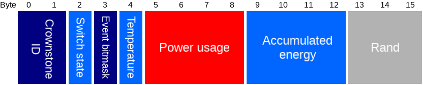
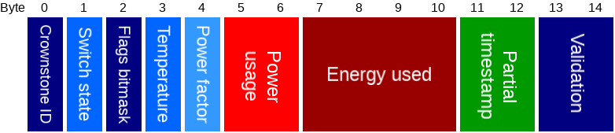
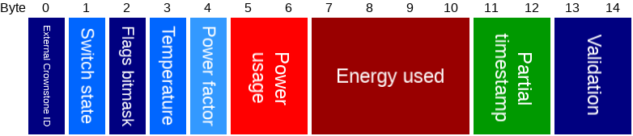
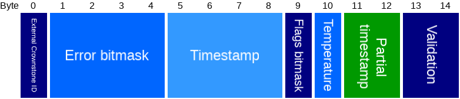
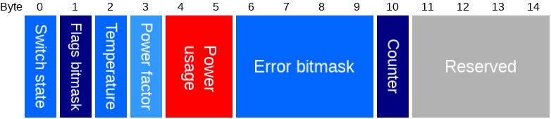
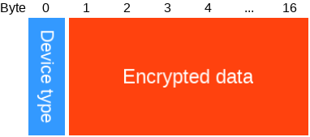
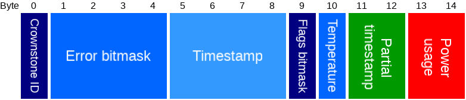
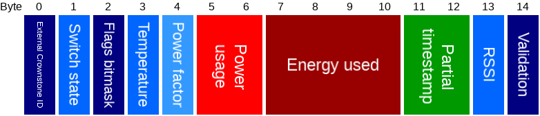
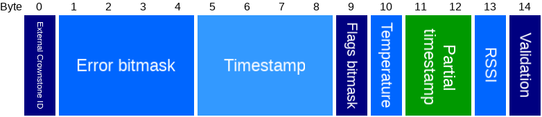

# Bluenet deprecated service data
----------------------

The service data contains the state of the Crownstone.

# Service data header
The first byte of the service data determines how to parse the remaining bytes.

Type | Name | Length | Description
--- | --- | --- | ---
uint 8 | Service data type | 1 | Type of service data, see below.
uint 8[] | Data |  | Remaining data, length depends on type.

Type | Packet
--- | ---
1 | [Encrypted data](#encrypted-service-data-v1-packet), encrypted data.
3 | [Encrypted data](#encrypted-service-data-v3). Advertised when in normal mode.
4 | [Setup data](#setup-service-data-v3). Advertised when in setup mode.
5 | [Device type + data](#device-type-and-encrypted-service-data-v5). Advertised when in normal mode.

# Encrypted service data v1 packet
This packet contains the state info. If encryption is enabled, it's encrypted using [AES 128 ECB](https://en.wikipedia.org/wiki/Block_cipher_mode_of_operation#Electronic-Codebook-.28ECB.29) using the guest key.
You receive a MAC address on Android and an UUID on iOS for each advertisement packet. This allows you to get the Crownstone ID associated with the packet and you verify the decryption by checking the expected Crownstone ID against the one in the packet.

Type | Name | Length | Description
--- | --- | --- | ---
uint 16 | Crownstone ID | 2 | ID that identifies this Crownstone.
uint 8 | [Switch state](#switch-state) | 1 | The state of the switch.
uint 8 | [Event bitmask](#event-bitmask) | 1 | Bitflags to indicate a certain state of the Crownstone.
int 8 | Temperature | 1 | Chip temperature (°C).
int 32 | Power usage | 4 | The power usage at this moment (mW). Divide by 1000 to get power usage in Watt.
int 32 | Accumulated energy | 4 | The accumulated energy (Wh).
uint 8[] | Rand | 3 | Random bytes.

#### Event Bitmask

Bit | Name |  Description
--- | --- | ---
0 | New data available | If you request something from the Crownstone and the result is available, this will be 1.
1 | Showing external data |  If this is 1, the shown ID and data is from another Crownstone.
2 | Error |  If this is 1, the Crownstone has an error, you should check what error it is by reading the [error state](PROTOCOL.md#state-get-packet).
3 | Reserved  |  Reserved for future use (switch locked).
4 | Reserved |  Reserved for future use (marked as dimmable).
5 | Reserved  |  Reserved for future use (not dimmable yet).
6 | Reserved |  Reserved for future use.
7 | Setup mode active |  If this is 1, the Crownstone is in setup mode.

# Encrypted service data v3
This packet contains the state info. If encryption is enabled, it's encrypted using [AES 128 ECB](https://en.wikipedia.org/wiki/Block_cipher_mode_of_operation#Electronic-Codebook-.28ECB.29) using the guest key.
You receive a MAC address on Android and an UUID on iOS for each advertisement packet. This allows you to get the Crownstone ID associated with the packet and you verify the decryption by checking the expected Crownstone ID against the one in the packet.

Type | Name | Length | Description
--- | --- | --- | ---
uint 8 | Data type | 1 | Type of data, see below.
uint 8[] | Data | 15 | Data, see below.

The following types are available:

Type | Packet
--- | ---
0 | [State](#state-packet-v3).
1 | [Error](#error-packet-v3).
2 | [External state](#external-state-packet-v3).
3 | [External error](#external-error-packet-v3).

## State packet v3

The following type gives the latest state of the Crownstone.

Type | Name | Length | Description
--- | --- | --- | ---
uint 8 | Crownstone ID | 1 | ID that identifies this Crownstone.
uint 8 | [Switch state](#switch-state) | 1 | The state of the switch.
uint 8 | [Flags bitmask](#flags-bitmask) | 1 | Bitflags to indicate a certain state of the Crownstone.
int 8 | Temperature | 1 | Chip temperature (°C).
int 8 | Power factor | 1 | The power factor at this moment. Divide by 127 to get the actual power factor.
int 16 | Power usage | 2 | The real power usage at this moment. Divide by 8 to get power usage in Watt. Divide real power usage by the power factor to get apparent power usage in VA.
int 32 | Energy used | 4 | The total energy used. Multiply by 64 to get the energy used in Joule.
uint 16 | Partial timestamp | 2 | The least significant bytes of the timestamp when this was the state of the Crownstone. If the time was not set on the Crownstone (can be seen in flags), this will be replaced by a counter.
uint 16 | Validation | 2 | Value is always `0xFACE`. Can be used to help validating that the decryption was successful.

## Error packet v3

The following type only gets advertised in case there is an error. It will be interleaved with the state type.

Type | Name | Length | Description
--- | --- | --- | ---
uint 8 | Crownstone ID | 1 | The identifier of the crownstone which has this state.
uint 32 | [Error bitmask](#error-bitmask) | 4 | Error bitmask of the Crownstone.
uint 32 | Timestamp | 4 | The timestamp when the first error occured.
uint 8 | [Flags bitmask](#flags-bitmask) | 1 | Bitflags to indicate a certain state of the Crownstone.
int 8 | Temperature | 1 | Chip temperature (°C).
uint 16 | Partial timestamp | 2 | The least significant bytes of the timestamp when this were the flags and temperature of the Crownstone. If the time was not set on the Crownstone (can be seen in flags), this will be replaced by a counter.
int 16 | Power usage | 2 | The real power usage at this moment. Divide by 8 to get power usage in Watt. Divide real power usage by the power factor to get apparent power usage in VA.

## External state packet v3

The following type sends out the last known state of another Crownstone. It will be interleaved with the state type (unless there's an error).

Type | Name | Length | Description
--- | --- | --- | ---
uint 8 | External Crownstone ID | 1 | The identifier of the crownstone which has the following state.
uint 8 | [Switch state](#switch-state) | 1 | The state of the switch.
uint 8 | [Flags bitmask](#flags-bitmask) | 1 | Bitflags to indicate a certain state of the Crownstone.
int 8 | Temperature | 1 | Chip temperature (°C).
int 8 | Power factor | 1 | The power factor at this moment. Divide by 127 to get the actual power factor.
int 16 | Power usage | 2 | The real power usage at this moment. Divide by 8 to get power usage in Watt. Divide real power usage by the power factor to get apparent power usage in VA.
int 32 | Energy used | 4 | The total energy used. Multiply by 64 to get the energy used in Joule.
uint 16 | Partial timestamp | 2 | The least significant bytes of the timestamp when this was the state of the Crownstone. If the time was not set on the Crownstone (can be seen in flags), this will be replaced by a counter.
uint 16 | Validation | 2 | Value is always `0xFACE`. Can be used to help validating that the decryption was successful.

## External error packet v3

The following type sends out the last known error of another Crownstone. It will be interleaved with the state type (unless there's an error).

Type | Name | Length | Description
--- | --- | --- | ---
uint 8 | External Crownstone ID | 1 | The identifier of the crownstone which has the following state.
uint 32 | [Error bitmask](#error-bitmask) | 4 | Error bitmask of the Crownstone.
uint 32 | Timestamp | 4 | The timestamp when the first error occured.
uint 8 | [Flags bitmask](#flags-bitmask) | 1 | Bitflags to indicate a certain state of the Crownstone.
int 8 | Temperature | 1 | Chip temperature (°C).
uint 16 | Partial timestamp | 2 | The least significant bytes of the timestamp when this were the flags and temperature of the Crownstone. If the time was not set on the Crownstone (can be seen in flags), this will be replaced by a counter.
uint 16 | Validation | 2 | Value is always `0xFACE`. Can be used to help validating that the decryption was successful.

# Setup service data v3
This packet contains the state info, it is unencrypted.

Type | Name | Length | Description
--- | --- | --- | ---
uint 8 | Data type | 1 | Type of data, see below.
uint 8[] | Data | 15 | Data, see below.

Type | Packet
--- | ---
0 | [State](setup-state-packet-v3).

## Setup state packet v3

Type | Name | Length | Description
--- | --- | --- | ---
uint 8 | [Switch state](#switch-state) | 1 | The state of the switch.
uint 8 | [Flags bitmask](#flags-bitmask) | 1 | Bitflags to indicate a certain state of the Crownstone.
int 8 | Temperature | 1 | Chip temperature (°C).
int 8 | Power factor | 1 | The power factor at this moment. Divide by 127 to get the actual power factor.
int 16 | Power usage | 2 | The real power usage at this moment. Divide by 8 to get power usage in Watt. Divide real power usage by the power factor to get apparent power usage in VA.
uint 32 | [Error bitmask](#error-bitmask) | 4 | Error bitmask of the Crownstone.
uint 8 | Counter | 1 | Simply counts up and overflows.
uint 8 | Reserved | 4 | Reserved for future use.

# Device type and encrypted service data v5
This packet contains the device type and the state info. If encryption is enabled, the state is encrypted using [AES 128 ECB](https://en.wikipedia.org/wiki/Block_cipher_mode_of_operation#Electronic-Codebook-.28ECB.29) using the guest key.
You receive a MAC address on Android and an UUID on iOS for each advertisement packet. This allows you to get the Crownstone ID associated with the packet and you verify the decryption by checking the expected Crownstone ID against the one in the packet.

Type | Name | Length | Description
--- | --- | --- | ---
uint 8 | [Device type](#device-type) | 1 | Type of stone: plug, builtin, guidestone, etc.
uint 8[] | Encrypted data | 16 | Encrypted data, see below.

Encrypted data:

Type | Name | Length | Description
--- | --- | --- | ---
uint 8 | Data type | 1 | Type of data, see below.
uint 8[] | Data | 15 | Data, see below.

The following data types are available:

Type | Packet
--- | ---
0 | [State](#state-packet-v5).
1 | [Error](#error-packet-v5).
2 | [External state](#external-state-packet-v5).
3 | [External error](#external-error-packet-v5).

## State packet v5

The following type gives the latest state of the Crownstone.

Type | Name | Length | Description
--- | --- | --- | ---
uint 8 | Crownstone ID | 1 | ID that identifies this Crownstone.
uint 8 | [Switch state](#switch-state) | 1 | The state of the switch.
uint 8 | [Flags bitmask](#flags-bitmask) | 1 | Bitflags to indicate a certain state of the Crownstone.
int 8 | Temperature | 1 | Chip temperature (°C).
int 8 | Power factor | 1 | The power factor at this moment. Divide by 127 to get the actual power factor.
int 16 | Power usage | 2 | The real power usage at this moment. Divide by 8 to get power usage in Watt. Divide real power usage by the power factor to get apparent power usage in VA.
int 32 | Energy used | 4 | The total energy used. Multiply by 64 to get the energy used in Joule.
uint 16 | Partial timestamp | 2 | The least significant bytes of the timestamp when this was the state of the Crownstone. If the time was not set on the Crownstone (can be seen in flags), this will be replaced by a counter.
uint 8 | Reserved | 1 | Reserved for future use.
uint 8 | Validation | 1 | Value is always `0xFA`. Can be used to help validating that the decryption was successful.

## Error packet v5

The following type only gets advertised in case there is an error. It will be interleaved with the state type.

Type | Name | Length | Description
--- | --- | --- | ---
uint 8 | Crownstone ID | 1 | The identifier of the crownstone which has this state.
uint 32 | [Error bitmask](#error-bitmask) | 4 | Error bitmask of the Crownstone.
uint 32 | Timestamp | 4 | The timestamp when the first error occured.
uint 8 | [Flags bitmask](#flags-bitmask) | 1 | Bitflags to indicate a certain state of the Crownstone.
int 8 | Temperature | 1 | Chip temperature (°C).
uint 16 | Partial timestamp | 2 | The least significant bytes of the timestamp when this were the flags and temperature of the Crownstone. If the time was not set on the Crownstone (can be seen in flags), this will be replaced by a counter.
int 16 | Power usage | 2 | The real power usage at this moment. Divide by 8 to get power usage in Watt. Divide real power usage by the power factor to get apparent power usage in VA.

## External state packet v5

The following type sends out the last known state of another Crownstone. It will be interleaved with the state type (unless there's an error).

Type | Name | Length | Description
--- | --- | --- | ---
uint 8 | External Crownstone ID | 1 | The identifier of the crownstone which has the following state.
uint 8 | [Switch state](#switch-state) | 1 | The state of the switch.
uint 8 | [Flags bitmask](#flags-bitmask) | 1 | Bitflags to indicate a certain state of the Crownstone.
int 8 | Temperature | 1 | Chip temperature (°C).
int 8 | Power factor | 1 | The power factor at this moment. Divide by 127 to get the actual power factor.
int 16 | Power usage | 2 | The real power usage at this moment. Divide by 8 to get power usage in Watt. Divide real power usage by the power factor to get apparent power usage in VA.
int 32 | Energy used | 4 | The total energy used. Multiply by 64 to get the energy used in Joule.
uint 16 | Partial timestamp | 2 | The least significant bytes of the timestamp when this was the state of the Crownstone. If the time was not set on the Crownstone (can be seen in flags), this will be replaced by a counter.
int 8 | RSSI | 1 | RSSI to the external crownstone.
uint 8 | Validation | 1 | Value is always `0xFA`. Can be used to help validating that the decryption was successful.

## External error packet v5

The following type sends out the last known error of another Crownstone. It will be interleaved with the state type (unless there's an error).

Type | Name | Length | Description
--- | --- | --- | ---
uint 8 | External Crownstone ID | 1 | The identifier of the crownstone which has the following state.
uint 32 | [Error bitmask](#error-bitmask) | 4 | Error bitmask of the Crownstone.
uint 32 | Timestamp | 4 | The timestamp when the first error occured.
uint 8 | [Flags bitmask](#flags-bitmask) | 1 | Bitflags to indicate a certain state of the Crownstone.
int 8 | Temperature | 1 | Chip temperature (°C).
uint 16 | Partial timestamp | 2 | The least significant bytes of the timestamp when this were the flags and temperature of the Crownstone. If the time was not set on the Crownstone (can be seen in flags), this will be replaced by a counter.
int 8 | RSSI | 1 | RSSI to the external crownstone.
uint 8 | Validation | 1 | Value is always `0xFA`. Can be used to help validating that the decryption was successful.

# Common packets

#### Switch state
To be able to distinguish between the relay and dimmer state, the switch state is a bit struct with the following layout:

Bit | Name |  Description
--- | --- | ---
0 | Relay | Value of the relay, where 0 = OFF, 1 = ON.
1-7 | Dimmer | Value of the dimmer, where 100 if fully on, 0 is OFF, dimmed in between.

#### Flags bitmask

Bit | Name |  Description
--- | --- | ---
0 | Dimming available | When dimming is physically available, this will be 1.
1 | Marked as dimmable | When dimming is configured to be allowed, this will be 1.
2 | Error |  If this is 1, the Crownstone has an error, you can check what error it is in the error packet, or by reading the [error state](PROTOCOL.md#state-get-packet).
3 | Switch locked | When the switch state is locked, this will be 1.
4 | Time set | If this is 1, the time is set on this Crownstone.
5 | Switchcraft | If this is 1, switchcraft is enabled on this Crownstone.
6 | Reserved | Reserved for future use.
7 | Reserved | Reserved for future use.

#### Error Bitmask

Bit | Name |  Description
--- | --- | ---
0   | Overcurrent | If this is 1, overcurrent was detected.
1   | Overcurrent dimmer | If this is 1, overcurrent for the dimmer was detected.
2   | Chip temperature | If this is 1, the chip temperature is too high.
3   | Dimmer temperature | If this is 1, the dimmer temperature is too high.
4   | Dimmer on failure | If this is 1, the dimmer is broken, in an always (partial) on state.
5   | Dimmer off failure | If this is 1, the dimmer is broken, in an always (partial) off state.
6-31 | Reserved | Reserved for future use.

#### Device type

Value | Device type
---| ---
0 | Unknown
1 | Crownstone plug
2 | Guidestone
3 | Crownstone builtin
4 | Crownstone dongle
