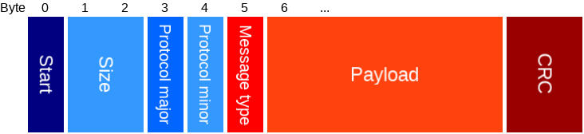
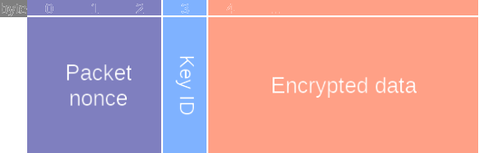
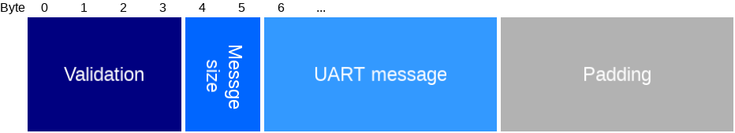
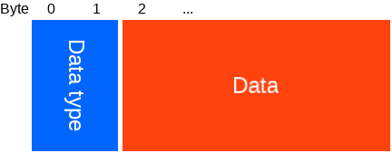
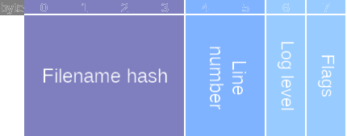
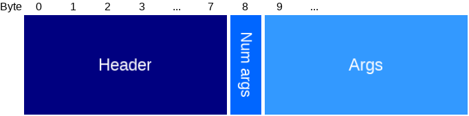
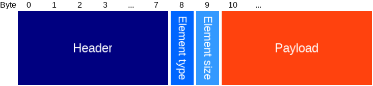

# UART Protocol 1.0.0
-------------------

## Special characters

There are two special characters:
- Start: `0x7E`
- Escape: `0x5C`

Every byte in the UART message that equals one of the special characters will be XORed by `0x40`, and prepended by the escape character.

## UART wrapper

Every UART message is wrapped.

Type | Name | Length | Description
--- | --- | --- | ---
uint8   | Start          | 1 | Start of a message (0x7E).
uint16  | Size           | 2 | Size of all data after this field, including CRC. Size 0 is always invalid.
uint8   | Protocol major | 1 | Major protocol version, increased for breaking changes.
uint8   | Protocol minor | 1 | Minor protocol version, increased when new types are added.
[Uart message type](#uart-message-type)   | Message type   | 1 | Type of UART message, see below.
uint8[] | Payload        | N | Depends on message type.
uint16  | CRC            | 2 | The CRC16 (CRC-16-CCITT) of everything after the size field.

## UART message type
A uint8 to differentiate between several uart message formats.

Type | Payload | Description
---- | ------- | -----------
0    | [UART message](#uart-message) | Plain text UART message.
128  | [Encrypted UART message](#encrypted-uart-message) | Encrypted UART message. **Not implemented yet.**

### Encrypted UART message

Although the name suggests this is encrypted, only the `encrypted data` is actually encrypted. The other fields are unencrypted, but required for the encryption.

Type | Name | Length | Description
--- | --- | --- | ---
uint8[] | Packet nonce | 3 | Packet nonce: should be different random numbers each time.
uint8   | Key ID       | 1 | Key ID used for encryption: always 0 for now. Also determines access level: always admin for now.
uint8[] | Encrypted data | N | Encrypted with [AES CTR](PROTOCOL.md#aes-128-ctr-encryption). Get a (new) session nonce with the session nonce command.

### Encrypted data

Type | Name | Length | Description
--- | --- | --- | ---
uint32  | Validation   | 4 | Validation: must be 0xCAFEBABE.
uint16  | Message size | 2 | Size of the uart message in bytes.
uint8[] | [UART message](#uart-message) | Size | The uart message.
uint8[] | Padding      | N | Padding to make this whole packet size a multiple of 16.

### UART message

Type | Name | Length | Description
--- | --- | --- | ---
uint16  | Data type    | 2 | Type of UART data.
uint8[] | Data         | N | The data packet, depends on type.

## TX data types (commands)

Data types for messages sent to the Crownstone.

- Each message will be replied to with a message with the same data type.
    - You __must__ wait for the reply before sending the next message, else the next message will be ignored.
    - If your message is invalid (no access, wrong payload, unknown type, etc), there will be an error reply.
- Messages with _encrypted_ set to _yes_, have to be encrypted when the crownstone status has _encryption required_ set to true.
- Messages with _encrypted_ set to _optional_, may be encrypted.
- Types >= 50000 are for development. These may change, and will be disabled in release.

Type  | Type name                     | Encrypted | Data   | Description
----- | ----------------------------- | --------- | ------ | -----------
0     | Hello                         | Never     | [Hello](#user-hello-packet) | First command that should sent, used to determine whether this is the right crownstone, and to tell and determine whether encryption has to be used.
1     | Session nonce                 | Never     | [Session nonce](#refresh-session-nonce-packet) | Refresh the session nonce.
2     | Heartbeat                     | Optional  | [Heartbeat](#heartbeat-packet) | Used to know whether the UART connection is alive. You can mix encrypted and unencrypted heartbeat commands. With current implementation though, each time you send an unencrypted heartbeat, the hub service data flag `UART alive encrypted` will be false until an encrypted heartbeat is sent.
3     | Status                        | Optional  | [Status](#user-status-packet) | Status of the user, this will be advertised by a dongle when it is in hub mode. Hub mode can be enabled via a _Set state_ control command.
4     | Get MAC                       | Never     | -      | Get MAC address of this Crownstone (in reverse byte order compared to string representation).
10    | Control command               | Yes       | [Control msg](../docs/PROTOCOL.md#control-packet) | Send a control command.
11    | Hub data reply                | Optional  | [Hub data reply](#hub-data-reply) | Only after receiving `Hub data`, reply with this command. This data will be relayed to the device (phone) connected via BLE.
50000 | Enable advertising            | Never     | uint8  | Enable/disable advertising.
50001 | Enable mesh                   | Never     | uint8  | Enable/disable mesh.
50002 | Get ID                        | Never     | -      | Get ID of this Crownstone.
50103 | Inc current range             | Never     | -      | Increase the range on the current channel.
50104 | Dec current range             | Never     | -      | Decrease the range on the current channel.
50105 | Inc voltage range             | Never     | -      | Increase the range on the voltage channel.
50106 | Dec voltage range             | Never     | -      | Decrease the range on the voltage channel.
50108 | Enable diff current           | Never     | uint8  | Enable/disable differential mode on current channel. (Currently the packet is ignored, and it toggles instead)
50109 | Enable diff voltage           | Never     | uint8  | Enable/disable differential mode on voltage channel. (Currently the packet is ignored, and it toggles instead)
50110 | Voltage pin                   | Never     | uint8  | Change the pin used on voltage channel. (Currently the packet is ignored, and it rotates between certain pins instead)
50200 | Log current                   | Never     | uint8  | Enable sending current samples.
50201 | Log voltage                   | Never     | uint8  | Enable sending voltage samples.
50202 | Log filtered current          | Never     | uint8  | Enable sending filtered current samples.
50204 | Log power                     | Never     | uint8  | Enable sending calculated power samples.
60000 | Inject event                  | Never     | uint8[]      | Inject an internal event. Payload consists of the CS_TYPE and its associated event data structure.

## RX data types (events and replies)

Data types for messages received from the Crownstone.

- Messages with _encrypted_ set to _yes_, will be encrypted when the crownstone status has _encryption required_ set to true.
- Messages with _encrypted_ set to _optional_, may be encrypted.
- Types in range 0 - 9900 are replies to a UART command with the same type.
- Types in range 9900 - 10000 are error replies to any UART command.
- Types in range 10000 - 20000 are events, not a (direct) reply to a UART command.
- Types in range 40000 - 50000 are for development. These may change, and will be enabled in release.
- Types >= 50000 are for development. These may change, and will be disabled in release.

Type  | Type name                     | Encrypted | Data   | Description
----- | ----------------------------- | --------- | ------ | -----------
0     | Hello                         | Never     | [Hello](#crownstone-hello-packet) | Hello reply.
1     | Session nonce                 | Never     | [Session nonce](#session-nonce-reply-packet) | The new session nonce.
2     | Heartbeat                     | Optional  | -      | Heartbeat reply. Will be encrypted if the command was encrypted too.
3     | Status                        | Never     | [Status](#crownstone-status-packet) | Status reply.
4     | MAC                           | Never     | uint8 [6] | The MAC address of this crownstone.
10    | Control result                | Yes       | [Result packet](../docs/PROTOCOL.md#result-packet) | Result of a control command.
11    | Hub data reply ack            | Optional  | -      | Simply an acknowledgement that the hub data reply was received by the crownstone. Will be encrypted if the command was encrypted too.
9900  | Parsing failed                | Never     | -      | Your command was probably formatted incorrectly, is too large, has an invalid data type, or you don't have the required access level.
9901  | Error reply                   | Never     | [Status](#crownstone-status-packet) | Your command was probably not encrypted while it should have been.
9902  | Session nonce missing         | Never     | -      | The Crownstone has no session nonce, please send one.
9903  | Decryption failed             | Never     | -      | Decryption failed due to missing or wrong key.
10000 | Uart msg                      | Yes       | string | As requested via control command `UART message`.
10001 | Session nonce missing         | Never     | -      | The Crownstone has no session nonce, please send one.
10002 | Service data                  | Yes       | [Service data with device type](../docs/SERVICE_DATA.md#service-data-header) | Service data of this Crownstone.
10004 | Presence change               | Yes       | [Presence change packet](#presence-change-packet) | Sent when the presence has changed. Note: a profile ID can be at multiple locations at the same time.
10005 | Factory reset                 | Yes       | -      | Sent when a factory reset will be performed.
10006 | Booted                        | Never     | -      | This Crownstone just booted, you probably want to start a new session.
10007 | Hub data                      | Optional  | uint8 [] | As requested via control command `Hub data`. Make sure you reply with the `Hub data reply` uart command.
10102 | Mesh state msg                | Yes       | [Service data without device type](../docs/SERVICE_DATA.md#encrypted-data) | State of other Crownstones in the mesh (unencrypted).
10103 | Mesh state part 0             | Yes       | [External state part 0](#mesh-state-part-0) | Part of the state of other Crownstones in the mesh.
10104 | Mesh state part 1             | Yes       | [External state part 1](#mesh-state-part-1) | Part of the state of other Crownstones in the mesh.
10105 | Mesh result                   | Yes       | [Mesh result](#mesh-result-packet) | Result of an acked mesh command. You will get a mesh result for each Crownstone, also when it timed out. Note: you might get this multiple times for the same ID.
10106 | Mesh ack all                  | Yes       | [Mesh ack all result](../docs/PROTOCOL.md#result-packet) | SUCCESS when all IDs were acked, or TIMEOUT if any timed out.
10107 | Rssi between stones           | Yes       | Deprecated.
10108 | Asset Rssi Data               | Yes       | [Asset rssi data](#asset-rssi-data-packet) | Information about an asset a crownstone on the mesh has forwarded.
10109 | Nearest crownstone update     | Yes       | [Nearest crownstone update](#nearest-crownstone-update) | The rssi between an asset and its nearest Crownstone changed.
10110 | Nearest crownstone timed out  | Yes       | [Nearest crownstone timeout](#nearest-crownstone-timeout) | A previously tracked asset hasn't been observed in a
10111 | RSSI between stones report    | Yes       | [RSSI between stones report](#rssi-between-stones-report) | A report of the RSSI between 2 Crownstones.
10200 | Binary debug log              | Yes       | [Binary log](#binary-log-packet) | Binary debug logs, that you have to reconstruct on the client side.
10201 | Binary debug log array        | Yes       | [Binary log array](#binary-log-array-packet) | Binary debug logs, that you have to reconstruct on the client side.
40000 | Event                         | Yes       | ?      | Raw data from the internal event bus.
40103 | Mesh cmd time                 | Yes       | [Time](../docs/MESH_PROTOCOL.md#cs_mesh_model_msg_time_t) | Received command to set time from the mesh.
40110 | Mesh profile location         | Yes       | [Profile location](../docs/MESH_PROTOCOL.md#cs_mesh_model_msg_profile_location_t) | Received the location of a profile from the mesh.
40111 | Mesh set behaviour settings   | Yes       | [Behaviour settings](../docs/MESH_PROTOCOL.md#behaviour_settings_t) | Received command to set behaviour settings from the mesh.
40112 | Mesh tracked device register  | Yes       | [Tracked device register](../docs/MESH_PROTOCOL.md#cs_mesh_model_msg_device_register_t) | Received command to register a tracked device from the mesh.
40113 | Mesh tracked device token     | Yes       | [Tracked device token](../docs/MESH_PROTOCOL.md#cs_mesh_model_msg_device_token_t) | Received command to set the token of a tracked device from the mesh.
40114 | Mesh sync request             | Yes       | [Sync request](../docs/MESH_PROTOCOL.md#cs_mesh_model_msg_sync_request_t) | Received a sync request from the mesh.
40120 | Mesh tracked device heartbeat | Yes       | [Tracked device heartbeat](../docs/MESH_PROTOCOL.md#cs_mesh_model_msg_device_heartbeat_t) | Received heartbeat command of a tracked device from the mesh.
50000 | Advertising enabled           | Never     | uint8  | Whether advertising is enabled.
50001 | Mesh enabled                  | Never     | uint8  | Whether mesh is enabled.
50002 | Stone ID                      | Never     | uint8  | The stone ID of this crownstone.
50100 | ADC config                    | Never     | [ADC config](#adc-channel-config) | ADC configuration.
50101 | ADC restarted                 | Never     | -      | ADC restarted.
50200 | Current samples               | Never     | [Current samples](#current-samples) | Raw ADC samples of the current channel.
50201 | Voltage samples               | Never     | [Voltage samples](#voltage-samples) | Raw ADC samples of the voltage channel.
50202 | Filtered current samples      | Never     | [Filtered current samples](#current-samples) | Filtered ADC samples of the current channel.
50203 | Filtered voltage samples      | Never     | [Filtered voltage samples](#voltage-samples) | Filtered ADC samples of the voltage channel.
50204 | Power                         | Never     | [Power calculations](#power-calculations) | Calculated power values.
60000 | Debug log                     | Never     | string | Debug strings.
60001 | Test                          | Never     | string | Firmware test strings.

## Packets

### User hello packet

Type | Name | Length | Description
--- | --- | --- | ---
uint8 | [Flags](#user-status-flags-bitmask) | 1 | Status flags.

### Crownstone hello packet

Type | Name | Length | Description
--- | --- | --- | ---
uint8 | Sphere ID | 1 | Short sphere ID, as given during [setup](PROTOCOL.md#setup-mode).
[status](#crownstone-status-packet) | Status | 1 | Status packet.

### Heartbeat packet

Type | Name | Length | Description
--- | --- | --- | ---
uint16 | Timeout | 2 | If no heartbeat is received for _timeout_ seconds, the connection can be considered to be dead.

### User status packet

Type | Name | Length | Description
--- | --- | --- | ---
uint8 | Type | 1 | Status type: 0=no-data, 1=crownstone-hub
uint8 | [Flags](#user-status-flags-bitmask) | 1 | Status flags.
uint8[] | Data | 9 | Status data to be advertised by dongle (will be ignored if status type is _no-data_).

### User status flags bitmask

Bit | Name |  Description
--- | ---- | ---
0 | Encryption required | Whether messages with _encrypted_ set to _yes_, have to be encrypted.
1 | Has been set up     | Whether the hub has been set up.
2 | Has internet        | Whether internet is available.
3 | Has error           | Whether there is some error.
4-7 | Reserved          | Reserved for future use, must be 0 for now.

### Crownstone status packet

Type | Name | Length | Description
--- | --- | --- | ---
uint8 | [Flags](#crownstone-status-flags-bitmask) | 1 | Status flags.

### Crownstone status flags bitmask

Bit | Name |  Description
--- | ---- | ---
0 | Encryption required | Whether messages with _encrypted_ set to _yes_, have to be encrypted.
1 | Has been set up     | Whether the crownstone has been set up.
2 | Hub mode            | Whether hub mode is enabled.
3 | Has error           | Whether there is some error.
4-7 | Reserved          | Reserved for future use, must be 0 for now.

### Refresh session nonce packet

Type | Name | Length | Description
--- | --- | --- | ---
uint8 | Timeout | 1 | How long (minutes) this session nonce is valid.
uint8[] | Session nonce | 5 | The session nonce to use for encrypted messages sent by the user.

### Session nonce reply packet

Type | Name | Length | Description
--- | --- | --- | ---
uint8[] | Session nonce | 5 | The session nonce to use for encrypted messages sent by the crownstone.

### Hub data reply

Type | Name | Length | Description
--- | --- | --- | ---
uint16 | [Result code](PROTOCOL.md#result-codes) | 2 | The result code, which will be set as the result code of the [result packet](PROTOCOL.md#result-packet).
uint8[] | Data | N | Data.

### Presence change packet

Type | Name | Length | Description
--- | --- | --- | ---
uint8 | [Type](#presence-change-type) | 1 | Type of change.
uint8 | Profile ID | 1 | ID of the profile.
uint8 | Location ID | 1 | ID of the location.

##### Presence change type

Value | Name | Description
--- | --- | ---
0 | First sphere enter     | The first user entered the sphere. Ignore profile and location values.
1 | Last sphere exit       | The last user left the sphere. Ignore profile and location values.
2 | Profile sphere enter   | The first user of given profile entered the sphere. Ignore location value.
3 | Profile sphere exit    | The last user of given profile left the sphere. Ignore location value.
4 | Profile location enter | The first user of given profile entered the given location.
5 | Profile location exit  | The first user of given profile left the given location.

### Asset rssi data packet

Type | Name | Length | Description
--- | --- | --- | ---
uint8[] | AssetMac | 6 | Mac address of the observed asset (in reverse byte order compared to string representation).
uint8 | StoneId | 1 | Id of the Crownstone that observed the asset.
int8 | Rssi | 1 | Rssi between the observed asset and the observing Crownstone.
uint8 | Channel | 1 | Channel of the observed advertisement.

### Nearest Crownstone update

Type | Name | Length | Description
--- | --- | --- | ---
uint8[] | AssetId | 3 | ShortAssetId of the observed asset
uint8 | ClosestStoneId | 1 | Id of the Crownstone that this Crownstone thinks is closest to the asset
int8 | Rssi | 1 | Rssi between the observed asset and the observing Crownstone
uint8 | Channel | 1 | Channel of the observed advertisement

### nearest Crownstone timeout

Type | Name | Length | Description
--- | --- | --- | ---
uint8[] | AssetId | 3 | ShortAssetId of the asset that timed out

### RSSI between stones report

Type | Name | Length | Description
--- | --- | --- | ---
uint8 | Type | 1 | Defines the remainder of this message to allow for future changes. For now, always 0.
uint8 | Receiver ID | 1 | Stone ID of the stone that received a message.
uint8 | Sender ID | 1 | Stone ID of the stone that sent a message.
int8  | RSSI channel 37 | 1 | RSSI between the two stones on channel 37, according to the receiver. A value of 0 means there is no data yet.
int8  | RSSI channel 38 | 1 | RSSI between the two stones on channel 38, according to the receiver. A value of 0 means there is no data yet.
int8  | RSSI channel 39 | 1 | RSSI between the two stones on channel 39, according to the receiver. A value of 0 means there is no data yet.
uint8 | Last seen | 1 | How many seconds ago the sender was last seen by the receiver.
uint8 | Report number | 1 | Number that is increased by 1 each time the receiver sends this report. This can be used to identify how many messages from the receiver ID are lost.

### Binary log header

The log header should contain enough info to find the log string from the source code.

Type | Name | Length | Description
--- | --- | --- | ---
uint32 | Filename hash | 4 | 32 bits DJB2 hash of the reversed filename of the source code where the log is.
uint16 | Line number | 2 | Line number (starting at line 1) where the ; of the source code where the log is.
uint8 | Log level | 1 | Verbosity of the log, similar to serial_verbosity in config: verbose=8, debug=7, info=6, warn=5, error=4, fatal=3.
uint8 | Flags | 1 | Options for the log. Currently only bit 0 is used, which is true to end the line.

### Binary log packet

The binary log packet consists of a header and arguments. The header is used to find the string in printf format. The arguments are then filled in according to this string.

For example, if the format string is `"%s is %u"` then the first argument is interpreted as a string, which replaces the `%s`. While the second arguement is interpreted as an unsigned integer, that replaces the `%u`.

Type | Name | Length | Description
--- | --- | --- | ---
[Header](#binary-log-header) | Header | 8 | Header.
uint8 | Num args | 1 | Number of arguments that follow.
[Args[]](#binary-log-argument-packet) | Args | N | Array of argument packets.

### Binary log argument packet

Type | Name | Length | Description
--- | --- | --- | ---
uint8 | Arg size | 1 | Size of the payload.
uint8[] | Payload | N | The argument data.

### Binary log array packet

Type | Name | Length | Description
--- | --- | --- | ---
[Header](#binary-log-header) | Header | 8 | Header.
[Element type](#binary-log-element-type) | Element type | 1 | The type of the elements.
uint8 | Element size | 1 | The size of each element.
uint8[] | Payload | X | The element data, of size: elementSize * numberOfElements.

##### Binary log element type

Value | Name | Description
--- | --- | ---
0   | INT     | Signed integer.
1   | UINT    | Unsigned integer.
2   | FLOAT   | Floating point number.
10  | FORMAT  | Use format string to determine the type, like printf. Not implemented yet.

### Mesh result packet

Type | Name | Length | Description
--- | --- | --- | ---
uint8 | Stone ID | 1 | ID of the stone.
[Result packet](../docs/PROTOCOL.md#result-packet) | Result | N | The result.

### Mesh state part 0

Type | Name | Length | Description
--- | --- | --- | ---
uint8 | Stone ID | 1 | ID of the stone.
[Mesh msg state 0](../docs/MESH_PROTOCOL.md#cs_mesh_model_msg_state_0_t) | State | 7 | The state.

### Mesh state part 1

Type | Name | Length | Description
--- | --- | --- | ---
uint8 | Stone ID | 1 | ID of the stone.
[Mesh msg state 1](../docs/MESH_PROTOCOL.md#cs_mesh_model_msg_state_1_t) | State | 7 | The state.

### ADC config

Sent when the ADC config changes.

Type | Name | Length | Description
--- | --- | --- | ---
uint8 | Count | 1 | Number of channels.
[channel_config](#adc-channel-config)[] | Channels |  | List of channel configs.
uint32 | Sampling period | 4 | Sampling period in μs. Each period, all channels are sampled once.

### ADC channel config

Type | Name | Length | Description
--- | --- | --- | ---
uint8 | Pin | 1 | Analog pin number (AIN..). 100 for Vdd.
uint32 | Range | 4 | Range in mV. Max is 3600.
uint8 | RefPin | 1 | Reference pin for differential measurements. Set to 255 to disable differential measurements.

### Current samples

Type | Name | Length | Description
--- | --- | --- | ---
uint32  | Timestamp | 4 | Counter of the RTC (running at 32768 Hz, max value is 0x00FFFFFF).
int16[] | Samples | 200 | Raw sample data.

### Voltage samples

Type | Name | Length | Description
--- | --- | --- | ---
uint32  | Timestamp | 4 | Counter of the RTC (running at 32768 Hz, max value is 0x00FFFFFF).
int16[] | Samples | 200 | Raw sample data.

### Power calculations

Type | Name | Length | Description
--- | --- | --- | ---
uint32 | Timestamp | 4 | Counter of the RTC (running at 32768 Hz, max value is 0x00FFFFFF).
int32  | currentRmsMA | 4 | 
int32  | currentRmsMedianMA | 4 | 
int32  | filteredCurrentRmsMA | 4 | 
int32  | filteredCurrentRmsMedianMA | 4 | 
int32  | avgZeroVoltage | 4 | 
int32  | avgZeroCurrent | 4 | 
int32  | powerMilliWattApparent | 4 | 
int32  | powerMilliWattReal | 4 | 
int32  | avgPowerMilliWattReal | 4 | 

