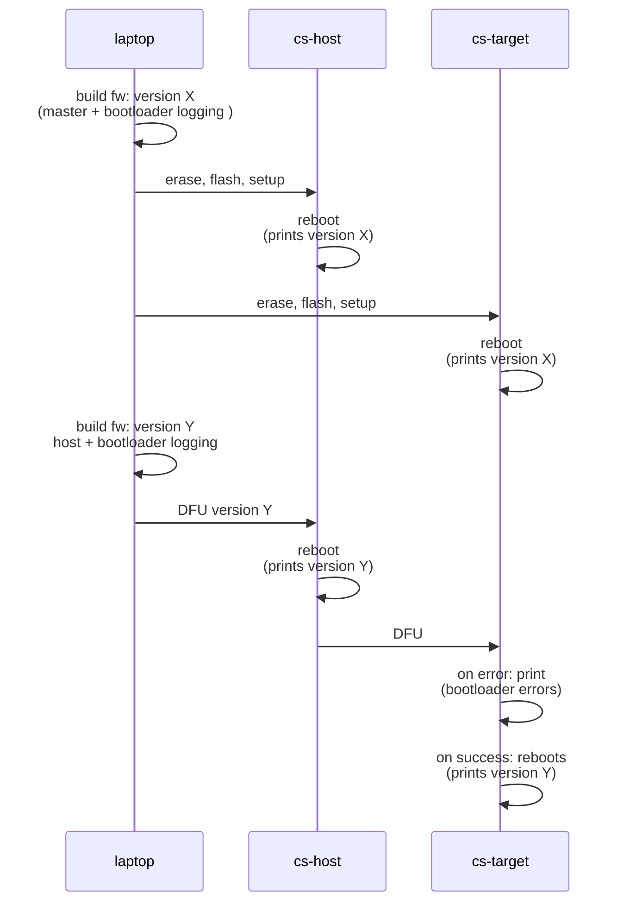

# Peer to peer firmware updates

This component enables crownstones to update their peers on command.
Currently it doesn't synchronize or do version checking except for checks
that the bootloader already executes.

# Testing

Notes on the diagram:
- setting both devices in the same sphere is necessary
- using a DFU tool to load version Y on the host crownstone is necessary. (It places the dfu init packet in the correct location so that bluenet can execute the dfu process.)
- it is not necessary to enable bootloader logging on the host, but nice to have during testing.

# Process

This is an overview flow chart of the dfu process. For more detail, see [this file](P2P_DFU_PHASES.md)

```mermaid
flowchart TD;
    subgraph Phases
        %% style
        classDef blue fill:#2374f7,stroke:#000,stroke-width:2px,color:#fff
        classDef red fill:#bf3a15,stroke:#000,stroke-width:2px,color:#fff
        classDef green fill:#0d9116,stroke:#000,stroke-width:2px,color:#fff


        %% Phases (corresponding to the MeshDfuHost::Phase enum)
        N[None]
        I0[Idle]:::blue
        I1[Idle]:::blue

        M[TargetTriggerDfuMode]:::green
        W[WaitForTargetReboot]:::green
        C[ConnectTargetInDfuMode]:::green
        D[DiscoverDfuCharacteristics]:::green
        P[TargetPreparing]:::green
        T[TargetInitializing]:::green
        U[TargetUpdating]:::green
        V[TargetVerifying]:::green
        
        A0[Aborting]:::red
        A1[Aborting]:::red
        A2[Aborting]:::red
        
        %% transitions
        _i(["init()"])
        _c(["copyFirmwareTo()"])

        A0 -->|reset process| I0

        N --> _i -->|success| I0
        _i -->|fail| N

        I0 --> _c -->|success| C
        _c -->|fail| I0
        
        C -->|fail| A1
        C -->|success| D

        D --> D_COMPLETE_1(["completeDiscoverDfuCharacteristics()"])
        D_COMPLETE_1{dfu mode?} -->|yes| P
        D_COMPLETE_1 -->|no| D_COMPLETE_2
        D_COMPLETE_2{retry dfu?} -->|no| A2
        D_COMPLETE_2 -->|"yes (first time)"| M

        M -->|fail| A2
        M -->|dfu command sent| W

        W -->|timeout or receive advertisment| C

        P --> T
        P -->|failed enabling notifications| A2
        
        T --> U
        T -->|failed streaming init packet| A2
        
        U --> V
        U -->|failed streaming firmware| A2

        V -->|success/done| I1
        V --> A2
    end
```

