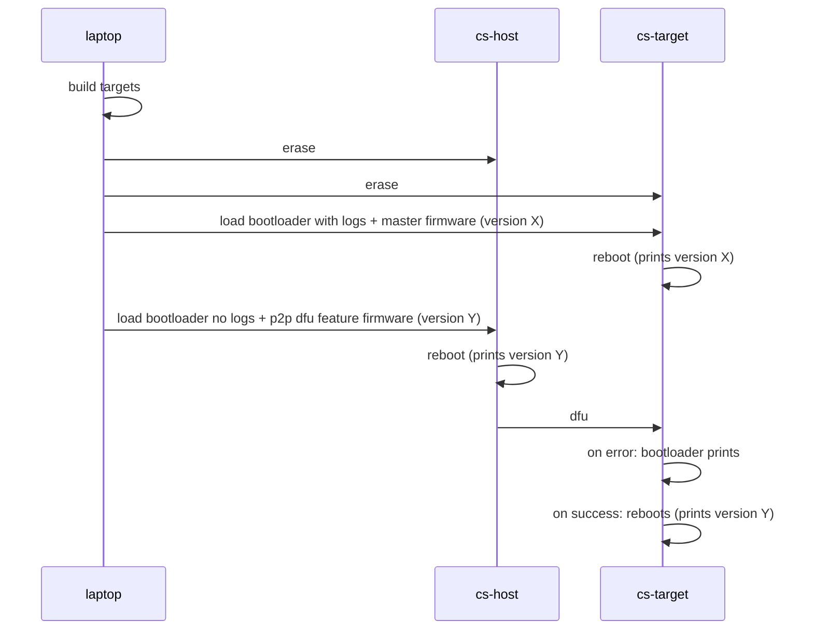
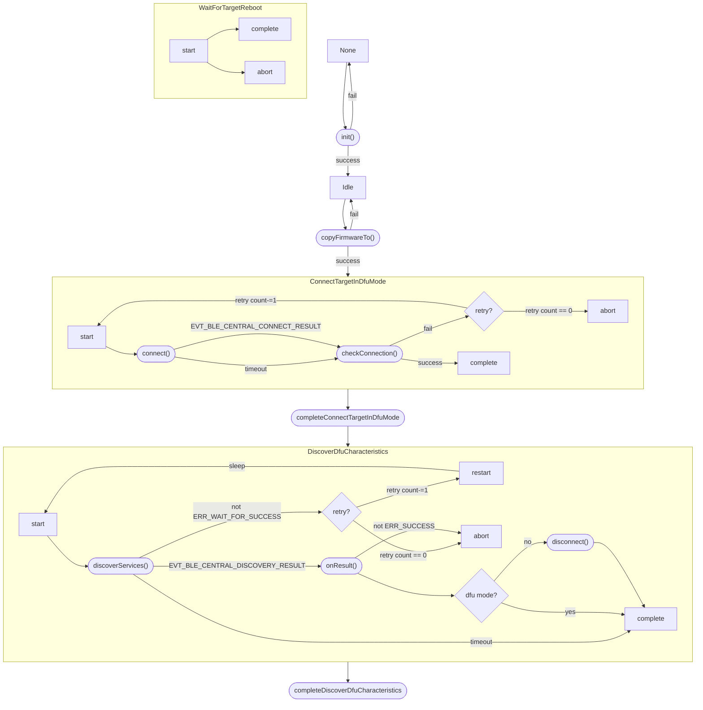

# Peer to peer firmware updates

This component enables crownstones to update their peers on command.
Currently it doesn't synchronize or do version checking except for checks
that the bootloader already executes.

# Testing

# Process

This is an in depth flow chart of the dfu process.

TargetTriggerDfuMode            M
WaitForTargetReboot             W
ConnectTargetInDfuMode          C
DiscoverDfuCharacteristics      D
TargetPreparing                 P
TargetInitializing              T
TargetUpdating                  U
TargetVerifying                 V
Aborting                        A