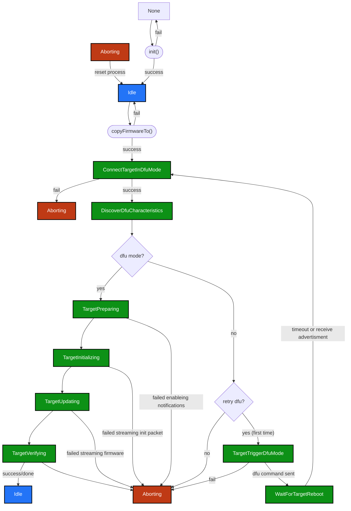
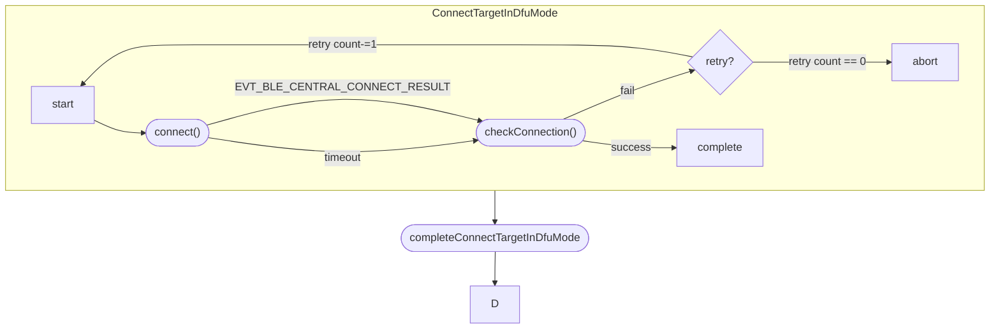
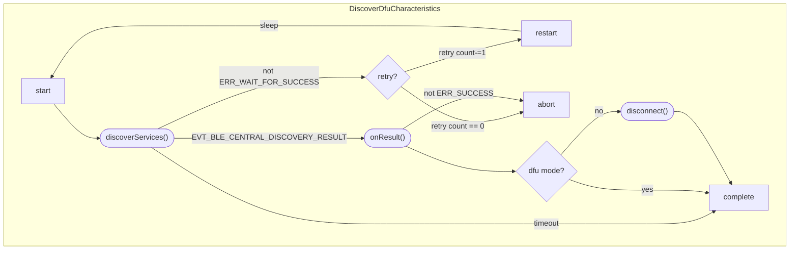
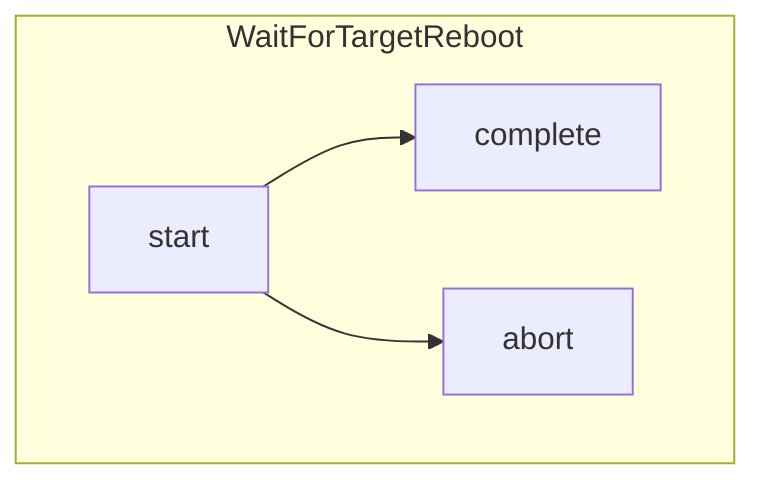

## top level flow

```mermaid
flowchart TD;
    %% style
    classDef blue fill:#2374f7,stroke:#000,stroke-width:2px,color:#fff
    classDef red fill:#bf3a15,stroke:#000,stroke-width:2px,color:#fff
    classDef green fill:#0d9116,stroke:#000,stroke-width:2px,color:#fff


    %% Phases corresponding to the MeshDfuHost::Phase enum
    N[None]
    I0[Idle]:::blue
    I1[Idle]:::blue

    M[TargetTriggerDfuMode]:::green
    W[WaitForTargetReboot]:::green
    C[ConnectTargetInDfuMode]:::green
    D[DiscoverDfuCharacteristics]:::green
    P[TargetPreparing]:::green
    T[TargetInitializing]:::green
    U[TargetUpdating]:::green
    V[TargetVerifying]:::green
    
    A0[Aborting]:::red
    A1[Aborting]:::red
    A2[Aborting]:::red
    %%A3[Aborting]:::red
    %%A4[Aborting]:::red
    %%A5[Aborting]:::red
    
    %% function calls and branches
    _i(["init()"])
    _c(["copyFirmwareTo()"])

    %% transitions
    A0 -->|reset process| I0


    N --> _i -->|success| I0
    _i -->|fail| N

    I0 --> _c -->|success| C
    _c -->|fail| I0
    
    C -->|fail| A1
    C -->|success| D
    

    D --> D_COMPLETE_1(["completeDiscoverDfuCharacteristics()"])
    D_COMPLETE_1{dfu mode?} -->|yes| P
    D_COMPLETE_1 -->|no| D_COMPLETE_2
    D_COMPLETE_2{retry dfu?} -->|no| A2
    D_COMPLETE_2 -->|"yes (first time)"| M
    

    M -->|fail| A2
    M -->|dfu command sent| W

    W -->|timeout or receive advertisment| C

    P --> T
    P -->|failed enableing notifications| A2
    
    T --> U
    T -->|failed streaming init packet| A2
    
    U --> V
    U -->|failed streaming firmware| A2

    V -->|success/done| I1
    V --> A2
```

## phases

```mermaid
flowchart TD;
    subgraph M["ConnectTargetInDfuMode"]
        direction LR
        M_S[start]
        M_C[complete]
        M_A[abort]
        M_CON(["connect()"])
        M_CHE(["checkConnection()"])
        M_RET{retry?}
        
        M_S --> M_CON-->|timeout| M_CHE
        M_CON -->|EVT_BLE_CENTRAL_CONNECT_RESULT| M_CHE

        M_CHE -->|fail| M_RET
        M_CHE -->|success| M_C
        M_RET -->|retry count-=1| M_S
        M_RET -->|retry count == 0| M_A
    end

    M -->M_COMPLETE([completeConnectTargetInDfuMode]) --> D
```

```mermaid
flowchart TD;
    subgraph D["DiscoverDfuCharacteristics"]
        direction LR
        D_S[start]
        D_C[complete]
        D_A[abort]
        D_R[restart]
        D_RET{retry?}
        D_DIS(["discoverServices()"])
        D_RES(["onResult()"])
        D_CHE{dfu mode?}
        D_BTD(["disconnect()"])

        D_S --> D_DIS -->|not ERR_WAIT_FOR_SUCCESS| D_RET
        D_DIS -->|EVT_BLE_CENTRAL_DISCOVERY_RESULT| D_RES
        D_DIS -->|timeout| D_C
        D_RET -->|retry count-=1| D_R
        D_R -->|sleep| D_S
        D_RET -->|retry count == 0| D_A
        D_RES -->|not ERR_SUCCESS| D_A
        D_RES --> D_CHE 
        D_CHE -->|yes| D_C
        D_CHE -->|no| D_BTD --> D_C
    end
```

```mermaid
flowchart TD;
    subgraph W["WaitForTargetReboot"]
        direction LR
        W_S[start]
        W_C[complete]
        W_A[abort]

        W_S --> W_C & W_A
    end
```