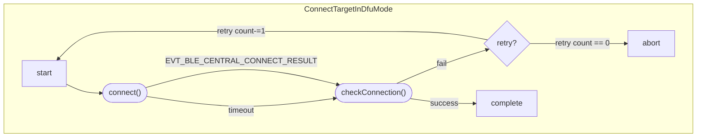
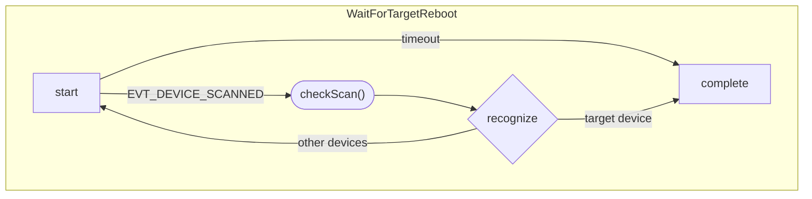
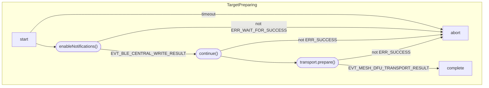
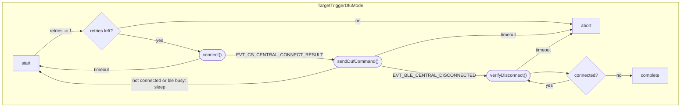
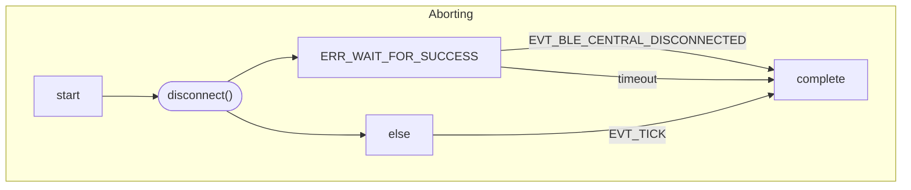
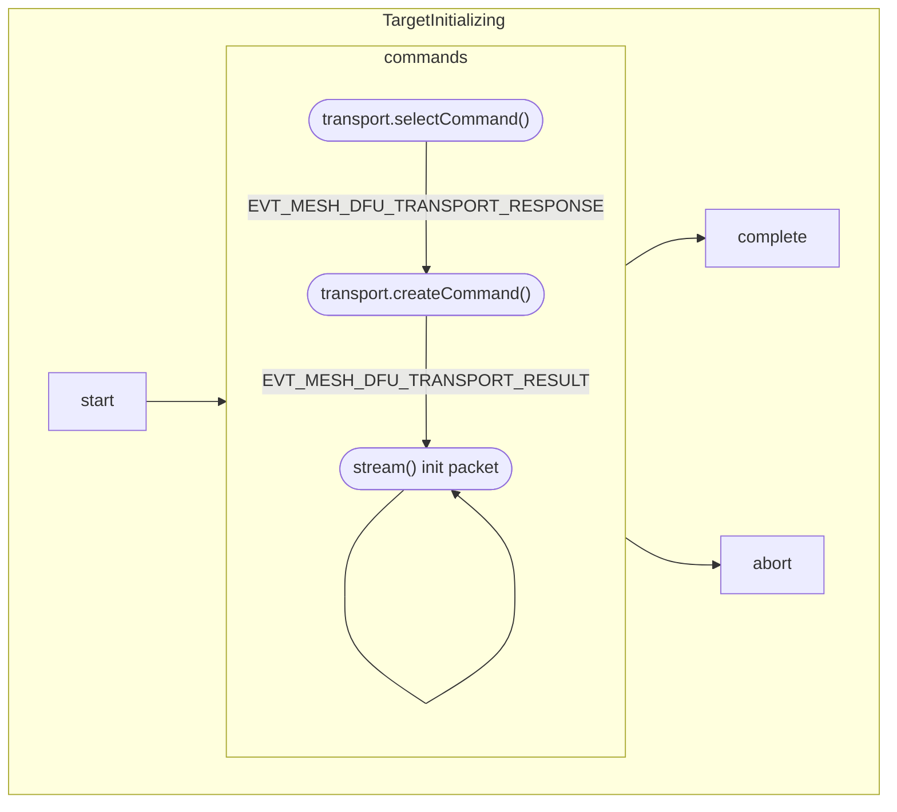

## top level flow

```mermaid
flowchart TD;
    subgraph Phases
        %% style
        classDef blue fill:#2374f7,stroke:#000,stroke-width:2px,color:#fff
        classDef red fill:#bf3a15,stroke:#000,stroke-width:2px,color:#fff
        classDef green fill:#0d9116,stroke:#000,stroke-width:2px,color:#fff


        %% Phases (corresponding to the MeshDfuHost::Phase enum)
        N[None]
        I0[Idle]:::blue
        I1[Idle]:::blue

        M[TargetTriggerDfuMode]:::green
        W[WaitForTargetReboot]:::green
        C[ConnectTargetInDfuMode]:::green
        D[DiscoverDfuCharacteristics]:::green
        P[TargetPreparing]:::green
        T[TargetInitializing]:::green
        U[TargetUpdating]:::green
        V[TargetVerifying]:::green
        
        A0[Aborting]:::red
        A1[Aborting]:::red
        A2[Aborting]:::red
        
        %% transitions
        _i(["init()"])
        _c(["copyFirmwareTo()"])

        A0 -->|reset process| I0

        N --> _i -->|success| I0
        _i -->|fail| N

        I0 --> _c -->|success| C
        _c -->|fail| I0
        
        C -->|fail| A1
        C -->|success| D

        D --> D_COMPLETE_1(["completeDiscoverDfuCharacteristics()"])
        D_COMPLETE_1{dfu mode?} -->|yes| P
        D_COMPLETE_1 -->|no| D_COMPLETE_2
        D_COMPLETE_2{retry dfu?} -->|no| A2
        D_COMPLETE_2 -->|"yes (first time)"| M

        M -->|fail| A2
        M -->|dfu command sent| W

        W -->|timeout or receive advertisment| C

        P --> T
        P -->|failed enabling notifications| A2
        
        T --> U
        T -->|failed streaming init packet| A2
        
        U --> V
        U -->|failed streaming firmware| A2

        V -->|success/done| I1
        V --> A2
    end
```

## phases

```mermaid
flowchart TD;
    subgraph M["ConnectTargetInDfuMode"]
        direction LR
        M_S[start]
        M_C[complete]
        M_A[abort]
        M_CON(["connect()"])
        M_CHE(["checkConnection()"])
        M_RET{retry?}
        
        M_S --> M_CON-->|timeout| M_CHE
        M_CON -->|EVT_BLE_CENTRAL_CONNECT_RESULT| M_CHE

        M_CHE -->|fail| M_RET
        M_CHE -->|success| M_C
        M_RET -->|retry count-=1| M_S
        M_RET -->|retry count == 0| M_A
    end
```

```mermaid
flowchart TD;
    subgraph D["DiscoverDfuCharacteristics"]
        direction LR
        D_S[start]
        D_C[complete]
        D_A[abort]
        D_R[restart]
        D_RET{retry?}
        D_DIS(["discoverServices()"])
        D_RES(["onResult()"])
        D_CHE{dfu mode?}
        D_BTD(["disconnect()"])

        D_S --> D_DIS -->|not ERR_WAIT_FOR_SUCCESS| D_RET
        D_DIS -->|EVT_BLE_CENTRAL_DISCOVERY_RESULT| D_RES
        D_DIS -->|timeout| D_C
        D_RET -->|retry count-=1| D_R
        D_R -->|sleep| D_S
        D_RET -->|retry count == 0| D_A
        D_RES -->|not ERR_SUCCESS| D_A
        D_RES --> D_CHE 
        D_CHE -->|yes| D_C
        D_CHE -->|no| D_BTD --> D_C
    end
```

```mermaid
flowchart TD;
    subgraph W["WaitForTargetReboot"]
        direction LR
        W_S[start]
        W_C[complete]
        W_CHE(["checkScan()"])

        W_S -->|timeout| W_C
        W_S -->|EVT_DEVICE_SCANNED| W_CHE
        W_CHE --> W_O{recognize}-->|target device| W_C
        W_O -->|other devices| W_S 
    end
```

```mermaid
flowchart TD;
    subgraph P[TargetPreparing]
        direction LR
        P_S[start]
        P_C[complete]
        P_A[abort]

        P_S -->|timeout| P_A
        P_S --> P_E(["enableNotifications()"])
        P_E -->|EVT_BLE_CENTRAL_WRITE_RESULT| P_CON(["continue()"])
        P_E -->|not ERR_WAIT_FOR_SUCCESS| P_A

        P_CON -->|not ERR_SUCCESS| P_A
        P_CON --> P_PRE(["transport.prepare()"])
        P_PRE -->|EVT_MESH_DFU_TRANSPORT_RESULT| P_C
        P_PRE -->|not ERR_SUCCESS| P_A

    end
```

```mermaid
flowchart TD;
    subgraph M["TargetTriggerDfuMode"]
        direction LR
        M_S[start]
        M_C[complete]
        M_A[abort]
        M_CON(["connect()"])
        M_V(["verifyDisconnect()"])
        M_COM(["sendDufCommand()"])
        M_RET{retries left?} 
        M_CCC{connected?}

        M_S -->|retries -= 1| M_RET
        M_RET -->|no| M_A
        M_RET -->|yes| M_CON

        M_CON -->|EVT_CS_CENTRAL_CONNECT_RESULT| M_COM
        M_CON -->|timeout| M_S

        M_COM -->|not connected or ble busy: sleep| M_S
        M_COM -->|timeout| M_A
        M_COM -->|EVT_BLE_CENTRAL_DISCONNECTED| M_V

        M_V --> M_CCC
        M_V -->|timeout| M_A
        M_CCC -->|yes| M_V
        M_CCC -->|no| M_C
        
        
    end
```

```mermaid
flowchart TD;
    subgraph A[Aborting]
        direction LR
        A_S[start]
        A_C[complete]
        
        A_S --> A_DIS(["disconnect()"])
        A_DIS -->A_AB[ERR_WAIT_FOR_SUCCESS]-->|EVT_BLE_CENTRAL_DISCONNECTED| A_C
        A_AB -->|timeout| A_C
        A_DIS --> A_EL[else] -->|EVT_TICK| A_C
    end
```

```mermaid
flowchart TD;
    subgraph T[TargetInitializing]
        direction LR
        A_S[start]
        A_C[complete]
        A_A[abort]

        subgraph T_CMDS[commands]
            direction TB
            A_CMD_SEL(["transport.selectCommand()"])
            A_CMD_CRE(["transport.createCommand()"])
            A_STR(["stream() init packet"])
            A_CMD_SEL -->|EVT_MESH_DFU_TRANSPORT_RESPONSE| A_CMD_CRE
            A_CMD_CRE -->|EVT_MESH_DFU_TRANSPORT_RESULT| A_STR

            A_STR --> A_STR
        end

        A_S --> T_CMDS
        T_CMDS --> A_C & A_A

    end
```