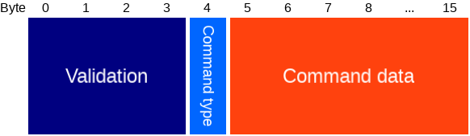
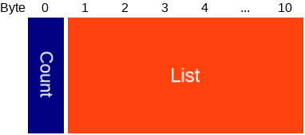

# Bluenet broadcast protocol v4.0
-----------------------------------

This only documents the latest protocol, older versions can be found in the git history.

# Index
- [Background](#background-broadcasts)
- [Command](#command-broadcasts)

# Background broadcasts

These are meant to be broadcasted by phones all the time.

#### Background broadcast advertisement

The packet that the phone should advertise to send a background broadcast.

Type | Name | Length | Description
--- | --- | --- | ---
uint8 | AD Length | 1 | Length of the next AD structure.
uint8 | AD Type | 1 | 0xFF: Manufacturer specific data.
uint8 | Company id | 2 | 0x004C: Apple.
uint8 | type | 1 | 0x01: Services bitmask.
uint8 [] | Services bitmask | 16 | Consists of 3x the same [data](#background-broadcast-data) plus 2 unused bits.background

#### Background broadcast data

Either [v0](#background-broadcast-data-v0) or [v1](#background-broadcast-data-v1).

#### Background broadcast data v0

Type | Name | Length in bits | Description
--- | --- | --- | ---
uint8 | Protocol | 2 | Protocol version = 0.
uint8 | Sphere ID | 8 | Hash of the sphere ID, acts as filter, so that not every advertisement has to be decrypted.
uint16 [] | Payload | 32 | Encrypted [payload](#background-broadcast-payload), using 32b RC5 with 128b localization key.

#### Background broadcast data v1

Type | Name | Length in bits | Description
--- | --- | --- | ---
uint8 | Protocol | 2 | Protocol version = 1.
uint24 | device token | 24 | Token of this device, set via command [Register tracked device](PROTOCOL.md#command-types) or [Update tracked device](#command-broadcast-types).
uint16 | reserved | 16 | Reserved for future use, should be 0 for now.

#### Background broadcast payload

Type | Name | Length in bits | Description
--- | --- | --- | ---
uint16 | Validation | 16 | Validation: current local time as unix timestamp, right shifted by 7.
uint8 | Location ID | 6 | ID of the location where the user is. 0 for in sphere, but no specific location.
uint8 | Profile ID | 3 | ID of the profile the user is using.
uint8 | RSSI offset | 4 | Offset from standard signal strength. Divide by 2, then add 8.
uint8 | Flags | 3 | [Flags](#background-broadcast-flags).

#### Background broadcast flags

Bit | Name |  Description
--- | --- | ---
0 | Reserved | Reserved for future use.
1 | Ignore for presence | Set to 1 when this broadcast should be ignored for presence.
2 | Tap to toggle | Set to 1 when this phone has tap to toggle enabled.

# Command broadcasts

These are meant to be broadcasted by phones for specific commands, like switching Crownstones.

#### Command broadcast advertisement

The packet that the phone should advertise to send a command broadcast.

Type | Name | Length | Description
--- | --- | --- | ---
uint8 | AD Length | 1 | 9: Length of the next AD structure.
uint8 | AD Type | 1 | 0x03: Complete list of 16 bit service UUIDs.
uint16 [] | 16bit services | 8 | List of four 16 bit service UUIDs, which are used as [header](#command-broadcast-header) data.
uint8 | AD Length | 1 | 17: Length of the next AD structure.
uint8 | AD Type | 1 | 0x07: Complete list of 128 bit service UUIDs.
uint64[] | 128bit service | 16 | Single 128 bit service UUID, which is used as [encrypted payload](#command-broadcast-payload), sent as two uint64.

## Command broadcast header

Type | Name | Length in bits | Description
--- | --- | --- | ---
uint8 | Sequence | 2 | 0: Sequence of this service UUID.
uint8 | Protocol | 3 | Protocol version, currently 0.
uint8 | Sphere ID | 8 | Sphere ID that must be the same as given during setup. Used to filter out broadcasts that are not meant for this Crownstone.
uint8 | Access level | 3 | Shortened access level: 0=admin, 1=member, 2=basic, 4=setup.
uint8 | Sequence | 2 | 1: Sequence of this service UUID.
uint8 | Reserved | 2 | Reserved for future use.
uint8 | Device ID | 8 | ID of this device, should be unique per device (phone) in the sphere.
uint16 | RC5 payload | 4 | First 4 bits of first block of [encrypted RC5 payload](#rc5-broadcast-payload).
uint8 | Sequence | 2 | 2: Sequence of this service UUID.
uint16 | RC5 payload | 12 | Last 12 bits of first block of [encrypted RC5 payload](#rc5-broadcast-payload).
uint16 | RC5 payload | 2 | First 2 bits of second block of [encrypted RC5 payload](#rc5-broadcast-payload).
uint8 | Sequence | 2 | 3: Sequence of this service UUID.
uint16 | RC5 payload | 14 | Last 14 bits of second block of [encrypted RC5 payload](#rc5-broadcast-payload).

#### RC5 broadcast payload

Type | Name | Length in bits | Description
--- | --- | --- | ---
uint8 | Counter | 8 | Count of the broadcast command. This value should be increased for each newly broadcasted command.
uint8 | Reserved | 8 | Reserved for future use.
uint8 | Location ID | 6 | ID of the location where the user is. 0 for in sphere, but no specific location.
uint8 | Profile ID | 3 | ID of the profile the user is using.
uint8 | RSSI offset | 4 | Offset from standard signal strength. Divide by 2, then add 8.
uint8 | Flags | 3 | [Flags](#background-broadcast-flags).

## Command broadcast payload

Type | Name | Length | Description
--- | --- | --- | ---
uint32 | Validation | 4 | Validation in the form of a local time unix timestamp.
uint8 | Command type | 1 | See the list of [types](#command-broadcast-types).
uint8[] | Command data | 11 | Depends on command type.

### Command broadcast types

Type nr | Type name | Payload type | Payload Description | A | M | B | S
--- | --- | --- | --- | :---: | :---: | :---: | :--:
0 | No operation | - | None | x | x | x |
1 | Multi switch | [Multi switch short list packet](#multi-switch-short-list-packet) | List of switch commands | x | x | x |
2 | Set time | [Set time packet](#set-time-packet) | Current time. | x | x | |
3 | Behaviour settings | [Behaviour settings](#behaviour-settings) | Currently only supports turning smart behaviour on/off | x | x | |
4 | Update tracked device | [Update tracked device packet](#update-tracked-device-packet) | Updates the data of a tracked device. Access level should match the original access level. | x | x | x |

##### Multi switch short list packet

Type | Name | Length | Description
--- | --- | --- | ---
uint 8 | Count | 1 | Number of valid entries.
[Multi switch short entry](#multi-switch-short-entry) [] | List | 10 | A list of switch commands.

##### Multi switch short entry

Type | Name | Length | Description
--- | --- | --- | ---
uint 8 | Crownstone ID | 1 | The identifier of the crownstone to which this item is targeted.
uint 8 | [Switch value](PROTOCOL.md#switch-command-value) | 1 | The switch value to be set by the targeted crownstone.

##### Set time packet

Type | Name | Length | Description
--- | --- | --- | ---
uint 8 | [Flags](#set-time-flags) | 1 | Flags bitmask.
uint 32 | Timestamp | 4 | Current local time.
uint 24 | Sunrise | 3 | Seconds after midnight that the sun rises.
uint 24 | Sunset | 3 | Seconds after midnight that the sun sets.

##### Set time flags

Bit | Name |  Description
--- | --- | ---
0 | Timestamp valid | Whether the provided timestamp is valid.
1 | Sunrise and sunset valid | Whether the provided sunrise and sunset are valid.
2-7 | Reserved | Reserved for future use, should be 0 for now.

##### Behaviour settings

Type | Name | Length | Description
--- | --- | --- | ---
uint 32 | [Flags](#behaviour-settings-flags) | 4 | Flags.
uint 8[] | Reserved | 7 | Reserved for future use, should be 0 for now.

##### Behaviour settings flags

Bit | Name |  Description
--- | --- | ---
0 | Enabled | Whether behaviours are enabled.
1-31 | Reserved | Reserved for future use, should be 0 for now.

##### Update tracked device packet

Type | Name | Length | Description
--- | --- | --- | ---
uint 16 | Device ID | 2 | Unique ID of the device.
uint 8 | Location ID | 1 | ID of the location where the device is. 0 for in sphere, but no specific location.
uint 8 | Profile ID | 1 | Profile ID of the device.
int 8 | RSSI offset | 1 | Offset from standard signal strength.
uint 8 | Flags | 1 | [Flags](BROADCAST_PROTOCOL.md#background-broadcast-flags).
uint 24 | Device token | 3 | Token that will be advertised by the device.
uint 16 | Time to live | 2 | Time in minutes after which the device token will be invalid.

