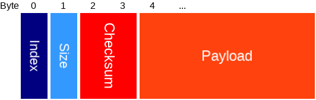

# Inter-process communication

## Item data

Each IPC RAM item will have the following data:

Type | Name | Length | Description
---- | ---- | ------ | -----------
uint8 | [Index](#index-types) | 1 | Index of this item. Each index has a specific use.
uint8 | Size | 1 | Size of the payload.
uint16 | Checksum | 2 | Checksum of index, size, and payload.
uint8[] | Payload | N | Depends on [index](#index-types). Max 24 bytes.

The checksum is a sum of: index, size, and all 24 payload bytes.
Then ...

## Index types

Index | Type | Set by | Value
----- | ---- | ------ | -----
0     | Reserved |
1     | Crownstone app | App |
2     | Bootloader info | Bootloader | [Bootloader info packet](#bootloader-info-packet).
3     | Micro app | Arduino programs |

## Packets

Each packet will be 24 bytes or smaller.

### Bootloader info packet

The bootloader can communicate with the bluenet firmware through a struct at a fixed location in RAM that sets e.g. 
version information. This can be read over the air as well.

Type | Name | Length | Description
---- | ---- | ------ | -----------
uint 8 | Protocol | 1 | Protocol version: 1, will be incremented on change of packet format. Set in CMakeBuild.config file.
uint 16 | DFU version | 2 | DFU Version, the value in the DFU settings page. Set in VERSION file.
uint 8 | Major | 1 | Major version. Set in VERSION file.
uint 8 | Minor | 1 | Minor version. Set in VERSION file.
uint 8 | Patch | 1 | Patch version. Set in VERSION file.
uint 8 | Prerelease | 1 | Prerelease version, will be 255 if not a pre-release. Set in VERSION file.
uint 8 | Build type | 1 | Build type (Debug = 1, Release = 2, RelWithDebInfo = 3, MinSizeRel = 4). Set by CMakeLists.txt file.

